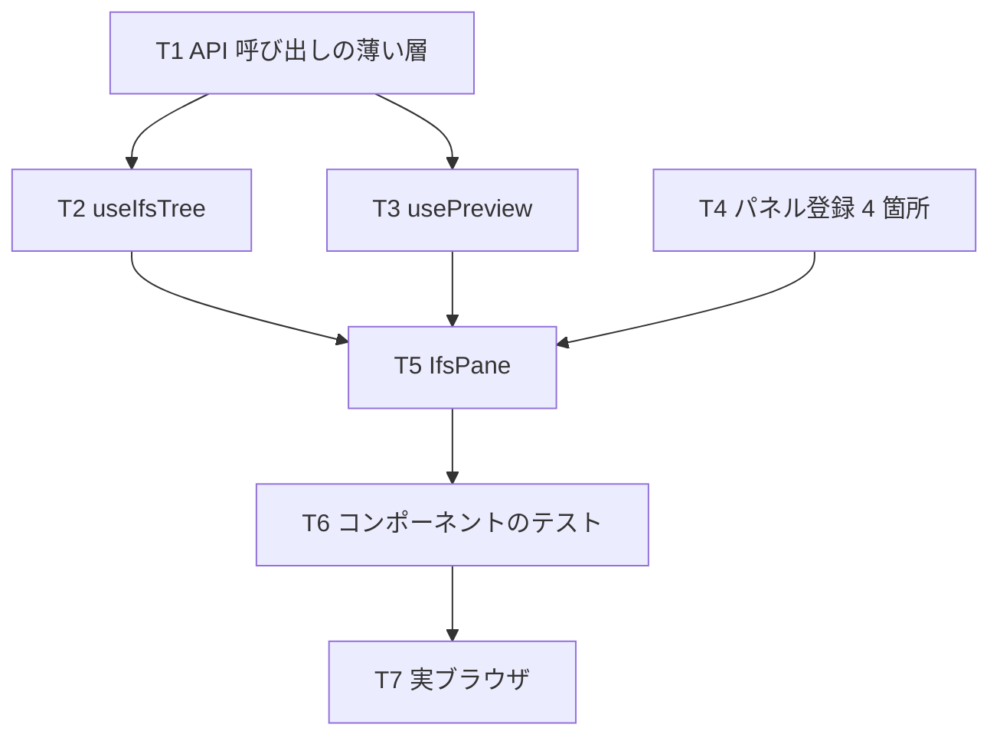

# 計画: 03-web-ui（IFS パネル）

親 plan（`../plan.md`）が確定させた割れ目のうち、**web-ui だけ**を担う。
scope は親で凍結済み。

## 実装方針

**状態の管理と描画を分ける。** ツリーの展開・ページング・プレビューの寿命は
composable に閉じ込め、`IfsPane.vue` は描画と操作に徹する。
02 の review で「ハンドラ本体をテストできない構造」を作ってしまったので、
**先に「テストから駆動できる形」を決めてから書く**。

web-ui は `globalThis.fetch` を差し替える作法が既にあるので（`host-list-pane.test.ts`）、
composable は素の `fetch` を呼んでよい。ただし**呼び出しを composable 側に寄せ**、
コンポーネントから直接 `fetch` しない——そうしないと描画を通さずにロジックを検証できない。

## サーバーから来る、誤用しやすい 4 つの形

02 までで確定した契約。**どれも「素直に読むと間違える」形**なので、
composable の層で吸収してコンポーネントに素の値を渡さない。

| 応答 | 罠 |
|---|---|
| `list` | **`entries` が空でも `hasMore` が true になりうる**（`.` と `..` が件数上限を消費する）。「空 = 終わり」と解釈するとディレクトリが空に見える |
| `list` | **`canContinue` を見ずに `nextRestartId` を渡し続けると無限ループする**（`/QSYS.LIB` は Restart ID が 0） |
| `read` | **`content: null` はエラーではない**（`code: "UNSUPPORTED_ENCODING"`）。読み取りは成功していて、足りないのは表示手段。「失敗」ではなく「文字コード未対応 → ダウンロード」と見せる |
| `zip` | 409 `INCOMPLETE_LISTING`（辿り切れない）と 413 `TOO_LARGE` / `TOO_MANY_DIRECTORIES`（大きすぎ）は**別の話**。前者は「この場所は一括取得できない」、後者は「絞ってください」 |

## CCSID は後回し（ユーザー判断）

テキストは **UTF-8 のものだけプレビューできる**状態で一度完成させる。
EBCDIC（PUB400 は CCSID 273）のファイルは `content: null` で返るので、
UI は「この文字コードは未対応です。ダウンロードしてください」と示す。

**この状態で日本語の実データはほとんど読めない**ことを承知のうえで進める。
core に CCSID 取得の口を足す作業は別途。

## 作業順序と依存関係

## リスク / 留意点

- **登録は 4 箇所を同時に直す**。`paneLabels.ts` の 2 箇所は片方だけだと
  `web-ui/test/csv.test.ts` が落ちる（これは既存テストが守ってくれる）
- **blob URL の解放**。既存 `PrinterPane.vue` は `click()` 直後に `revokeObjectURL` しており、
  プレビューに転用すると表示前に消える。解放は「次を表示する直前」と「ペイン破棄時」の 2 箇所だけ
- **ファイル名をそのまま描画しない**。実機の `/home` に端末エスケープを含む名前が実在した
  （`OZIAN[D[D…[C[Cau`）。Web では制御は効かないが、長さ・不可視文字・折り返しの扱いは決める
- **ビルドに `vue-tsc` を含める**（AGENTS.md）。`vite build` はテンプレートの型を見ない
- **テストはパッケージ dir から実行**（`cd packages/web-ui && npx vitest run`）

## テスト方針

| 対象 | 実ブラウザなしで確かめること | 実ブラウザで確かめること |
|---|---|---|
| `useIfsTree` | 展開・遅延読み込み・ページング（**空ページでも続きを取る／`canContinue` で止まる**）・エラー | — |
| `usePreview` | 種別の振り分け、blob URL の解放タイミング | 実際に表示されること |
| `IfsPane` | `mount` + `fetch` 差し替えで、一覧表示・選択・エラー文言・`content: null` の扱い | 操作感（クリック・スクロール） |
| 全体 | — | **テキスト / PDF / 画像のプレビュー**、ダウンロード、zip、アップロード |

**02 の教訓を適用する**: composable のテストは、本体の分岐を通っているか変異させて確かめる。
「fetch を差し替えたが描画しか見ていない」形にしない。
