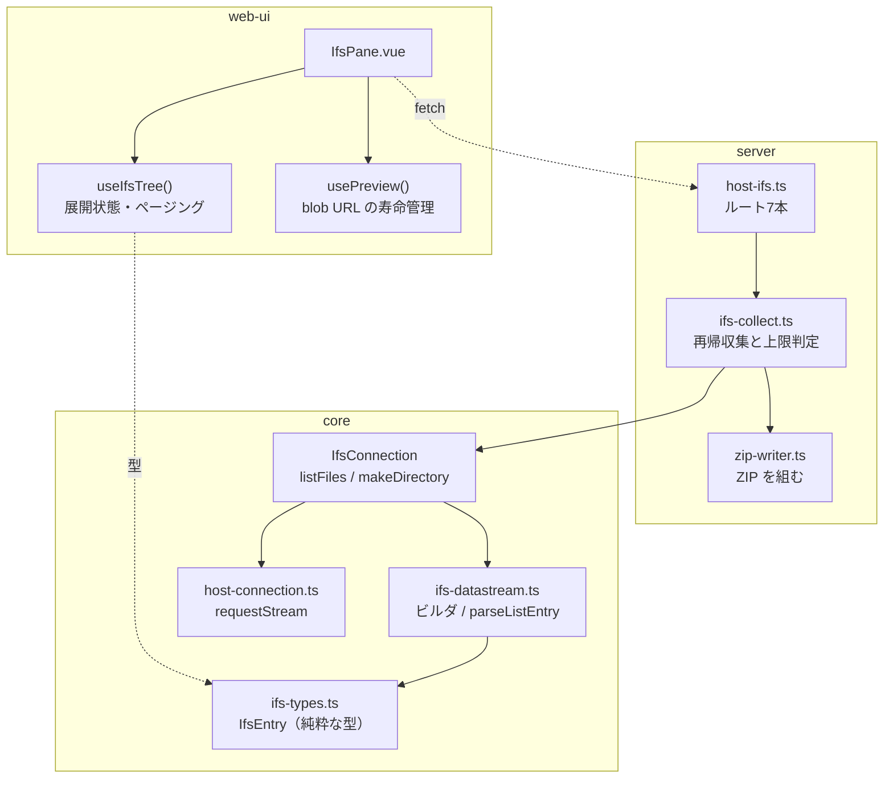
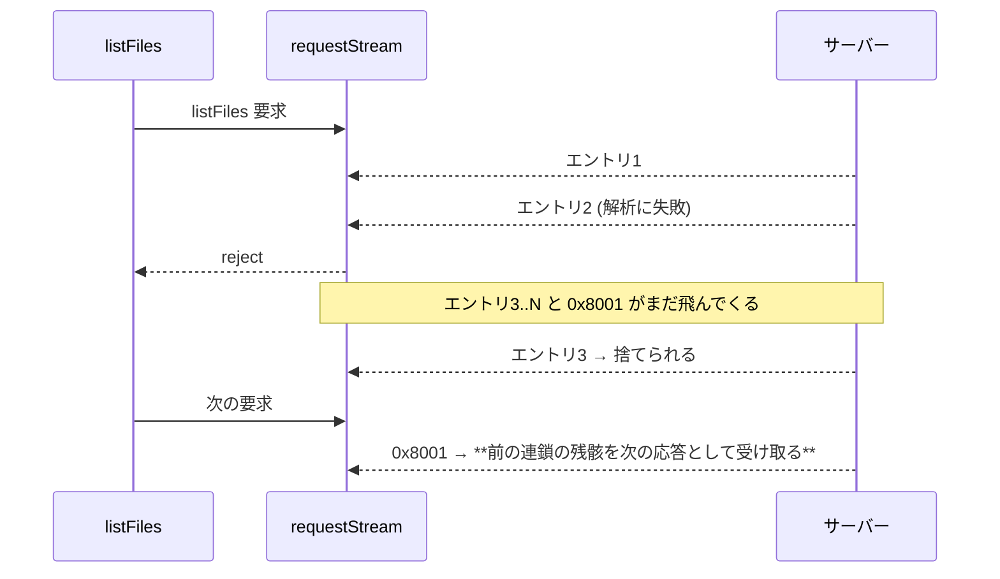
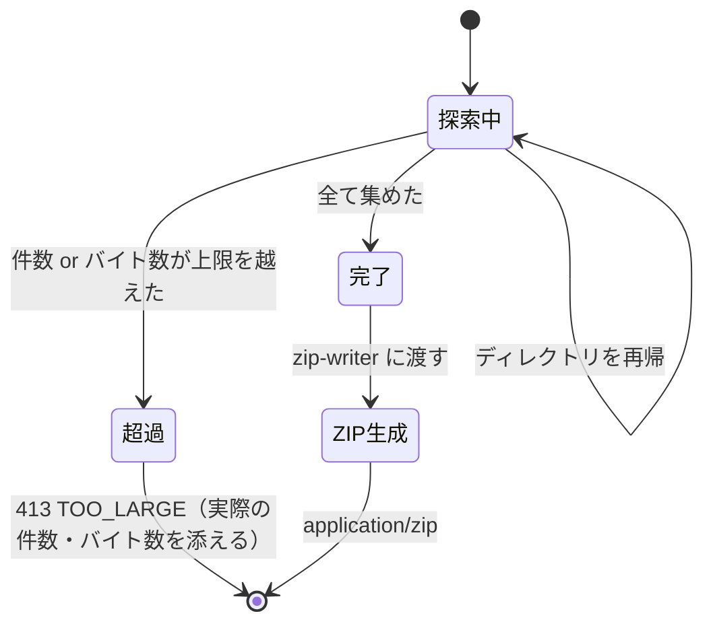
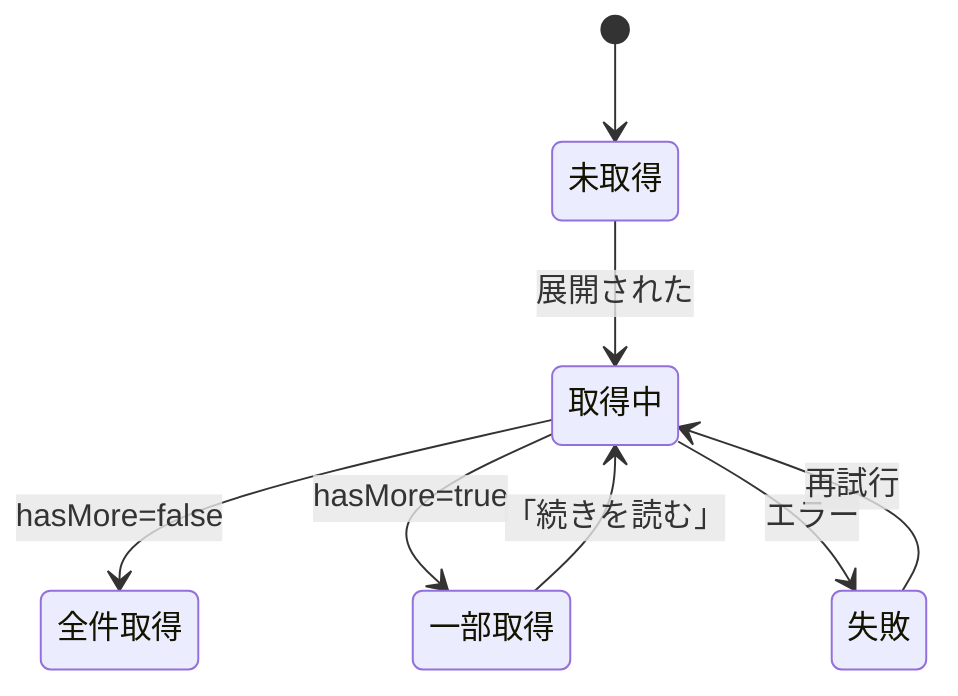

# 設計: IFS ファイルブラウザ

## アーキテクチャ概要



## コンポーネント / モジュール

| モジュール | 責務 | 依存 |
|---|---|---|
| `core/hostserver/ifs/ifs-types.ts` | `IfsEntry` / `IfsListResult`。**`node:*` に触れない純粋な型** | なし |
| `core/hostserver/ifs/ifs-datastream.ts` | 要求の組み立てと 1 フレームの解析。**I/O を持たない** | `ifs-types.ts` |
| `core/hostserver/ifs/ifs-connection.ts` | 接続・連鎖ループ・終端判定 | `ifs-datastream.ts`, transport |
| `core/transport/host-connection.ts` | `requestStream` | — |
| `server/host-ifs.ts` | ルート定義・入力検証・エラー写像 | `host-connect.ts`, `ifs-collect.ts` |
| `server/ifs-collect.ts` | 再帰収集と上限判定。**zip の組み立ては持たない** | `IfsConnection` |
| `server/zip-writer.ts` | バイト列 → ZIP。**IFS を知らない** | `node:zlib` |
| `web-ui/composables/useIfsTree.ts` | ツリーの展開状態・ページング | — |
| `web-ui/components/IfsPane.vue` | 描画・操作 | 上記 |

`ifs-collect.ts` と `zip-writer.ts` を分けるのは、**ZIP の組み立てを IFS から独立させて単体テストできるようにする**ため。
`zip-writer.ts` は「名前とバイト列の配列」を受けて ZIP を返すだけにする。

## インターフェース / データモデル

### 型の置き場所（論点 1）

`IfsEntry` は**純粋な型**なので `ifs-types.ts` に置き、**3 経路から再エクスポート**する。

- `core/src/index.ts` — server が使う
- `core/src/browser.ts` — web-ui が使う（root は pino / node:net を巻き込むため使えない）
- HTTP 応答はこの型をそのまま JSON にする

これにより server 側に応答型を定義しない（既存の「レスポンス型は `c.json` 直書き」の作法を守る）。
`browser.ts` に置いてよいのは `node:*` にも I/O にも触れないものだけ、という同ファイルの規約を満たす。

```ts
// ifs-types.ts
export interface IfsEntry {
  name: string;
  isDirectory: boolean;
  isSymlink: boolean;
  size: number;
  /** UNIX ミリ秒 */
  modifiedAt: number;
  restartId: number;
}

export interface IfsListResult {
  entries: IfsEntry[];
  hasMore: boolean;
}
```

### 解析の切り方（論点 2）

```ts
// ifs-datastream.ts — I/O を持たず、1 フレームだけを見る
export function parseListEntry(frame: Uint8Array): IfsEntry;
/** 一覧の終端（0x8001 / rc=18）か。それ以外の rc は呼び出し側が例外にする */
export function listReplyKind(frame: Uint8Array): "entry" | "end" | "error";
```

連鎖ループと終端判定は `ifs-connection.ts` の `listFiles()` に置く。
**`parseListEntry` は実機ダンプを固定データとして単体テストできる**（論点 6）。

## 処理フロー / シーケンス

### listFiles と、途中で失敗したときの接続の扱い（論点 2 の核心）

`requestStream` のコールバックが例外を投げると `pending` が消える。
しかし**サーバーは連鎖の残りを送り続けている**。残りのフレームは `host-connection.ts:112-113` の
「対応する要求の無いフレームは捨てる」に落ちる。

問題は、**破棄が次の要求と競合すること**。連鎖の残りが届く前に次の要求を出すと、
前の連鎖の残骸を次の応答として受け取る（フレームのずれ）。



**設計上の規約を 2 つ置く:**

1. **連鎖は必ず終端まで読み切る。** 途中で止めたいときも、コールバックは `false` を返さず
   最後まで受け続けて結果を捨てる。件数を絞るのは**要求側の `maxCount`** で行い、
   受信側で打ち切らない
2. **解析に失敗して連鎖を放棄した場合、その接続は破棄する**（`conn.close()`）。
   再利用しない。ホスト API は接続が単発完結（`try { openIfs } finally { close }`）なので、
   この規約は既存の使い方と衝突しない

`IfsConnection.listFiles()` は解析例外を捕まえて `this.close()` してから再送出する。

### zip の再帰収集（論点 4）

**集めながら判定し、上限に達した時点で打ち切って 413 を返す。**全件集めてから判定はしない。
100KB/s のホストから 500MB を読み切ってから「大きすぎます」と言うのは、
利用者を 80 分待たせてから断ることになる。



上限判定は**サイズを読む前に一覧のメタデータで行う**。一覧が返す `size` を積算し、
上限を超えると分かった時点で**中身を 1 バイトも読まずに**拒否する。
これで拒否が速い（一覧の往復だけで済む）。

### ZIP の組み立て（論点 4）

`zip-writer.ts` は次に限定する。

- 局所ファイルヘッダ（`PK\x03\x04`）→ データ → セントラルディレクトリ（`PK\x01\x02`）→ 終端（`PK\x05\x06`）
- 圧縮は `node:zlib` の `deflateRaw`（method=8）。**圧縮後が元より大きければ格納（method=0）に落とす**
- CRC-32 は自前（生成多項式 `0xEDB88320` のテーブル方式、約 15 行）
- **汎用フラグの bit 11 を立て、ファイル名を UTF-8 で入れる**（非 ASCII のファイル名対策）
- 日時は MS-DOS 形式（2 秒単位、1980 年起点）に変換する
- **zip64 は非対応**と明示する。`--ifs-zip-max-bytes` に 4GB 以上が指定されたら**起動時に弾く**
  （実行時に壊れた ZIP を作るより、起動時に落とす方がよい）
- データ記述子（ストリーミング用の後置ヘッダ）は使わない。全バイトが手元にあるので不要

### プレビューの blob URL（論点 5）

既存 `PrinterPane.vue:148-160` は `click()` 直後に `revokeObjectURL` している。
これはダウンロードでは正しいが、**プレビューに転用すると表示前に消える**。

`usePreview()` composable に寿命を閉じ込める。

```ts
const url = ref("");
function show(bytes: Uint8Array, mime: string) {
  revoke();                                   // 直前のものを先に解放
  url.value = URL.createObjectURL(new Blob([bytes], { type: mime }));
}
function revoke() { if (url.value) { URL.revokeObjectURL(url.value); url.value = ""; } }
onBeforeUnmount(revoke);                      // ペインを閉じたら解放
```

解放するのは **(a) 次のファイルを表示する直前** と **(b) ペインの破棄時** の 2 箇所だけ。
「表示中は生きている」ことが型の外から分かるよう、`url` は composable の外に出さず読み取り専用で公開する。

### ツリーの状態管理（論点 3）

パネルローカルの `ref` で持つ（既存の作法。ストアは横断状態だけ）。
ノードごとに状態を持たせる。



```ts
interface TreeNode {
  path: string;
  entries: IfsEntry[];
  state: "unloaded" | "loading" | "partial" | "loaded" | "error";
  /** 続きを取るための最後の restartId */
  restartId?: number;
  error?: string;
}
```

`Map<string, TreeNode>` をパス文字列で引く。**木構造を入れ子オブジェクトで持たない**——
親を辿らずに任意のノードを更新でき、展開状態の再計算が要らないため。
展開されているパスの集合は別に `Set<string>` で持つ。

## 設計判断

| 判断 | 理由 | 退けた案 |
|---|---|---|
| 連鎖は必ず終端まで読み切る | 途中放棄は次の要求とフレームがずれる。捨てられたフレームは静かに次の応答になりうる | 受信側で `false` を返して打ち切る（ずれの温床） |
| 解析失敗時は接続を破棄 | 残骸が残った接続を再利用すると、症状が別の場所に出て原因が追えなくなる | 残骸を読み飛ばして再利用（残量が分からないので不可能） |
| 上限判定を一覧のメタデータで行う | 中身を読む前に拒否できる。100KB/s で読み切ってから断ると 80 分待たせうる | 全件読んでから判定 |
| `zip-writer` が IFS を知らない | ZIP の正しさを実機なしで単体テストできる | ルート内で直接組む |
| 型は `ifs-types.ts` に置き 3 経路で再エクスポート | web-ui は `core/browser` 経由でしか core を使えない | server 側に応答型を定義（既存の作法に反する） |
| ツリーを `Map<path, node>` で持つ | 任意ノードの更新が親を辿らずに済む | 入れ子オブジェクトの木 |
| zip64 非対応・起動時に弾く | 実行時に壊れた ZIP を作るより起動時に落とす方が安全 | 実行時にエラー |

### 文字コードの候補集合（spec の未確定事項を解消）

`codec.ts:160-172` が持つのは **37 / 273 / 930 / 939 / 1399 / 931 / 5035 / 5026** のみ。

**850 は対応表に無い。** これは実測で我々自身のファイルに付いたタグそのもの
（`research.md` F3）で、タグに従う実装では復号できない値である。
中身の推定を先に置く spec の判断は、ここでも裏づけられる。

復号の決定表:

| 条件 | 採る文字コード | `detectedBy` |
|---|---|---|
| UTF-8 BOM がある | UTF-8 | `content` |
| UTF-8 として妥当 | UTF-8 | `content` |
| タグが codec 対応表にある | そのタグ | `tag` |
| タグが対応表に無い（850 等）で中身が ASCII 範囲 | UTF-8 として表示 | `content` |
| いずれでもない | 復号しない。「文字コード <N> は未対応」と示し、手動選択かダウンロードを促す | — |

手動切替の選択肢は**対応表の 8 種類 + UTF-8** に限る。持っていない変換表を選ばせない。

## plan への申し送り

### 分割単位と順序

1. **core プロトコル層**（`ifs-types.ts` / `parseListEntry` / `buildCreateDirRequest`）——
   実機ダンプを固定データにした単体テストが書けるので、ここから始めると早く緑になる
2. **core 接続層**（`listFiles()` / `makeDirectory()` / `rawConnection` の削除）——
   連鎖ループと接続破棄の規約はここに入る
3. **`zip-writer.ts`**——IFS と独立しているので 1・2 と並行できる。
   検証は「作った ZIP を `unzip -t` に通す」で実機不要
4. **`ifs-collect.ts` と `host-ifs.ts`**——1・2 に依存
5. **web-ui**——4 に依存。パネル登録の 4 箇所は同時に直す（片方だけだと `csv.test.ts` が落ちる）

### 注意

- spike の未コミット変更が作業ツリーにある（`requestStream` / `buildListFilesRequest` /
  検証コマンド 2 つ / `rawConnection` の暫定露出）。**1 と 2 でこれを正式な形に整える**のであって、
  ゼロから書くのではない
- `rawConnection` の削除を忘れると spike 用の露出が本番に残る
- 実機での確認は test 工程に集約する。`/home/MARO/ifsdemo/` に
  ファイル・ディレクトリ・シンボリックリンクが 1 つずつ揃えてある
- 実機の hex ダンプは `research.md` F1-3 にある。テストの固定データはそこから起こす
