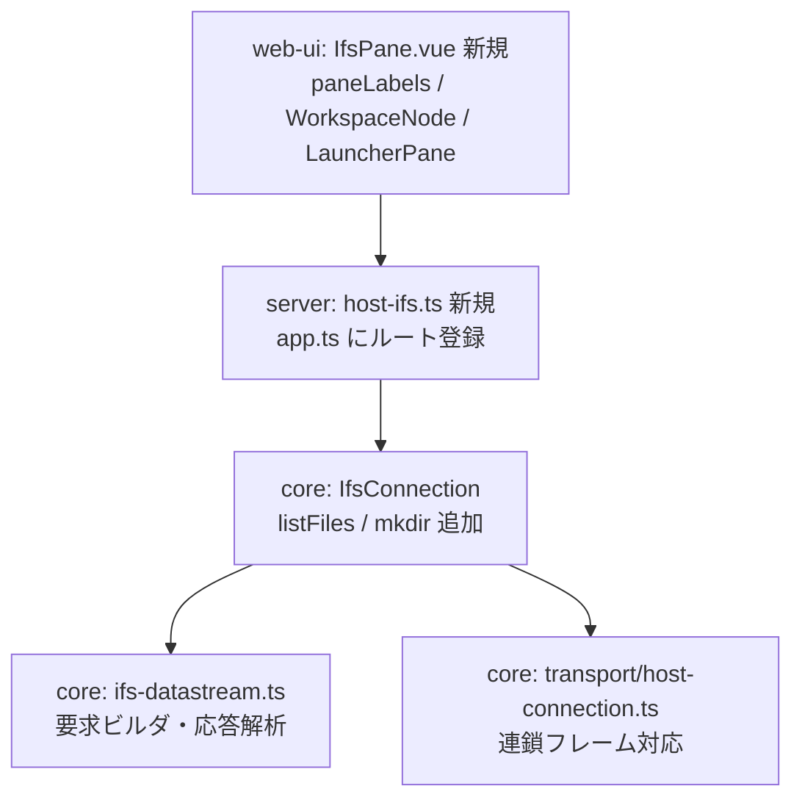

# 調査: IFS ファイルブラウザ

requirement.md の「未確定事項」を実機・原典で潰すための調査。
**推測で埋めた項目は無い。** 原典で確認したもの、実機で測ったもの、まだ不明なものを分けて書く。

## 調査の問い

- Q1: listFiles（要求 ID `0x000A`）の要求・応答レイアウト。特に応答からファイル名を取り出す位置
- Q2: ディレクトリ作成（mkdir）の要求 ID と、今回スコープに含めるかの判断材料
- Q3: ファイルごとの文字コード（CCSID）を取得できるか。取れないなら何を根拠に復号するか
- Q4: 32KB（`DEFAULT_CHUNK`）超の複数ブロック読み書きが実機で成立するか
- Q5: 巨大ディレクトリを列挙したときの実機の振る舞い
- Q6: 追加先（HTTP ルート・Web UI パネル）の既存の作法

---

## F4: 複数ブロックの読み書きは成立する（実機で確認）

**結論: 成立する。requirement の前提は満たされた。**

検証用コマンドを新設した（`tools/hostserver-check/src/ifs.ts`、`npm run ifs -w @as400web/hostserver-check`）。
決定的な擬似乱数バイト列を書き、読み戻して SHA-256 と全バイトを比較する。

実行結果（pub400.com / TLS / `/home/MARO`）:

| サイズ | 結果 | 書き込み | 読み取り |
|---|---|---|---|
| 1,024 | 一致 | 815ms | 780ms |
| 32,767（境界の 1 つ手前） | 一致 | 573ms | 1,574ms |
| 32,768（`DEFAULT_CHUNK` ちょうど） | 一致 | 1,053ms | 1,557ms |
| 32,769（境界の 1 つ先） | 一致 | 1,304ms | 1,289ms |
| 100,000 | 一致 | 1,852ms | 2,327ms |
| 300,000 | 一致 | 3,428ms | 4,699ms |
| 1,000,000 | 一致 | 9,507ms | 17,234ms |
| 4,000,000 | 一致 | 37,560ms | 38,619ms |

これで `.aidev/backlog/hostserver.md:177` の未チェック項目のうち「`DEFAULT_CHUNK` を超える複数ブロック読み書きの検証」が消化できる。

### F4-1: ただしスループットが約 100KB/s しかない（zip 設計の制約）

4MB の読み取りに 38.6 秒。1MB で 17.2 秒。**実効 100KB/s 前後で頭打ち**になっている。
サイズを増やしても改善しないので、固定オーバーヘッドではなく往復あたりの遅延が支配的とみられる
（32KB ごとに 1 往復するため、pub400.com のような遠隔ホストでは RTT がそのまま効く）。

zip 一括ダウンロードは**これに正面から当たる**。10MB のフォルダで約 2 分、50MB で約 8 分かかる計算になる。
上限値と、待ち時間の見せ方（進捗・中断）を spec で決める必要がある。

### F4-2: `readFile` の打ち切り条件は理屈の上では危うい（今回は顕在化せず）

`ifs-connection.ts:124` は `if (data.length < DEFAULT_CHUNK) break;` で読み取りを終える。
サーバーが要求より少ないバイト数を返しただけでも終了するため、途中で短い応答が返る実装だと
**静かに切り詰められる**。今回の 4MB までの検証では顕在化しなかった（末尾以外は常に 32768 が返っている）が、
「短い応答は末尾を意味する」という仮定に依存していることは spec 時に認識しておくべき。

---

## F3: CCSID は取得できるが、我々が書いたファイルのタグは中身と食い違う（実機で確認）

`QSYS2.IFS_OBJECT_STATISTICS` で、オブジェクトごとに `CCSID` / `CODE_PAGE` を取得できる。
実測した `/home` 配下には 37・273・1208 が混在していた。

**重要な食い違い**: `host_write_file` で UTF-8 のテキストを書いたところ、
できたファイルは **CCSID 850** のタグが付いた。

| ファイル | 書いた内容 | 付いたタグ |
|---|---|---|
| `/home/MARO/ifsdemo/hello.txt` | UTF-8 30 バイト | CCSID 850 |
| `/home/MARO/ifsdemo/nihongo.txt` | UTF-8 23 バイト（`日本語テスト@abc\n`） | CCSID 850 |

原因は `writeFile` が `dataCcsid` を渡さず 0（サーバー既定）で開いているため
（`ifs-datastream.ts:111` の `opts.dataCcsid ?? 0`、`ifs-connection.ts:135` は `dataCcsid` を指定していない）。
読み書き自体はバイト列として忠実に往復する（`日本語テスト@abc` がそのまま戻る）が、**タグは中身を説明していない**。

spec への含意:

- **プレビューは UTF-8 決め打ちにできない。** 他ツールが作ったファイルはタグが正しいので、
  EBCDIC 273/1399 のファイルを UTF-8 として復号すれば文字化けする
- 逆に**我々が作ったファイルはタグが嘘**なので、タグだけを信じても正しく読めない
- 書き込み時に適切な `dataCcsid` を指定するか、明示的に「バイト列として扱う」と決めるかの判断が要る

なお、SQL 経由で `PATH_NAME` を取ると `DBCLOB_LOCATOR`（CCSID 1200）で返り、
既存の SQL 層は CCSID 1208 を復号できない（`unsupported CCSID 1208 (supported: 37, 273, 930, 939, 1399, 931, 5035, 5026)`）。
非 ASCII のファイル名を SQL 経由で扱うと欠落しうる。

---

## F5: 巨大ディレクトリは実在する（実機で確認）

| パス | 直下のエントリ数 |
|---|---|
| `/` | 26 |
| `/home` | 265 |
| `/QSYS.LIB` | **21,192** |

`/QSYS.LIB` のカウントだけで約 25 秒かかった。
listFiles は**1 エントリにつき 1 応答フレーム**が返る形式（F1 参照）なので、
ここを無条件に展開すると 2 万フレーム以上を受けることになる。

spec への含意: ツリーは遅延展開必須。要求の「最大取得件数」フィールドで件数を絞り、
続きは Restart ID で取る設計にする。件数上限と、打ち切ったことを利用者に伝える手段が要る。

---

## F2: mkdir / rmdir の要求 ID（原典で確認）

原典: JTOpen `com.ibm.as400.access.IFSCreateDirReq` / `IFSDeleteDirReq`。

- **mkdir = `0x000D`**、テンプレート長 8、全長 `34 + name.length`
- **rmdir = `0x000E`**、テンプレート長 10、全長 `36 + name.length`（offset 28 に 2 バイトの flags が挟まる分ずれる）

**落とし穴**: どちらもディレクトリ名のコードポイントが **`0x0001`** で、
既存の `buildDeleteRequest` が使うファイル名の `0x0002` とは違う。形が似ているのでコピペすると壊れる。

応答はどちらも `IFSReturnCodeRep`（`0x8001`）。rc=0 が成功、4 が既存、9 がディレクトリ非空。
**`0x8001` は必ずしもエラーではない**（mkdir の正常応答も `0x8001` で rc=0）点は、既存の
`replyReturnCode` の使い方（`0x8001` ならエラーとみなす前提）と噛み合わないので注意が要る。

判断材料としては「アップロードをスコープに入れた以上、mkdir が無いと
『親ディレクトリが無いと失敗する』制約がそのまま UI に出る」ため、含める方向が自然。
最終判断は spec に委ねる。

---

## F6: 追加先の既存の作法（コードで確認）

### HTTP ルート

- 束ねている場所は `packages/server/src/app.ts`。`registerHostListRoutes`(105) / `registerHostSqlRoutes`(108) /
  `registerHostUploadRoutes`(112) と並べて登録する。**`app.ts:181` の `app.all("/api/*", … 404)` より前**に置くこと
- 1 ファイル = `registerHostXxxRoutes(app, deps)` の形。リクエストは同ファイル内に zod スキーマ（`.strict()` 必須）、
  `source` は共通の `sourceSchema`（`host-api.ts:20-28`）を埋め込む
- **ホスト API に共通の認可ラッパは無い**。`c.get("user")` を `resolveSource()` に渡すだけで、
  実際の権限は IBM i 側が決めるという方針（`host-lists.ts:4-6`）。`withAudit` は MCP ツール専用
- 接続は単発完結（`try { conn = await openIfs(...) } finally { conn?.close() }`）。`openIfs` は `host-connect.ts:79` に既にある
- エラーは `{ error, code }` + `statusOf(err)`（`host-api.ts:39`）
- **バイナリ応答の前例はスプール PDF**（`app.ts:115-133`）。`new Response(new Uint8Array(pdf), { headers: { "Content-Type": … } })` で、
  ストリーミングせず一括バッファ。`readFile()` も全バイトを返すので同じ形にできる

### Web UI パネル

ペインを 1 つ足すのに **4 箇所**の変更が要る。

1. `paneLabels.ts:11` の `PANE_PREFIXES` に `"ifs:"`
2. `paneLabels.ts:19-28` の `PANE_LABELS` に表示名
3. `WorkspaceNode.vue` の import・`activeIsIfs` computed・`v-else-if` チェーン
4. `LauncherPane.vue:39-49` の `FEATURES` 配列

`web-ui/test/csv.test.ts:79-84` に「全 `PANE_PREFIXES` に `PANE_LABELS` が対応すること」のテストがあり、
1 と 2 の片方だけ直すと落ちる。

その他の作法:

- **共通の fetch ラッパは無い**。素の `fetch("/api/host/...", {...})`。接続先はペインで選ばせず `systemsStore.selected` を使う
- ローディングは `useDelayedLoading()` + `<LoadingBar>`、エラーは `ref("")` に入れて `
`
- ブラウザから core を使うときは **`@as400web/core/browser` サブパス**から import（root だと pino/node:net を巻き込む）

### 既存の PDF 表示は「ダウンロードのみ」

`PrinterPane.vue:148-160` は blob URL を作って `<a download>` で落とすだけで、
**ブラウザ内プレビューは実装されていない**。IFS の PDF プレビューは新規実装になる。
流用できるのは blob URL の作り方まで。現行コードは `click()` 直後に `revokeObjectURL` しているので、
プレビューに転用するなら解放のタイミングを遅らせる必要がある。

### バイナリのアップロード経路

現状 **multipart で送る経路は無い**。`TransferPane.vue` はブラウザ側でパースして JSON で POST している。
IFS 書き込みは base64 を JSON に載せる形が既存 MCP ツール（`host-server-tools.ts:470-486`）と揃う。

### テスト

- サーバー: `packages/server/test/host-lists.test.ts` が `buildApp()` + `app.request()` で入力検証とステータスを固定。
  バイナリは `packages/server/test/app-pdf.test.ts` が `FakeTransport` を使う
- Web UI: `packages/web-ui/test/host-list-pane.test.ts` が `mount` + `flushPromises` + `globalThis.fetch` の差し替え

---

## F1: listFiles のレイアウト（原典 + 実機ダンプで確定）

原典（JTOpen `IFSListAttrsReq` / `IFSListAttrsRep`、jtopenlite `FileConnection`）でレイアウトを得たうえで、
**実機に投げて生バイトをダンプし、目視で確かめた**。spike は `tools/hostserver-check/src/ifs-list.ts`
（`npm run ifs-list -w @as400web/hostserver-check`）。

### F1-1: 要求（テンプレート長 20、全長 `46 + name.length`）

| offset | size | 内容 | 値 |
|---|---|---|---|
| 0-19 | 20 | 共通ヘッダー | templateLen=20, reqRepID=`0x000A` |
| 20 | 2 | 連鎖指示 | 0 |
| 22 | 4 | ファイルハンドル | 0（名前で指定するとき） |
| 26 | 2 | ファイル名 CCSID | 1200 |
| 28 | 4 | 作業ディレクトリハンドル | 1 |
| 32 | 2 | 権限チェック | 0 |
| 34 | 2 | **最大取得件数** | `0xFFFF` = 無制限 |
| 36 | 2 | 属性リストレベル | `0x0101` |
| 38 | 2 | パターン一致 | 1 |
| 40 | 4 | ファイル名 LL | name.length + 6 |
| 44 | 2 | ファイル名 CP | `0x0002` |
| 46 | n | ファイル名 | UTF-16BE |

パスはワイルドカード付きで送る（`/home/MARO/ifsdemo/*`）。既存の `CP_FILENAME` / CCSID 1200 のままでよい。

### F1-2: 応答は 1 エントリ＝1 フレームの連鎖

`/home/MARO/ifsdemo/*` に対して **7 フレーム**が返った:
`.` / `..` / `hello.txt` / `subdir` / `link.txt` / `nihongo.txt` が `0x8005`、最後に `0x8001` で rc=18。

- **`.` と `..` も返る。** 呼び出し側で除外する必要がある
- **終端は連鎖指示では判定できない。** 最後のエントリ（`nihongo.txt`）も連鎖指示が `0x0001` のままで、
  0 に落ちない。**`0x8001` が来たことで終端を判定する**（rc=18 = No more files）。
  原典の説明（連鎖ビットが 0 で終わり）を信じてループを書くと、来ないフレームを待って**ハングする**

### F1-3: 応答フィールド（実測。templateLength = **93**）

全 `0x8005` フレームが offset 16 に `00 5d`（93）を宣言していた。

| offset | size | 内容 | 実測での裏付け |
|---|---|---|---|
| 20 | 2 | 連鎖指示 | エントリは常に `0x0001` |
| 22 | 8 | 作成日時（4 バイト秒 + 4 バイトμ秒） | `6a 5e 1d 2d` = 1784552749 秒。**UNIX エポック**で、ファイル作成時刻と一致 |
| 30 | 8 | 更新日時 | 同形式 |
| 38 | 8 | アクセス日時 | 同形式 |
| 46 | 4 | サイズ（32 ビット） | 8 バイト版（81）を使うので未使用 |
| **50** | **4** | **固定属性** | ファイル `00 00 00 20` / ディレクトリ `00 00 00 10`。**2 バイトで読むと全て 0 になる** |
| 54 | 2 | オブジェクト種別 | ディレクトリ=`0x0002`、ファイル=`0x0001` |
| **73** | 2 | **名前の CCSID（内容ではない）** | 全フレームで `04 b0` = 1200。ファイルの内容 CCSID は 850 だが、`03 52` はフレーム内に一切現れない |
| **77** | 4 | **Restart ID** | フレームごとに 1,2,3,… と増える。継続取得に使える |
| 81 | 8 | サイズ（8 バイト） | `hello.txt`=30、`nihongo.txt`=23、`subdir`=8192。いずれも実際と一致 |
| 91 | 1 | シンボリックリンク | `link.txt` のみ `01`、他は `00` |
| **20 + templateLength** | 4 | ファイル名 LL | =113。`hello.txt` で `00 00 00 18`（24 = 名前 18 + 6） |
| +4 | 2 | ファイル名 CP | =117。`00 02` |
| +6 | LL-6 | ファイル名（UTF-16BE） | =119 から。`119 + 18 = 137` でフレーム長ちょうど |

### F1-4: 今回は `20 + templateLength` が正しい（READ 応答とは違う）

最大の懸念だった点。**listFiles では宣言テンプレート長からファイル名の位置を求めてよい**ことを実測で確認した
（113 に LL、119 に名前。フレーム長と辻褄が合う）。READ 応答（`0x8003`）が固定オフセットを要したのとは事情が違う。

ただし**原典が暗黙に仮定する 92 は誤り**で、実機は 93 を返す。
92 を固定値で埋め込むと LL を 1 バイトずれて読み、名前が空になる。
**宣言値を読んで使うこと。固定値を埋め込まないこと。**

### F1-5: 内容の CCSID は一覧では取れない

offset 73 は名前の CCSID（1200）であり、ファイル内容の CCSID ではない。
これは JTOpen 本体の記述（`NAME_CCSID_OFFSET`）と一致し、jtopenlite が同じ位置を `fileCCSID` として
読んでいるのは**誤り**であることが実測で確認できた。

`IFSFileImplRemote.listDirectoryDetails` にある File Server の制限
（「ファイル名パターンを指定した要求では OA1/OA2 構造体を応答に含められない」）とも整合する。
**内容の CCSID が要るなら 1 ファイルずつ取り直すしかない。**

---

## 影響範囲

**トランスポートまで波及する**のがこの作業の特徴で、requirement 時点では見えていなかった。

---

## 実現性 / リスク

- ~~最大のリスクは応答レイアウト~~ → **実測で解消した**（F1-4）。listFiles では `20 + templateLength` で
  正しく名前に届く。ただし原典が仮定する 92 ではなく実機は 93 を返すため、**宣言値を読むこと**が条件
- **終端判定を間違えるとハングする**（F1-2）。連鎖指示は最後のエントリでも 0 に落ちない。
  `0x8001` の受信で終える必要がある。原典の説明どおりに実装すると来ないフレームを待ち続ける
- **トランスポートの変更が必須**。`HostConnection` は `request()` の 1 往復しか表現できず、
  `host-connection.ts:112-113` は対応する要求の無いフレームを**黙って捨てる**。
  listFiles は連鎖する複数フレームで返るため、ここを直さないと 2 件目以降が消える。
  既存の全ホストサーバー機能（SQL・スプール・コマンド）が同じトランスポートに乗っているため、
  変更は後方互換を保つ形（既存 `request()` の挙動を変えない）で入れる必要がある
- **スループット 100KB/s** が zip とプレビューの体験を規定する（F4-1）
- `traced()`（`frame-trace.ts`）のラッパが新メソッドを素通ししないと、デバッグ経路だけ静かに壊れる

## spec への申し送り

- **一覧は listFiles プロトコルで実装する**（ユーザー判断で確定）。
  `QSYS2.IFS_OBJECT_STATISTICS` を使えば種別・サイズ・CCSID・更新日時・シンボリックリンク先が
  SQL だけで揃い、プロトコル実装を回避できることは実機で確認済みだが、この経路は採らない。
  結果として**トランスポートの連鎖フレーム対応が必須作業として確定する**
- mkdir を含めるかを決めること（F2。含める方向が自然）
- テキストプレビューの復号方針を決めること（F3。タグを信じる／利用者に選ばせる／併用）
- zip の上限（件数・総バイト）と、100KB/s 相当の待ち時間の見せ方を決めること（F4-1）
- ツリーの遅延展開と件数上限、打ち切りの伝え方を決めること（F5）
- `readFile` の「短い応答＝末尾」仮定を残すか、明示的に end-of-file を判定するか（F4-2）
- `0x8001` をエラーとみなす既存の前提は mkdir では成り立たない（F2）
- 一覧から `.` と `..` を除外すること（F1-2）
- テキストプレビューの CCSID は一覧では得られないため、ファイルを開く時点で別途決めること（F1-5）
- 一覧のページングは Restart ID（応答 offset 77）と要求の最大取得件数（offset 34）で行う（F1-3・F5）

### spike で先行して入った変更（coding 工程で引き継ぐ）

research の検証のために以下を実装済み。**未コミット**で、テストは core 659 件が通っている。

- `packages/core/src/transport/host-connection.ts` — `requestStream(frame, onFrame)` を追加。
  `onFrame` がある間は `pending` を消さないので連鎖フレームを受け続ける。既存 `request()` の挙動は不変
- `packages/core/src/hostserver/frame-trace.ts` — `traced()` が `requestStream` を素通しするよう追従
- `packages/core/src/hostserver/ifs/ifs-datastream.ts` — `buildListFilesRequest()` と `REPLY_LIST_ENTRY = 0x8005`
- `packages/core/src/hostserver/ifs/ifs-connection.ts` — spike 用の `rawConnection` getter（**要整理**。
  正式実装では `listFiles()` を生やして生接続を露出しない形にすること）
- `tools/hostserver-check/src/ifs.ts`（複数ブロック検証）と `ifs-list.ts`（一覧ダンプ）

### 実機に残したテスト用データ

`/home/MARO/ifsdemo/` に `hello.txt`（30 バイト・CCSID 850）、`nihongo.txt`（23 バイト・UTF-8 の中身に
CCSID 850 のタグ）、`subdir/`、`link.txt`（`hello.txt` へのシンボリックリンク）を置いた。
ファイル・ディレクトリ・シンボリックリンクが 1 つずつ揃っているので、test 工程でそのまま再利用できる。
