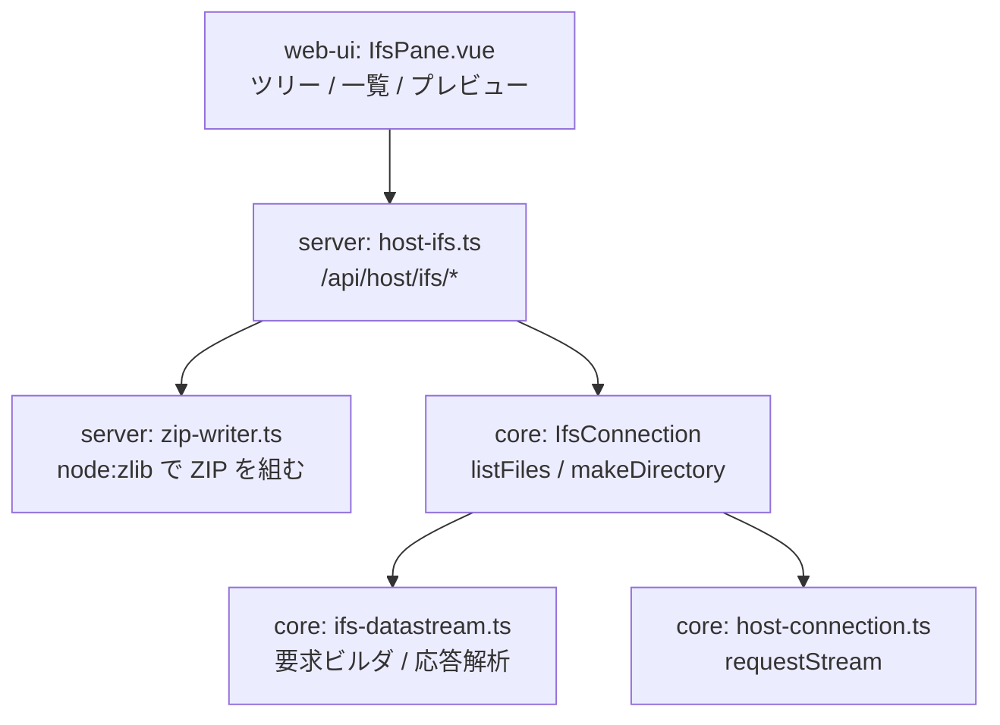
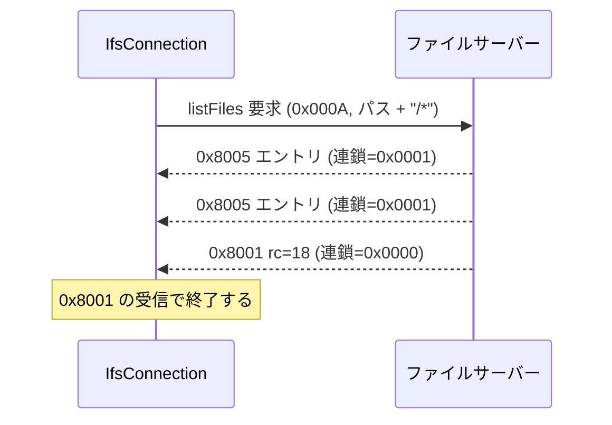

# 仕様: IFS ファイルブラウザ

## 概要

IFS をツリー + ファイル一覧で探索し、プレビュー・ダウンロード・zip 一括取得・アップロード・編集ができる
Web UI パネルを追加する。土台として **listFiles（`0x000A`）と mkdir（`0x000D`）をプロトコル層に実装**し、
連鎖フレーム応答を受けられるようトランスポートを拡張する。

レイアウトは research 工程で**実機ダンプにより確定済み**（`research.md` F1）。本仕様は推測を含まない。

## 設計方針

### 一覧は listFiles プロトコルで実装する（SQL 代替を採らない）

`QSYS2.IFS_OBJECT_STATISTICS` を使えば種別・サイズ・CCSID・更新日時が SQL だけで揃うことは実機で確認したが、
**この経路は採らない**（ユーザー判断）。既存の IFS 機能がすべてファイルサーバー直結で一貫しており、
一覧だけ SQL に逃がすと接続経路が二重になるため。

代償として**トランスポートの連鎖フレーム対応が必須作業になる**ことを受け入れる。

### 層の分担



### spike で入った変更の整理

research の検証で `IfsConnection.rawConnection` を露出させたが、**正式実装では削除する**。
`listFiles()` を `IfsConnection` のメソッドとして生やし、生接続を外に出さない。

## 対象範囲

### core

| ファイル | 変更 |
|---|---|
| `transport/host-connection.ts` | `requestStream(frame, onFrame)` 追加（spike 済み・維持） |
| `hostserver/frame-trace.ts` | `traced()` が `requestStream` を素通し（spike 済み・維持） |
| `hostserver/ifs/ifs-datastream.ts` | `buildListFilesRequest` / `buildCreateDirRequest` / `parseListEntry` を追加 |
| `hostserver/ifs/ifs-connection.ts` | `listFiles()` / `makeDirectory()` を追加、`rawConnection` を**削除** |

### server

| ファイル | 変更 |
|---|---|
| `host-ifs.ts` | **新規**。`/api/host/ifs/*` を登録 |
| `zip-writer.ts` | **新規**。ZIP を組む（後述） |
| `app.ts` | `registerHostIfsRoutes(app, { resolver })` を 112 行付近に追加（`app.all("/api/*", 404)` より前） |
| `main.ts` | `--ifs-zip-max-bytes` / `--ifs-zip-max-files` を `parseArgs` に追加 |

### web-ui

| ファイル | 変更 |
|---|---|
| `components/IfsPane.vue` | **新規** |
| `paneLabels.ts` | `PANE_PREFIXES` に `"ifs:"`、`PANE_LABELS` に `"ifs:files": "IFS"`（**両方必須**。片方だけだと `csv.test.ts:79-84` が落ちる） |
| `components/WorkspaceNode.vue` | import・`activeIsIfs` computed・`v-else-if` チェーン |
| `components/LauncherPane.vue` | `FEATURES` 配列に追加 |

## インターフェース / データ構造

### core: 一覧エントリ

```ts
export interface IfsEntry {
  name: string;
  /** ディレクトリか */
  isDirectory: boolean;
  /** シンボリックリンクか */
  isSymlink: boolean;
  /** バイト数 */
  size: number;
  /** 更新日時（UNIX ミリ秒） */
  modifiedAt: number;
  /** 続きを取得するための ID。最後のエントリのものを次の要求に渡す */
  restartId: number;
}

export interface IfsListResult {
  entries: IfsEntry[];
  /** サーバーが打ち切ったか（まだ続きがある） */
  hasMore: boolean;
}

/** ディレクトリの中身を返す。`.` と `..` は除外する */
listFiles(path: string, opts?: { maxCount?: number; restartId?: number }): Promise<IfsListResult>;

/** ディレクトリを作る。既存なら rc=4 でエラー */
makeDirectory(path: string): Promise<void>;
```

### HTTP API

すべて POST・JSON。`source` は既存の `sourceSchema`（`host-api.ts:20-28`）を埋める。
zod スキーマは `.strict()`。認可は既存のホスト API と揃え、`c.get("user")` を `resolveSource()` に渡すのみ
（実際の権限は IBM i 側が決める）。

| ルート | 要求 | 応答 |
|---|---|---|
| `POST /api/host/ifs/list` | `{ source, path, maxCount?, restartId? }` | `{ entries: IfsEntry[], hasMore }` |
| `POST /api/host/ifs/read` | `{ source, path, encoding: "utf8"\|"base64", ccsid? }` | `{ content, bytes, ccsid, detectedBy }` |
| `POST /api/host/ifs/write` | `{ source, path, content, encoding, create? }` | `{ bytes }` |
| `POST /api/host/ifs/mkdir` | `{ source, path }` | `{ ok: true }` |
| `POST /api/host/ifs/delete` | `{ source, path }` | `{ ok: true }` |
| `POST /api/host/ifs/download` | `{ source, path }` | **バイナリ**（`Content-Type` は拡張子から推定、`Content-Disposition: attachment`） |
| `POST /api/host/ifs/zip` | `{ source, path }` | **バイナリ**（`application/zip`） |

バイナリ応答はスプール PDF（`app.ts:115-133`）に倣い `new Response(new Uint8Array(...), { headers })` で返す。
ストリーミングはしない（`readFile()` が全バイトを返すため、既存の作法と揃う）。

### CLI 引数（既定値）

| 引数 | 既定 | 意味 |
|---|---|---|
| `--ifs-zip-max-bytes` | `20971520`（20MB） | zip に入れる合計バイトの上限 |
| `--ifs-zip-max-files` | `500` | zip に入れるファイル数の上限 |

実測スループット約 100KB/s なので、既定の 20MB は最悪で約 3.5 分に相当する。

## 振る舞いの詳細

### 一覧の取得



- パスは末尾に `/*` を付けて送る（既に `*` を含むならそのまま）
- **終端は `0x8001` の受信で判定する。連鎖指示では判定しない**——最後のエントリでも連鎖指示は `0x0001` のままで
  0 に落ちないため、連鎖ビットを見るループは来ないフレームを待って**ハングする**（実機で確認）
- `0x8001` の rc は 18（No more files）が正常終了。2（File not found）/ 3（Path not found）は
  「存在しない」として扱い、それ以外は `PROTOCOL_ERROR`
- **`.` と `..` は応答に含まれるので除外する**
- `maxCount` を指定した場合、その件数で打ち切られたら `hasMore: true` を返す。
  続きは最後のエントリの `restartId` を次の要求に渡す

### 応答エントリの解析

実測で確定した配置（`research.md` F1-3）。

| 読む位置 | 内容 | 注意 |
|---|---|---|
| offset 30、8 バイト | 更新日時 | 前半 4 バイト = UNIX 秒、後半 4 バイト = マイクロ秒。ミリ秒に直す |
| offset 50、**4 バイト** | 固定属性 | **2 バイトで読むと全て 0 になる** |
| offset 54、2 バイト | オブジェクト種別 | 1=ファイル、2=ディレクトリ |
| offset 77、4 バイト | Restart ID | 継続取得に使う |
| offset 81、8 バイト | サイズ | 4 バイト版（offset 46）ではなくこちらを使う |
| offset 91、1 バイト | シンボリックリンク | 1 なら symlink |
| `20 + templateLength` | ファイル名 LL | **宣言値を読む。実機は 93 で、原典が仮定する 92 は誤り。固定値を埋め込まないこと** |
| `20 + templateLength + 6` | ファイル名 | UTF-16BE、長さは `LL - 6` |

ディレクトリ判定は**種別（54）と固定属性（50）の両方**を見る。
QSYS の LIB/PF が種別 2 で返るため、種別だけでは実態と合わない場合がある
（固定属性の `0x10` ビットを併用する）。

### テキストの復号

内容の CCSID は**一覧では取得できない**（offset 73 は名前の CCSID = 1200 で、
File Server の制限により一覧要求では OA2 構造体が返らない）。よってファイルを開く時点で決める。

決定順:

1. **中身を UTF-8 として解釈できるならそれを採る**（BOM があれば優先）
2. できなければ**ファイルの CCSID タグに従う**
3. 利用者は UI から**手動で文字コードを切り替えられる**

中身の推定を先に置くのは、**我々自身が書いたファイルはタグが実態と違う**ため。
実測では UTF-8 の内容に CCSID 850 のタグが付いた（`writeFile` が `dataCcsid` を渡さずサーバー既定で開くため）。
タグだけを信じると自分で書いたファイルを自分で化けさせる。

応答には `ccsid`（採用した文字コード）と `detectedBy`（`"content"` / `"tag"` / `"manual"`）を載せ、
UI で「何を根拠に復号したか」が見えるようにする。

### プレビューの振り分け

| 種別 | 判定 | 表示 |
|---|---|---|
| テキスト | 拡張子 + 中身にヌルバイトが無いこと | 復号して表示。編集可 |
| PDF | 拡張子 `.pdf` | blob URL を `<iframe>` に流す |
| 画像 | 拡張子 `.png` / `.jpg` / `.jpeg` / `.gif` / `.webp` | blob URL を `` に流す |
| その他 | 上記以外 | プレビューせず、ダウンロードボタンのみ |

blob URL は `PrinterPane.vue:148-160` の作り方を流用するが、**`revokeObjectURL` のタイミングを変える**。
現行はダウンロード用に `click()` 直後で解放しており、そのままプレビューに転用すると表示前に消える。
プレビューでは要素の差し替え時／ペインを閉じる時に解放する。

プレビューは**サイズ上限を設ける**（既定 5MB）。100KB/s では 5MB でも約 50 秒かかるため、
それ以上は「大きすぎるためプレビューしない。ダウンロードしてください」と示す。

### zip 一括ダウンロード

- **サブフォルダを再帰**して集める
- 収集中に上限（`--ifs-zip-max-bytes` / `--ifs-zip-max-files`）を超えたら、**途中まで作って返すのではなく拒否する**。
  応答は 413 で `{ error, code: "TOO_LARGE", files, bytes }` を返し、UI は
  「対象が大きすぎます（N ファイル / M バイト）。フォルダを絞ってください」と実際の値を添えて示す
- zip は `node:zlib` の `deflateRaw` で自前に組む（`zip-writer.ts`）。新規依存を入れない。
  この PJ は 5250 データストリームやホストサーバープロトコルを自前実装しており、ZIP はそれより単純
- **非対応と決めること**: zip64（4GB 超）。上限が既定 20MB であり、
  `--ifs-zip-max-bytes` に 4GB 以上を指定した場合は起動時に弾く
- ファイル名は UTF-8 で入れ、汎用フラグの bit 11 を立てる（非 ASCII のファイル名が化けないように）

### アップロード・編集・削除

- アップロードは **base64 を JSON に載せる**（multipart の経路が既存に無く、MCP ツールの
  `host_write_file` と形が揃う）。ブラウザ側は `<input type="file">` とドラッグ&ドロップの両方を受ける
  （`dnd.ts` の `isFileDrag()` を使い、ペイン分割の操作と競合させない）
- **上書きになる場合は事前に確認する**。一覧に同名が既にあれば「上書きします」と示してから実行する
- テキスト編集は復号に使った文字コードで再符号化して書き戻す
- 削除は確認ダイアログを挟む。ディレクトリの削除は**対象外**（rmdir は実装しない）

### ツリーの遅延展開

- ツリーは**展開されたノードだけ**を取得する。初期表示で全体を舐めない
- 1 回の取得は既定 **1,000 件**で打ち切る（`maxCount`）。打ち切った場合は
  「さらに N 件あります」と示し、利用者の操作で続きを取る（`restartId`）
- `/QSYS.LIB` は直下だけで 21,192 件あることを実測済み。listFiles は 1 エントリ 1 フレームなので、
  無条件展開は 2 万フレームの受信になる。上限は必須

## ドメイン固有の考慮

- **`0x8001` は必ずしもエラーではない**。mkdir の正常応答も `0x8001` で rc=0 として返る。
  既存の `replyReturnCode()` は「`0x8001` ならエラー」という前提で使われているので、
  mkdir では rc を見て 0 を成功として扱う
- **mkdir のコードポイントは `0x0001`** で、ファイル名の `0x0002` とは違う。
  既存の `buildDeleteRequest` と形が似ているため、コピペすると壊れる
- `readFile` の「要求より短い応答＝末尾」という打ち切り条件（`ifs-connection.ts:124`）は**今回は変更しない**。
  4MB までの実機検証で顕在化しておらず、今回のスコープで直す根拠が無いため。
  ただし理屈の上では静かな切り詰めになりうることを `research.md` F4-2 に記録済みで、
  backlog に残す
- ブラウザから core を使う場合は `@as400web/core/browser` サブパスから import する
  （root だと pino / node:net を巻き込む）

## エラー処理 / 異常系

| 状況 | 扱い |
|---|---|
| パスが存在しない（rc=2 / 3） | 404 `{ code: "NOT_FOUND" }` |
| 権限が無い（rc=13） | 403 `{ code: "ACCESS_DENIED" }` |
| mkdir で既存（rc=4） | 409 `{ code: "ALREADY_EXISTS" }` |
| zip が上限超過 | 413 `{ code: "TOO_LARGE", files, bytes }` |
| プレビューがサイズ上限超過 | 413。UI はダウンロードを促す |
| 上流の通信失敗 | 既存の `statusOf()` に従い 502 |
| 入力検証の失敗 | 400 `{ error: <zod の先頭 issue> }` |

接続は既存の作法どおり**単発完結**（`try { conn = await openIfs(...) } finally { conn?.close() }`）。

## 受け入れ基準との対応

| requirement の完了条件 | 満たし方 |
|---|---|
| 実機でディレクトリ一覧が取れ、レイアウトが実測で確定 | **research 工程で完了済み**（`research.md` F1、`ifs-list` で採取） |
| 32KB 超の読み書きが往復し内容が一致 | **research 工程で完了済み**（F4。4MB まで SHA-256 一致） |
| ツリーからファイル一覧を表示できる | `IfsPane.vue` + `/api/host/ifs/list` |
| テキスト・PDF・画像のプレビューが実ブラウザで表示できる | プレビュー振り分け。実ブラウザでの確認を test 工程で行う |
| 非対応形式でダウンロードできる | `/api/host/ifs/download` |
| 再帰 zip をダウンロードし展開して一致 | `/api/host/ifs/zip` + `zip-writer.ts` |
| zip 上限超過で落ちず理由が分かる | 413 + 実際の件数・バイト数を添える |
| アップロードと編集・保存が実機で反映される | `/api/host/ifs/write` |
| 既存の IFS ユニットテストが壊れていない | `ifs-datastream.test.ts` は変更せず、追加分のテストを足す |
| backlog `hostserver.md:177` の消化 | 複数ブロックは検証済み。ディレクトリ操作は本作業で実装。deliver 時にチェックを入れる |

## 未確定事項

- **文字コードの候補集合**。手動切替で何を選ばせるか（UTF-8 / 273 / 1399 / 943 / 5035 …）。
  既存 SQL 層がサポートするのは 37, 273, 930, 939, 1399, 931, 5035, 5026。
  core の変換テーブルが持つ範囲に合わせる必要があり、coding 着手時に確認する
