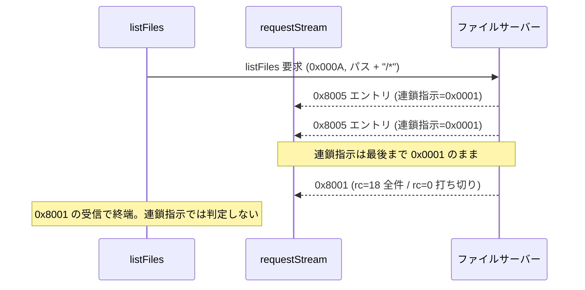
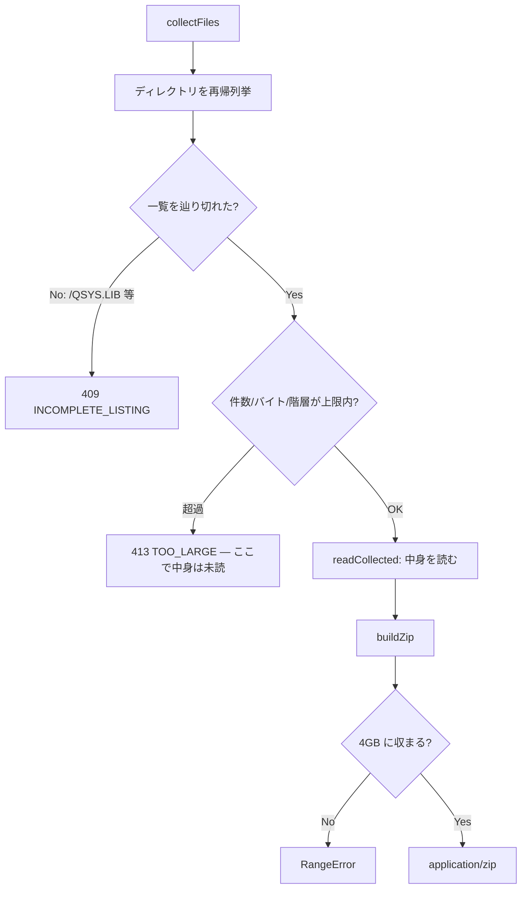

# レビューガイド: IFS ファイルブラウザ

## 変更概要 / 目的

IFS（統合ファイルシステム）を Web UI から探索・閲覧・取得・更新できるようにする。
これまで IFS はファイル単体の read/write が **MCP 専用**で、UI からは一切触れなかった。

3 層・新規 12 ファイル・約 3,000 行（テスト・工程記録込みで 6,500 行）。
コミットは層ごとに 3 本:

| コミット | 層 | 主な内容 |
|---|---|---|
| `7bef799` | core | `listFiles`(0x000A) / `makeDirectory`(0x000D)、連鎖フレーム対応 |
| `9a2914b` | server | `/api/host/ifs/*` 7 ルート、zip 自前実装 |
| `b069378` | web-ui | IFS パネル（ツリー・プレビュー・編集・zip） |

**アクセス経路は SSH ではない。** ホストサーバー QZLSFILE（8473/9473）へ生ソケット直結で、
SQL・スプールと同じ transport / signon を共有する。

## この差分の読み方（最優先）

**すべての非自明な判断は実機（PUB400）で確定させた。** 原典（JTOpen）どおりに書くと壊れる箇所が
複数あり、それらは各 `decisions.md` に「なぜそうしたか」が実測付きで残っている。
コードのコメントも why 中心。**レビューは decisions.md を先に読むと速い。**

## 重要ポイント（特に見てほしい所）

### 1. 応答レイアウトは原典と食い違う（実機で確定）

`packages/core/src/hostserver/ifs/ifs-datastream.ts:420` `parseListEntry`。
[01 decisions D1](01-core-listfiles/decisions.md) と research F1 に実測の hex ダンプ。

- **終端は連鎖指示では判定できない** — 実機では最後のエントリでも連鎖指示が `0x0001` のまま。
  原典どおり「連鎖ビットが 0 で終わり」と書くと**来ないフレームを待ってハングする**。
  `0x8001`(rc=18) の受信で終える（`ifs-connection.ts:209` の `listFiles`）
- **templateLength は実機 93、原典が仮定する 92 は誤り** — 92 を固定値で埋め込むと
  ファイル名の LL を 1 バイトずれて読み、**名前が空になる**。宣言値を読む
- **固定属性は offset 50 の 4 バイト** — 2 バイトで読むと全エントリ 0 でディレクトリ判定が壊れる
- **打ち切りの終端は rc=18 ではなく rc=0** — `maxCount` で切られたときだけ rc=0。件数比較では判定不能

### 2. ページングの罠が 3 層を貫く

[01 D1/D2/D6](01-core-listfiles/decisions.md)。**3 層すべてがこれを吸収している**ことを確認してほしい。

- **`hasMore` が true でも `entries` が空になりうる** — `.` と `..` がサーバーの件数上限を消費するため。
  「空 = 終わり」と解釈するとディレクトリが空に見える
- **`canContinue` を見ないと無限ループ** — `/QSYS.LIB`（直下 21,192 件）は全エントリの
  Restart ID が 0 で返る。無検査で継続すると毎回先頭の数件が返り続ける
- 判定は純粋関数に切り出し（`ifs-datastream.ts:328` `canRestartFrom`）、単調増加で守る

### 3. zip は自前実装・上限は「読む前」・部分 zip を返さない

`packages/server/src/zip-writer.ts`（`node:zlib`、依存を増やさない）と `ifs-collect.ts`。
[02 D3/D4/D6](02-server-api/decisions.md)。

- **上限は一覧のメタデータで判定し、中身を 1 バイトも読まずに拒否**（`ifs-collect.ts` の `collectFiles`）。
  実効 100KB/s なので、500MB を読み切ってから断ると 80 分待たせる
- **一覧を辿り切れない場所では zip を作らない**（409 `INCOMPLETE_LISTING`）。
  欠けに気づけないアーカイブは失敗より悪い
- **zip64 非対応** — オフセットが 32 ビットに収まらないなら `buildZip` が落とす（黙って巻き戻さない）。
  bit 11 を立てて UTF-8 名に対応
- **検証は外部ツール**（`unzip` / Python `zipfile`）で行う。自前パーサで読み返しても、
  同じ誤解で書いて同じ誤解で読めば一致してしまう

### 4. エラーコードが 3 層を往復する

`fileFailure`（`ifs-datastream.ts:381`）→ `statusOf`（`server/host-api.ts`）→
`messageFor`（`web-ui/ifsApi.ts`）。[02 D1](02-server-api/decisions.md) / [03 D12](03-web-ui/decisions.md)。

```
rc=2/3   → NOT_FOUND      → 404 → 「対象が見つかりません」
rc=13    → ACCESS_DENIED  → 403 → 「権限がありません」
rc=4     → ALREADY_EXISTS → 409 → 「同じ名前のものが既にあります」
rc=1/32/33 → RESOURCE_BUSY → 409 → 「時間をおいて再試行してください」
```

**まとめて `PROTOCOL_ERROR` にしない**のが肝 — 502 に落ちると「ホストが落ちている」と
「指定が間違っている」を利用者が区別できない。統合テストで `NOT_FOUND`/`ACCESS_DENIED` の
日本語化漏れ（英語生文言が出る）が見つかり、`messageFor` に集約して直した（D12）。

### 5. 復号できないテキストはエラーではなく案内

`/read` は UTF-8 で読めなければ **200 で `content: null`**（`code: "UNSUPPORTED_ENCODING"`）。
[02 D12](02-server-api/decisions.md)。IFS のテキストは EBCDIC が普通なので、
非 fatal な `TextDecoder` で U+FFFD の羅列を返すと、それを編集して書き戻して**元ファイルを壊す**。
UI は「失敗」ではなく「文字コード未対応・ダウンロードを」と見せる。

## 処理フロー

### listFiles の連鎖フレーム応答

`request()` は 1 往復しか表現できないので、`requestStream`（`transport/host-connection.ts:42`）を足した。



**途中で解析に失敗したら接続を破棄する**（残りのフレームが次の要求の応答として読まれるのを防ぐ）。
トランスポート側でも `desynced` フラグで二重に守る。

### zip の再帰収集と上限判定



## 主要な変更箇所

| ファイル | 要点 |
|---|---|
| `core/.../ifs-datastream.ts:420` | `parseListEntry`。実機 hex に基づく offset。**92 でなく宣言 templateLength** |
| `core/.../ifs-connection.ts:209` | `listFiles`。終端は `0x8001`、`.`/`..` 除外、失敗時に接続破棄 |
| `core/.../transport/host-connection.ts:205` | `requestStream`。連鎖応答＋`desynced` ガード |
| `core/.../ifs-datastream.ts:381` | `fileFailure`。rc → 区別できる `As400Error` |
| `server/.../ifs-collect.ts` | 再帰収集・**読む前の上限判定**・部分 zip の拒否 |
| `server/.../zip-writer.ts` | 自前 ZIP。zip64 非対応・4GB 防波堤・bit 11 |
| `server/.../host-ifs.ts` | 7 ルート。接続は単発完結。バイナリは一括返却 |
| `web-ui/.../ifsApi.ts:messageFor` | エラーコード → 日本語。**対処可能な全コードを網羅**（テストで固定） |
| `web-ui/.../useIfsTree.ts` | ページングの罠を吸収。`blocked` で無限ループを防ぐ |
| `web-ui/.../IfsPane.vue` | ツリー＋一覧＋プレビュー。編集は UTF-8 のみ（二重防御） |

## この課題の特徴: 検証で揉んだ

**実装より検証で揉んだ。** 3 subtask で計 9 ラウンドの差し戻し。レビュアが同種のコードを
見るときの参考に、繰り返し出た 2 つの失敗パターンを挙げておく。

- **テストが本体を通っていない（5 回）** — 判定式をテストにコピー / 偽物が契約に寄りかかって
  ガードを実行しない / ハンドラ本体を 1 行も通さない。毎回「緑」だった。
  **変異させて初めて分かる**。この差分のテストは主要な分岐を変異で確認済み
- **修正が新たな欠陥を生む（6 回）** — 応答 ID を類推して書き込み全滅 / パス正規化の特別扱いを
  分けて 1 文字欠落 / `input.value` で FileList が空に。**指摘が正しいことと直し方が正しいことは別**

効いた仕組み: **外部ツール検証**（ZIP を `unzip`/`zipfile` に通す）、
**実ブラウザ検証**（画像は `naturalWidth` で実描画を、編集は保存→読み戻しを確認。jsdom では取れない）、
**第三者レビュー**（3 subtask すべてで自分では気づけない欠陥を検出）。

## リスク / 確認してほしい点

### 未実装（backlog 送り・各 decisions に理由）

- **CCSID の決定表**（[02 D7](02-server-api/decisions.md)）。
  現状 UTF-8 で読めないテキストは「文字コード未対応」の案内。
  **実機の日本語テキスト（EBCDIC）の多くはこの状態**。編集も UTF-8 に限る
- **プレビューのサイズ上限・ヌルバイト判定**（[03 D11](03-web-ui/decisions.md)）。
  サーバーの `readMaxBytes` が最後の砦
- **ディレクトリ削除（rmdir）** — 一覧・作成は実装、削除は対象外
- 上限「値」の UI 表示 — 超過した実測値は出るが、上限 20MB/5MB そのものは非表示

### 判断を仰ぎたい点

- **エラーコードの網羅はテストで固定した**が、server に新しい code を足したら
  `web-ui/ifsApi.ts` の `KNOWN_ERROR_CODES` にも足す必要がある（テストが落ちて気づける）
- **CLI 引数**を 4 つ追加（`--ifs-zip-max-bytes`/`-files`/`-dirs`/`--ifs-read-max-bytes`）。
  README への追記は未（backlog）
- **実機検証は PUB400 単一ホスト**。他の IBM i / 別 CCSID 環境は未確認
