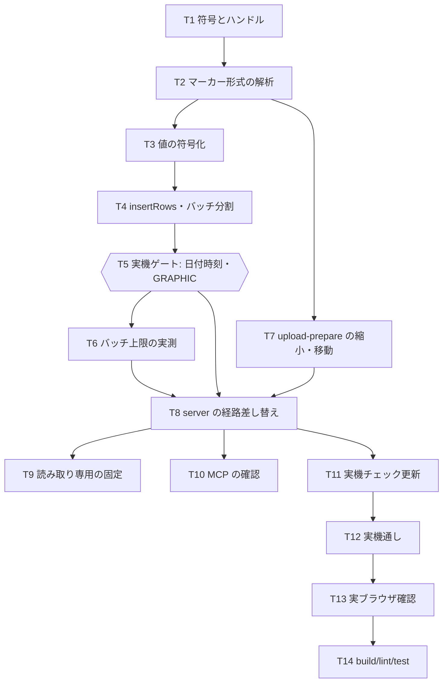

# 計画: 取り込みを SQL INSERT（パラメータマーカー）経路へ

## split 判定（protocol §2.8）

**分割しない**（単一 `tasks.md`）。

判定の discriminator「そのピースは単独で検証・デリバリ可能か」を当てると:

- 変更の中心は **core の 3 モジュール**（形式解析・値の符号化・実行）で、
  互いに型を通じて連動する。単独でデリバリできる層は無い＝**高結合**。
- 前作業（PR #104）より**小さい**。web-ui は**変更なし**、server は実行経路の差し替えのみ。
- **手順・データ構造がスパイクで確定済み**なので、漸進レビューで得られるものが少ない。

→ 「不可分」に該当。前作業と同じく単一 `tasks.md` で進める。

## 実装方針

**スパイクで通した順序をそのまま作業順にする。** 下から積み上げ、各段で実機と突き合わせる。

要点は 3 つ。

1. **形式解析 → 値の符号化 → 実行**の順に作る。上の段は下の段の型に乗る。
2. **spec の「残る不確実性」を早い段階で潰す**。とくに**日付時刻・`GRAPHIC` の詰め方は未検証**で、
   ここが崩れると「型は全部」という要件が揺らぐ。**T5 をゲートにする**。
3. **実ブラウザ確認を仕上げに必ず入れる**（T13）。前作業でこれを怠り、
   テストが通るのにブラウザで動かないバグをレビューまで見逃した。

## 作業順序と依存関係

1. **T1〜T4**（core の骨格）依存: 順に
2. **T5 実機ゲート** 依存: T4 — **未検証の型の詰め方をここで確かめる**。崩れたら spec へ差し戻す
3. **T6**（上限の実測）依存: T5
4. **T7**（`upload-prepare` 縮小）依存: T2 — T1〜T6 と並行可
5. **T8〜T11**（server / tools）依存: T5, T6, T7
6. **T12〜T14**（仕上げ）依存: 順に

## リスク / 留意点

| リスク | 度合い | 対応 |
|---|---|---|
| **日付時刻・`GRAPHIC` の詰め方が違う** | 中 | T5 をゲートにし、server 以降より前に潰す |
| 1 バッチの上限が想定より小さい | 小 | T6 で実測。保守的な既定から始める |
| 準備〜実行の間に別の SQL が割り込む | 中 | `insertRows` に 3 段を閉じ込める（spec D1）。**構造で防ぐ** |
| プール占有で SQL ペインと競合 | 小 | 取り込み中は接続を占有する。必要なら別接続になるだけ |
| 失敗が沈黙する | 中 | 診断ビットを常時立てる（spec D5）。**スパイクで実際に踏んだ** |
| DDM 経路の削除で既存が壊れる | 小 | **DDM は消さない**（requirement の対象外） |

## テスト方針

**単体（実機不要・ここで大半を固める）**

- `marker-format`: 0x3813 の解析。列数・行サイズ・型・長さ・位取り・CCSID・オフセットの累積。
  スパイクで実際に受け取ったバイト列を**固定データとしてテストに入れる**（回帰資産）。
- `marker-encode`: 型ごとの詰め方。`INTEGER`/`SMALLINT`/`BIGINT`（BE・境界値）・
  `CHAR`（空白詰め・CCSID 別）・`VARCHAR`（2 バイト長）・`DECIMAL`/`NUMERIC`（既存の再利用）・
  **未対応型の拒否**・NULL 指標（0xFFFF）・ヘッダーの各欄。
- `buildMarkerData`: 複数行の並び（指標が行ごとに列数ぶん並ぶこと）・総長の計算。
- `insertRows` のバッチ分割: 上限からの件数計算・境界・`uncertainRange` の算出。
- `upload-prepare`（縮小後）: 列突き合わせ・NULL 検査・行番号が 1 始まり・**まとめて返す**。
- server: 認証オフ / admin / 一般ユーザーの 3 パターン（AGENTS.md）・行数上限・
  **`/api/host/sql` が更新系を実行できないこと**。

**実機（PUB400・単体の代替にしない）**

- T5: `DATE` / `TIME` / `TIMESTAMP` / `GRAPHIC` を含む表への 1 行 INSERT → SQL で読み返して一致。
- T6: バッチ上限（行数を増やして限界を測り、定数の根拠にする）。
- T12 通し: 日本語（CCSID 5035）・NULL・`VARCHAR`（引用符入り）・100 行の性能。
  **前作業の 11.6 秒と比較して記録する**。
- T12: 未対応型・NULL 不可列への NULL が**1 行も書かずに**拒否されること。

**実ブラウザ（T13）**

- データ転送ペインで CSV を取り込み、日本語が入ることを目視。
- 拒否・部分完了の表示。ファイル D&D。取得側の CSV 保存。
- **これを飛ばさない**——前作業の最大の反省。
