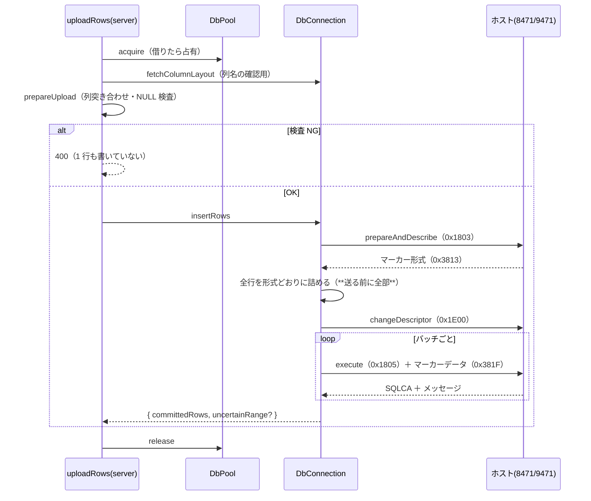

# 仕様: 取り込みを SQL INSERT（パラメータマーカー）経路へ

## 概要

取り込みの実行経路を DDM から **database サーバーのパラメータマーカー付き INSERT** に移す。
手順・データ構造・性能は research のスパイクで**実機実証済み**（F12〜F15）なので、
本仕様は「実証したものをどう製品コードに収めるか」に絞る。

前作業（DDM）との違いは、**こちらが型を計算しない**こと。
サーバーが `prepareAndDescribe` の応答でマーカー形式（型・長さ・位取り・CCSID）を教えるので、
実装はその形式どおりに値を詰めるだけになる。

## 設計方針

### D1: 3 段の手順をそのまま関数に写す

```
prepareAndDescribe(0x1803) → changeDescriptor(0x1E00) → execute(0x1805)
```

この 3 段は**分けられない 1 つの操作**として扱う（F15: 間に別の SQL を挟むと
同じ RPB の文が上書きされて `Prepared statement not found` になる）。

→ `insertRows(conn, table, columns, rows)` という**1 つの関数の中で 3 段を完結**させる。
途中で他の SQL を呼べる形（3 つの公開関数に分ける等）にしない。**構造で誤用を防ぐ**。

**退けた案**: `prepare()` / `execute()` を別々に公開して呼び出し側が組み立てる。
柔軟だが、F15 の制約をコメントでしか守れない。

### D2: 値の詰め方は「形式が返す型」に対してだけ実装する

`Column.java`（3,464 行）相当は要らない。必要なのは**サーバーが返した型に対する詰め方**のみ。

| SQL 型 | 形式の長さ | 詰め方 |
|---|---|---|
| `SMALLINT`(500/501) / `INTEGER`(496/497) / `BIGINT` | 2 / 4 / 8 | ビッグエンディアン |
| `CHAR`(452/453) | 宣言長 | 対象 CCSID で符号化 → **0x40 で右詰め** |
| `VARCHAR`(448/449) | 宣言長 + 2 | **2 バイト長 ＋ 本体** |
| `DECIMAL` / `NUMERIC` | 形式どおり | 既存 `encodePacked` / `encodeZoned` を再利用 |
| `DATE` / `TIME` / `TIMESTAMP` | 形式どおり | **文字列としてそのまま**（ホストが解釈する） |
| `GRAPHIC` / `VARGRAPHIC` | 形式どおり | 対象 CCSID（純 DBCS）で符号化 |

**未対応の型に当たったら、値を詰めずに拒否する**（列名と型番号を添えて）。
黙って 0 埋めしない——前作業から一貫した方針。

### D3: NULL は指標で表す。**値の側は触らない**

指標 `0xFFFF` が NULL。NULL の列はデータ領域を初期値のままにする
（サーバーは指標を見るので中身を見ない）。

### D4: バッチはヘッダーの行数を増やすだけ

`BLOCKED INSERT`（種別 7）も ブロック指示子（`0x3814`）も**使わない**（実証で不要と判明）。

1 バッチの行数は **マーカーデータの総バイト長**から決める:

```
総長 = 20 + N × 列数 × 2 + N × 行サイズ
```

上限は未実測なので、**保守的な既定（例 1MB 相当）から始め、実機で詰める**。
DDM の LL 上限と同じ考え方だが、こちらは 4 バイト長なので余裕がある見込み。

### D5: 診断ビットを常時立てる

`ORS.messageId | ORS.firstLevelText` を実行要求に**常に**含める。
立てないと失敗が空の SQLCA だけになり、原因が分からない（F12 で 3 回空振りした）。
返ってきたメッセージ（例 `S0043`）は例外メッセージに載せる。

### D6: 接続はプールから借り、借りている間は占有する

`/api/host/sql` と同じ `DbPool` を使う（research F6）。
ただし D1 の制約があるため、**借りている間に他の SQL を流さない**。

### D7: `prepareUpload` を縮小し、DDM 依存から切り離す

現在の `hostserver/ddm/upload-prepare.ts` から**型・CCSID・バイト長の検査を外す**
（サーバーが型を教え、詰め方も形式に従うため事前に判定できない・する必要がない）。

残すのは:

- 列名の突き合わせ（CSV ヘッダー ⇄ 表の列）
- NULL を受け付けない列への NULL 検査
- **行番号つきの拒否**（前作業の振る舞いを維持）

置き場所を `hostserver/ddm/` から `hostserver/db/` 側へ移す。

**値の妥当性（数値として解釈できるか等）は詰める段で分かる**ので、
`prepareUpload` では見ない。ただし **1 行も書かずに中止する**保証は維持する
（＝全行を詰め終えてから送る。design DD2 と同じ構造）。

## 対象範囲

| 層 | ファイル | 変更 |
|---|---|---|
| core | `db/db-datastream.ts` | `changeDescriptor`(0x1E00) 等の符号追加 |
| core | `db/db-connection.ts` | `parameterMarkerHandle`（**スパイクで追加済み**） |
| core | `db/insert.ts` | **新規**。3 段を完結させる `insertRows` |
| core | `db/marker-encode.ts` | **新規**。形式に従って値をバイト列に詰める |
| core | `db/marker-format.ts` | **新規**（または既存パーサーの一般化）。0x3813 の解析 |
| core | `upload-prepare.ts` | 縮小して `ddm/` から移動 |
| core | `index.ts` | 公開の入れ替え |
| server | `host-upload.ts` | 実行経路の差し替え（**API の形は変えない**） |
| web-ui | — | **変更なし**（応答の形が同じなら） |
| tools | `hostserver-check/src/upload.ts` | 新経路での実機チェックに更新 |

**DDM 実装は残す**（requirement の対象外）。`ddm/` はそのまま。

## インターフェース / データ構造

```ts
// core/hostserver/db/insert.ts
export interface InsertResult {
  /** 書き込みが確定した行数 */
  committedRows: number;
  /** 失敗したバッチの範囲（1 始まり）。成功時は付かない */
  uncertainRange?: { from: number; to: number };
  error?: string;
  /** 1 バッチに詰めた行数 */
  batchSize: number;
}

/**
 * 表に行を追加する。**準備〜実行を 1 つの操作として完結させる**（F15）。
 * 呼び出し側はこの間 conn に他の SQL を流してはならない。
 */
export async function insertRows(
  conn: DbConnection,
  args: {
    library: string;
    table: string;
    /** 挿入する列名（宣言順である必要はない） */
    columns: readonly string[];
    /** 値。列数ぶんの文字列 or null */
    rows: readonly (readonly (string | null)[])[];
    maxBatchBytes?: number;
  }
): Promise<InsertResult>;

// core/hostserver/db/marker-format.ts
export interface MarkerField {
  sqlType: number;
  /** マーカーデータ内でこの列が占めるバイト数 */
  length: number;
  scale: number;
  precision: number;
  ccsid: number;
  /** 行バッファ内の開始位置（length の累積） */
  offset: number;
}
export interface MarkerFormat { fields: MarkerField[]; rowSize: number }
export function parseMarkerFormat(value: Uint8Array): MarkerFormat;

// core/hostserver/db/marker-encode.ts
/** 1 行を形式どおりに詰める。未対応の型は例外 */
export function encodeMarkerRow(
  format: MarkerFormat,
  values: readonly (string | null)[]
): { data: Uint8Array; nulls: boolean[] };

/** N 行ぶんのマーカーデータ（20 バイトヘッダー ＋ 指標 ＋ データ） */
export function buildMarkerData(
  format: MarkerFormat,
  rows: readonly { data: Uint8Array; nulls: boolean[] }[]
): Uint8Array;
```

## 振る舞いの詳細



### INSERT 文の組み立て

```sql
INSERT INTO <lib>.<table> (<col1>, <col2>, …) VALUES (?, ?, …)
```

- 表名・ライブラリ名は `assertIdentifier` を通す（既存）。
- **列名も検証する**。`SYSCOLUMNS` から取った実際の列名だけを使い、
  CSV のヘッダー文字列をそのまま埋め込まない（大文字化して突き合わせ、一致した実列名を使う）。
- 値はすべてマーカー（`?`）。**リテラルは一切埋め込まない**。

### 部分失敗

DDM と同じ扱いを維持する。バッチ単位で失敗したとき、そのバッチの何行目までが確定したかは
**応答から特定できない**ので、`committedRows`（確定した下限）と `uncertainRange`（不明な範囲）を返す。

> commit 制御は requirement の対象外。将来入れるなら `commit`(0x1807) が使えるが、
> UI の「部分完了」表示ごと設計し直しになる。

## エラー処理 / 異常系

| 事象 | 扱い | HTTP |
|---|---|---|
| 列名の不一致 | 1 行も書かずに拒否（列名を添えて） | 400 |
| NULL 不可の列に NULL | 同上（行番号・列名） | 400 |
| 未対応の SQL 型 | 同上（列名・型番号）。`UNSUPPORTED_TYPE` | 400 |
| 値が詰められない（数値でない等） | 同上（行番号・列名） | 400 |
| `S0043` 等のサーバー拒否 | メッセージを添えて 502 | 502 |
| バッチ途中の失敗 | `committedRows` / `uncertainRange` を返す | 200 |

**診断ビットで得たメッセージ（`0x3801` メッセージ ID・`0x3802` 本文）を必ず添える**（D5）。

## ドメイン固有の考慮

- **AGENTS.md「原典を直読してから設計する」**: 済（research F12〜F13）。
  実装には出典（`DatabaseConnection` / `JDBCPreparedStatement` のメソッド名）を参照コメントで明示し、
  **逐語移植しない**（IPL 1.0）。
- **AGENTS.md「実機検証を単体テストの代替にしない」**: 形式の解析・値の詰め方・バッチ分割は
  **単体テストで固める**。実機は往復の確認に使う。
- **`/api/host/sql` は読み取り専用のまま**。新経路は別関数・別要求コードで、`query` に触れない。
- **AGENTS.md「認可はサーバーで担保する」**: 既存の `resolveSource` を通す形を維持。

## 受け入れ基準との対応

| requirement の完了条件 | 満たし方 |
|---|---|
| CSV から追加され SQL で読み返して一致 | 実機（スパイクで実証済みの経路） |
| **日本語** | 実機。CCSID 5035 の列（スパイクで実証済み） |
| **DDM で対象外だった型すべて** | `VARCHAR` は実証済み。日付時刻・`GRAPHIC` は D2 の詰め方＋実機で確認 |
| リテラル連結をしない | マーカー方式。`quote'test` が素通りすることを実機で確認済み |
| 1 行も書かずに拒否 | `prepareUpload` ＋ 全行を詰め終えてから送る構造 |
| 100 行が DDM（11.6 秒）を下回る | 実証済み **288ms** |
| MCP から同じ取り込み | `uploadRows` の実行経路差し替えのみ（入口は変えない） |
| `/api/host/sql` が読み取り専用のまま | テストで固定 |
| 実ブラウザで操作確認 | **deliver 前に必ず行う**（前作業の反省） |

## 残る不確実性

- **1 バッチの上限**（マーカーデータ長）。未実測。保守的な既定から始めて実機で詰める。
- **日付時刻・`GRAPHIC` の詰め方**。D2 は「文字列そのまま」「純 DBCS 符号化」と置いたが**未検証**。
  coding の早い段階で実機確認する（前作業の反省として、後回しにしない）。
- **プール占有の影響**。取り込み中はその接続で他の SQL を流せない。
  同時に SQL ペインを使うと接続が増える可能性がある。
