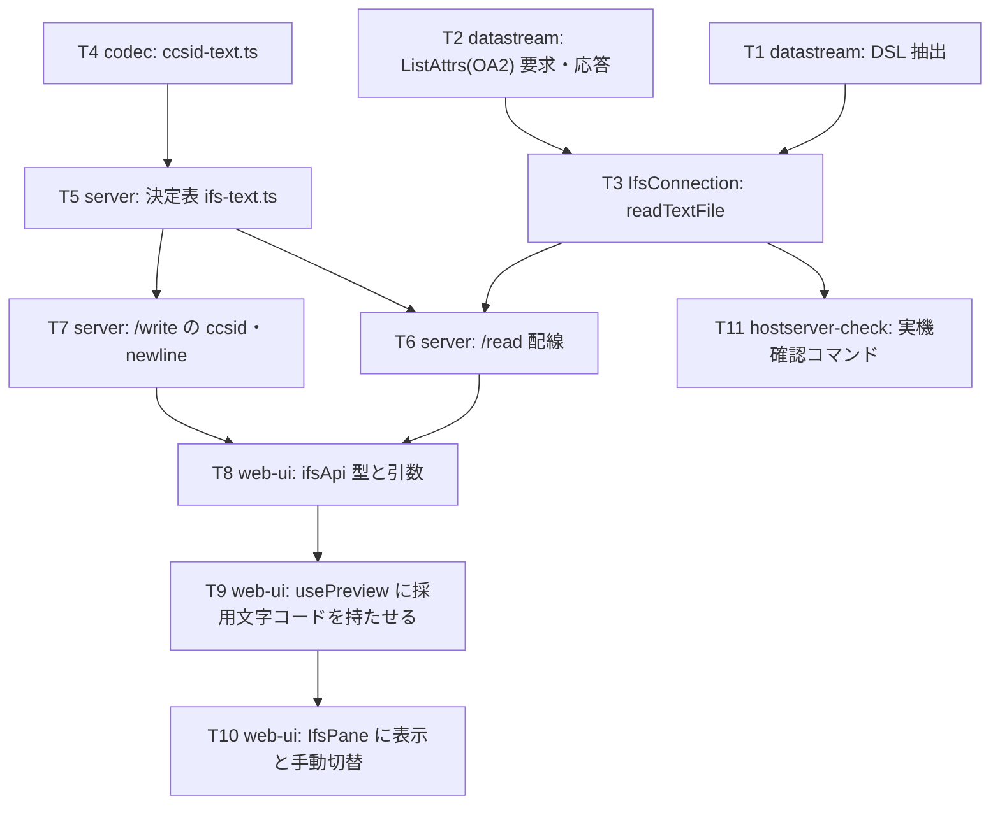

# 計画: IFS テキストの CCSID 決定表

## 実装方針

**下から上へ積む**——プロトコル層（実測済みのレイアウト）→ 接続層 → codec → 決定表 → HTTP → UI。
各段は 1 つ下の段だけに依存し、それぞれ単体テストで閉じられる。

- **プロトコル層（core datastream）**が最初。研究で捕えた実物のバイト列（OA2 応答 194 バイト・
  交換属性応答 38 バイト）をそのままテストの入力にできるので、**実機なしで固定できる**
- **codec の入口**（`ccsid-text.ts`）はプロトコルと独立なので、並行して進めてよい
- **決定表**（server `ifs-text.ts`）は純関数。バイト列・タグ・手動指定の組み合わせを網羅テストする
- **HTTP と UI** は最後。ここまでで振る舞いは固まっているので、配線と表示に集中できる
- 実機確認は test 工程でまとめて行う（`tools/hostserver-check` に検証コマンドを 1 つ足す）

## 作業順序と依存関係

1. T1・T2（core datastream）: 依存なし。research の実測バイト列でテストする
2. T3（IfsConnection）: 依存 T1・T2
3. T4（codec の入口）: 依存なし（T1〜T3 と並行可）
4. T5（決定表の純関数）: 依存 T4
5. T6・T7（HTTP）: 依存 T3・T5
6. T8〜T10（web-ui）: 依存 T6・T7
7. T11（実機確認コマンド）: 依存 T3。test 工程で使う

## リスク / 留意点

- **DSL 依存のオフセット**（126 / 142 / 134）を決め打ちにしない。PUB400 は要求 8 に対し 24 を返した。
  テストで 3 分岐すべてを覆う
- **`requestStream()` を使わない**。ハンドル指定の応答に終端フレームは来ない（実測でタイムアウト）。
  ここを間違えると 20 秒固まる形で出るので、テストにも「1 フレームで完結する」ことを書き残す
- **`parseListEntry` を流用しない**（テンプレート長 8 と 93 の違い）
- **既存経路を壊さない**。`readFile` / zip / download は無変更で通ること。`/read` の `base64` 要求は
  OA2 を引かない（往復を増やさない）
- **行末の正規化は EBCDIC 系のみ**。UTF-8 の本文にある U+0085 を改行に変えてしまうと静かにデータが変わる
- **web-ui のビルドは `vue-tsc` を通す**（AGENTS.md）。テストはパッケージ dir から実行する

## テスト方針

- **core（vitest）**: 実測バイト列を固定値として持ち、OA2 から 850 が取れること・DSL ごとにオフセットが
  変わること・OA2 が無い応答で `undefined` になること。`readTextFile` はモック接続で
  「open → ListAttrs → read → close」の順序と、OA2 失敗時も読み取りが続くことを確認する
- **codec（vitest）**: 対応表の各 CCSID で往復（EBCDIC 3 種・UTF-8・ISO-8859-1・UTF-16・Shift_JIS）、
  未対応 CCSID で例外、行末 0x15/0x25 の判定と復元
- **server（vitest）**: 決定表の分岐を網羅（手動 / BOM / UTF-8 / タグ / どれも不可）。
  「UTF-8 の内容に 850 タグ」が①で読まれること、EBCDIC が①を素通りして②で読まれること
- **web-ui（vitest, パッケージ dir から）**: 採用文字コードの表示、手動切替で `ccsid` 付き再読み込み、
  保存時に `ccsid`/`newline` が送られること、`UNSUPPORTED_ENCODING` でも選択 UI が出ること
- **実機（test 工程・手動）**: PUB400 で EBCDIC ファイルを作り、Web UI で読めること・編集して保存して
  往復すること。`/home/MARO`（819）と `/tmp`（1208）が従来どおり読めること（退行がないこと）
