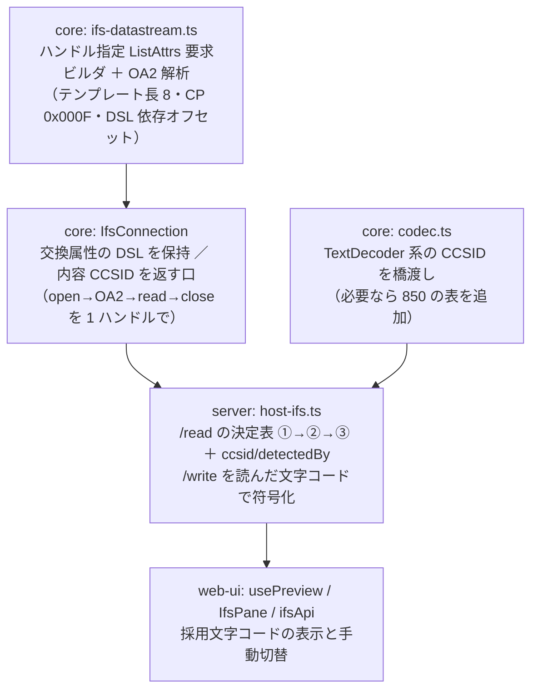

# 調査: IFS テキストの CCSID をどう特定し、どう復号するか

## 調査の問い

- Q1: File Server の ListAttrs で **OA2 構造体を返させてファイル内容の CCSID タグを取れるか**
  （JTOpen 原典を直読し、実機 PUB400 で検証する）
- Q2: 取れない場合の代替として、SQL `QSYS2.IFS_OBJECT_STATISTICS` 経路は実用に足るか
- Q3: 実機の IFS に実在する CCSID の分布と、`codecForCcsid` 未対応分（819 / 1208 / 850 / 943 系）の復号手段
- Q4: 出力先仕様——現行の `/api/host/ifs/read` 応答・UI の受け口・保存経路は何を前提にしているか

**結論を先に**: Q1 は**取れる**（原典どおり・実機で確認）。よって Q2 の SQL 経路は不要。

---

## 判明した事実

### F1: OA 構造体は「ハンドル指定」の ListAttrs でしか返らない（原典）

JTOpen `IFSFileDescriptorImplRemote.listObjAttrs()` に設計メモがある:

> Design note: In order to get an OA* structure back in the "List File Attributes" reply,
> we must specify the file by handle rather than by name.

つまり **open してハンドルを得てから ListAttrs(0x000A) を送る**。要求の形（`IFSListAttrsReq(handle, attrsType, …)`）:

| offset | 値 | 備考 |
|---|---|---|
| 0-19 | ヘッダー（全長 40・テンプレート長 20・要求 ID `0x000A`） | 可変部なし（OA2 の場合） |
| 20 | 連鎖指示 = 0 | |
| 22 | **ファイルハンドル** | 名前は送らない |
| 26 | 名前 CCSID | ハンドル指定では未設定（0） |
| 28 | 作業ディレクトリハンドル = 1 | |
| 32 | 権限チェック = 0（`NO_AUTHORITY_REQUIRED`） | |
| 34 | 最大件数 = 0xffff | |
| 36 | **属性リストレベル = 0x44** | 「OA2 を返す ＋ 開いたインスタンスを使う」 |
| 38 | パターン一致 = 0（POSIX） | |

`0x42` = OA1、`0x46` = OA12、`0x01` = OA なし。OA1 系だけ可変部に 14 バイトの Flags（LL=14 / CP=0x0010）が付く。

応答（`IFSListAttrsRep`）側の読み方:

- 可変部（`20 + 宣言テンプレート長`）から LL/CP を辿り、**CP = 0x000F の塊が OA2**（OA1 は 0x0010）
- OA2 本体は LL/CP の 6 バイトを除いた部分。**CCSID の位置はデータストリームレベルで変わる**
  （`IFSObjAttrs2.determineCCSIDOffset()`）:

  | サーバー報告 DSL | 構造 | CCSID/コードページのオフセット |
  |---|---|---|
  | 0 | OA2 | 126（コードページ） |
  | 0xF4F4 | OA2a | 142（コードページ） |
  | それ以外（2/3/8/12/16…） | OA2b / OA2c | **134（CCSID of object）** |

- ハンドルを作るときの open は **読み取り・変換なし・データ CCSID 0・無ければ失敗**
  （`createFileHandle()` → `IFSOpenReq(READ_ACCESS, DENY_NONE, NO_CONVERSION, OPEN_OPTION_FAIL_OPEN)`）。
  これは既存の `IfsConnection.open(path, FILE_ACCESS.read, false)` と同じ。

出典: `IFSListAttrsReq.java` / `IFSListAttrsRep.java` / `IFSObjAttrs2.java` /
`IFSFileDescriptorImplRemote.java`（JTOpen main、IBM Public License 1.0。**逐語移植はしない**）。

### F2: 実機で OA2 が返り、CCSID タグが取れた（PUB400・`/home/MARO/ifsdemo/hello.txt`）

送信（40 バイト）:

```
00 00 00 28 00 00 e0 02 00 00 00 00 00 00 00 00 00 14 00 0a
00 00 00 00 00 09 00 00 00 00 00 01 00 00 ff ff 00 44 00 00
```

応答（`0x8005`・194 バイト・**宣言テンプレート長 8**）:

| 位置 | 値 | 意味 |
|---|---|---|
| 16-17 | `00 08` | テンプレート長 = 8（**一覧応答の 93 とは別物**） |
| 20-21 | `00 00` | 連鎖指示 = 0 → **このフレームで終わり** |
| 28 | `00 00 00 a6` / `00 0f` | 可変部の LL = 166 / CP = 0x000F（OA2） |
| 34〜193 | OA2 本体（160 バイト） | |
| **34 + 134 = 168** | `03 52` | **CCSID = 850** |

この 850 は、前作業が SQL `IFS_OBJECT_STATISTICS` で測った同ファイルのタグ（research F3）と**一致**する。
2 経路で同じ値が取れたので、読み位置の解釈は正しい。

実装上の落とし穴（実測）:

- **`requestStream()` で受けると 20 秒待ってタイムアウトする**。一覧（パターン指定）と違い、
  ハンドル指定の応答は**終端 `0x8001` が来ない**。連鎖指示 0 の 1 フレームで完結するので `request()` で受ける
  （原典も `isEndOfChain()` で 1 周で抜けている）
- 応答のテンプレート長は 8 なので、`parseListEntry()`（テンプレート長 93 前提のレイアウト）は**使い回せない**
- 名前 CCSID を 1200 にしても結果は同じ（ハンドル指定では使われない）
- 属性リストレベルに `0x01` を指定するとハンドル指定でも**一覧と同じ 93 バイトテンプレート**が返り、OA 構造体は付かない

### F3: サーバー報告のデータストリームレベルは要求値と違う。保持が要る

交換属性の応答（`0x8009`・38 バイト）:

```
00 00 00 26 00 00 e0 02 00 00 00 00 00 00 00 00 00 0a 80 09
00 00 00 18 00 00 40 00 00 00 00 00 00 08 00 0a 04 b0
```

- offset 22 = **`00 18` = 24**（我々は要求で 8 を送っている。**要求値以下とは限らない**）
- offset 26 = 最大データブロック `0x40000000`、offset 30〜 = CCSID の LL/CP/値（8 / 10 / 1200）

24 は F1 の表の「それ以外」に落ちるので **オフセット 134** を使う。実測の 850 とも整合する。
現状の `IfsConnection.connect()` は交換属性の応答を rc しか見ずに捨てているので、**DSL を保持する改修が要る**
（別サーバーが 0 や 0xF4F4 を返したときにオフセットが変わるため、決め打ちにはできない）。

### F4: 実機の CCSID 分布（PUB400）

| パス | タグ | 中身 |
|---|---|---|
| `/home/MARO/ifsdemo/hello.txt` | 850 | UTF-8（我々が書いた。タグは嘘） |
| `/home/MARO/ifsdemo/nihongo.txt` | 850 | 同上 |
| `/home/MARO/*.dds` / `*.rpgle` / `*.clle`（10 件） | **819** | ASCII |
| `/tmp/vscodetemp-*`（読めたもの） | **1208** | UTF-8 |
| `/tmp/vscodetemp-*`（他人のもの） | — | **open が rc=5（権限なし）で失敗** |
| `/QSYS.LIB/QGPL.LIB/*.SQLPKG` `*.SRVPGM` `*.DTAQ` | — | **open が rc=4** で失敗（ストリームファイルではない） |

- 権限が無いファイルは**タグ取得の前に open で落ちる**。現状の `readFile` も同じ場所で落ちるので**退行はしない**
- `/QSYS.LIB` 配下の非ストリームオブジェクトも同様。エラー種別は既存の `fileFailure` の守備範囲

### F5: EBCDIC の往復を実機で確認した（作成 → タグ → 復号 → 削除）

`open` の `dataCcsid` を指定して EBCDIC タグ付きファイルを作り、OA2 で読み戻して `codecForCcsid` で復号した
（テスト用ファイルは probe の最後に削除済み）。

| CCSID | 書いた文字列 | 書いたバイト列 | OA2 タグ | 復号 | UTF-8 fatal |
|---|---|---|---|---|---|
| 1399 | `日本語テスト@abc\n2行目\n` | `0e 45 62 … 0f 25` | **1399** | 一致 | 読めない（＝①が誤爆しない） |
| 273 | `Grüße@abc\n` | `c7 99 d0 a1 85 b5 81 82 83 25` | **273** | 一致 | 読めない |
| 37 | `hello@world\n` | `88 85 93 93 96 7c a6 96 99 93 84 25` | **37** | 一致 | 読めない |

分かること:

- **決定表②（タグに従う）は実装すれば効く**。SO/SI 付きの混在 DBCS（1399）も既存 `DbcsCodec` で往復した
- **決定表①（UTF-8 推定）は EBCDIC を誤爆しない**。`fatal: true` の `TextDecoder` は 3 例とも例外になった
- File Server は **バイト列をそのまま返す**（open で「変換なし」を指定しているため）。復号は我々の責任のまま
- 書き込み時に `dataCcsid` を渡せばタグを正しく付けられる（既存 `writeFile` は渡していない。別課題だが、
  **この経路が使えることは確認できた**）

### F6: バイナリはタグでは判別できない

`dataCcsid = 65535`（変換しない＝バイナリ）を指定して作ったファイルのタグは、**65535 にならず 850**（サーバー既定）だった。
よって「タグが 65535 ならバイナリ」という判定は**成り立たない**。バイナリ判定は拡張子・ヌルバイトで行うしかない
（backlog の別項目「プレビューのヌルバイト判定」の領分）。

### F7: ディレクトリ・シンボリックリンク・不存在の振る舞い

| 対象 | 結果 |
|---|---|
| ディレクトリ（`/home/MARO/ifsdemo`） | **open が rc=4 で失敗** → OA2 は取れない（原典も「ディレクトリなら null」と書いている） |
| シンボリックリンク（`link.txt`） | 追跡先が開き、**追跡先のタグ**（850）が返る |
| 存在しないパス | open が rc=2 |

### F8: 改行コード——EBCDIC の行末は 0x25 とは限らない

`codecForCcsid` の復号結果（37 / 273 / 1399 で共通）:

| バイト | Unicode |
|---|---|
| `0x15` | **U+0085（NEL）** |
| `0x25` | U+000A（LF） |
| `0x0a` | U+008E |

我々が `codec.encode("\n")` で書くと `0x25` になり往復する（F5）。しかし **IBM i 側のツール（EDTF・CPYTOSTMF 等）が
作る EBCDIC ストリームファイルは行末に `0x15` を使うことがある**。その場合、復号結果は改行に見えない U+0085 の羅列になり、
`<textarea>` でも 1 行に見える。**実機の 0x15 ファイルは未入手＝未実測**（PUB400 には EBCDIC のテキストが見当たらなかったため、
F5 は自分で作って確かめた）。

### F9: 復号手段の担当分け

| CCSID | 手段 | 備考 |
|---|---|---|
| 37 / 273 / 290 / 1027 | `codecForCcsid`（SBCS） | 実装済み |
| 930 / 939 / 1399 / 931 / 5035 / 5026 | `codecForCcsid`（混在 DBCS） | 実装済み |
| 1208 | `TextDecoder("utf-8")` | 決定表①と同じ経路 |
| 819 | `TextDecoder("iso-8859-1")` | 実機に**一番多かった**（F4） |
| 1200 / 13488 | `TextDecoder("utf-16be")` | BOM 付きも同経路 |
| 1252 / 5348 | `TextDecoder("windows-1252")` | |
| 932 / 943 | `TextDecoder("shift_jis")` | WHATWG の shift_jis = Windows-31J。**IBM 943 と完全一致ではない** |
| **850 / 437** | **どちらも無い** | Node の `TextDecoder` は WHATWG の表しか持たず `ibm850` は不可（実測で確認） |

- 850 は実機で**実際に出る**（F4）。ただし出どころは「我々や他ツールが書いた UTF-8/ASCII にサーバー既定のタグが付いた」もので、
  中身は決定表①で読める。**真に CP850 のテキストが必要になったときだけ**表を足せばよい
- 足す場合は既存の `tools/gen-tables` で起こせる（ICU の `ibm-850_P100-1999.ucm` が upstream に存在することを確認。
  SBCS なので 174 行程度で、DBCS のような肥大はしない）

### F10: SQL（`QSYS2.IFS_OBJECT_STATISTICS`）経路は不要

Q1 が成立したので代替は要らない。採らない理由も記録しておく:

- **接続が増える**。IFS パネルは File Server 接続だけで完結しているのに、タグ 1 つのために SQL ホストサーバー接続が要る
- **非 ASCII パスに弱い**。`PATH_NAME` は `DBCLOB_LOCATOR`（CCSID 1200）で返り、既存 SQL 層は 1208 を復号できない（前作業 F3）
- **往復が重い**。OA2 は**既に開いているハンドルに 1 往復足すだけ**（open → **OA2** → read → close）。SQL は別接続 ＋ クエリ

### F11: 出力先仕様（現行の前提）

| 層 | 現状 | 出典 |
|---|---|---|
| core | `readFile(path): Uint8Array` のみ。タグを出す口が無い。交換属性応答の DSL も捨てている | `ifs-connection.ts:148` / `:132` |
| server `/read` | 無条件 UTF-8（`fatal: true`）。失敗時は 200 で `content: null` ＋ `code: "UNSUPPORTED_ENCODING"` | `host-ifs.ts:225-238` |
| server `/write` | **UTF-8 決め打ち**（`new TextEncoder()`）。core の `writeFile` も `dataCcsid` を渡さない | `host-ifs.ts:250` / `ifs-connection.ts:177` |
| web-ui | `IfsReadResult { content, bytes, encoding, code? }`。`content === null` を `undecodable` として扱い、ダウンロードへ誘導 | `ifsApi.ts:89-95` / `usePreview.ts:75-86` |
| spec（前作業） | 応答に `ccsid` / `detectedBy` を載せ、要求は `ccsid?` を受ける、と既に定義済み | `20260720-ifs-file-browser/spec.md:113,188-190` |

**API の形は前作業の spec で決まっており、今回はその未実装分を埋める**（新しい形を考え直す必要はない）。

---

## 影響範囲



---

## 実現性 / リスク

- **実現性は確認済み**（F2・F5）。原典どおりの要求で実機から CCSID が返り、EBCDIC の往復も通った
- **DSL 依存のオフセットが唯一の分岐**。PUB400 は 24 を返したが、他機（社内の SR-OSAKA 等）が 0 / 0xF4F4 を返す可能性がある。
  原典の switch をそのまま持てば全レベルを覆える。**決め打ちにしないこと**
- **性能**: 読み取り 1 回につき 1 往復増（既存のハンドルを使うため open/close は増えない）。一覧には影響しない
- **権限・種別**: タグが取れないケース（rc=5 / rc=4 / ディレクトリ）は、いずれも**現状でも読めない**対象。退行はしない
- **改行（F8）**: 0x15 を改行として扱うかは**表示と保存の往復に影響する**。正規化すると「読んだときと同じバイト列で書き戻す」
  性質が壊れうる（0x15 → \n → 0x25 でファイルの行末が変わる）。spec で明示的に決める必要がある
- **850 の表**: 今は不要と判断できるが、必要になったときのバンドル増（backlog `library-extraction.md:41` の懸念）を意識する

---

## spec への申し送り

1. **タグ取得は File Server の OA2 経路**（SQL は採らない）。`open → ListAttrs(0x44) → read → close` を 1 ハンドルで通す。
   応答は `request()` で 1 フレーム受ける（`requestStream()` はタイムアウトする＝実測）
2. **交換属性の DSL を `IfsConnection` に保持**し、OA2 の CCSID オフセットを 126 / 142 / 134 で切り替える
3. **決定表**は前作業 spec のまま ①中身 UTF-8 → ②タグ → ③手動。①が EBCDIC を誤爆しないことは実測済み。
   応答に `ccsid` と `detectedBy`（`content` / `tag` / `manual`）を載せる
4. **タグから復号手段への対応表**を決める（F9）。`codecForCcsid` に無い CCSID を `TextDecoder` に橋渡しする層をどこに置くか
   （core の codec に寄せるか、server 側に置くか）は design/spec の判断
5. **どの CCSID も引けないとき**は現状どおり `content: null` ＋ `code: "UNSUPPORTED_ENCODING"` に倒し、手動選択かダウンロードへ誘導する
6. **保存は読んだ文字コードで符号化**する。`/write` の UTF-8 決め打ちを解く。既存ファイルはタグを変えない
   （新規作成時に `dataCcsid` を渡すかは別課題＝backlog）
7. **改行の扱いを決める**（F8）。案: 復号後に U+0085 を \n として表示し、保存時は**元のファイルで優勢だった行末**に戻す。
   往復の忠実さを壊さない形にすること
8. **手動選択の候補一覧**を決める（F9 の表が素案）。実機で最も多いのは 819、次いで 850・1208
9. **バイナリ判定はタグでは出来ない**（F6）。プレビュー種別の判定は拡張子・ヌルバイトのまま（backlog の別項目）

### 残った未確定事項

- 行末 `0x15` の EBCDIC ファイルが実機にどれだけあるか（PUB400 では見つからず、F5 は自作で検証）
- 他機（SR-OSAKA・IBM i の版が違う環境）が報告する DSL の値。原典の switch を持てば実装は覆えるが、**実測はしていない**
