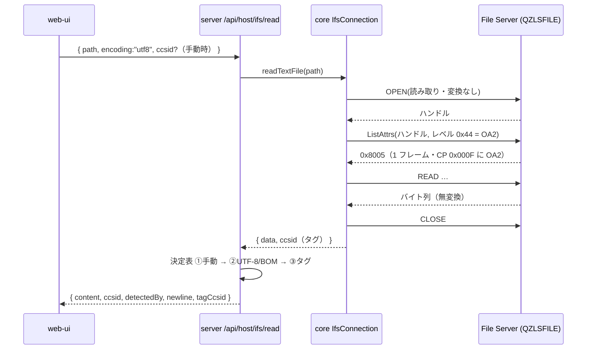
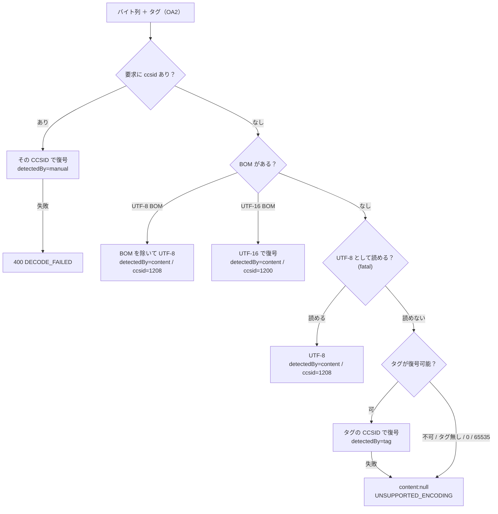

# 仕様: IFS テキストの CCSID 決定表（中身推定 → タグ → 手動切替）

## 概要

IFS のテキストを、**ファイル内容の CCSID タグを実際に引いたうえで**復号し、
何を根拠に復号したかを UI に見せ、外れていれば手動で正せるようにする。保存も読んだ文字コードで書き戻す。

タグの取得手段は research で確定した——**File Server の「ハンドル指定 ListAttrs（OA2）」**。
実機で CCSID が返り、EBCDIC の往復（タグ取得 → 復号 → 再符号化）も確認済み（research F2・F5）。



## 設計方針

- **タグ取得は読み取りと同じハンドルで行う**。`open → ListAttrs(OA2) → read → close` で、増える往復は 1 回だけ。
  SQL（`IFS_OBJECT_STATISTICS`）は採らない（別接続が要る・非 ASCII パスに弱い。research F10）
- **決定表の判断は server の純関数に閉じる**。core は「バイト列とタグを返す」ところまで、
  server が「どう解釈するか」を決める。判断をテストできる形にするため、決定表は独立モジュールに切り出す
- **CCSID → 復号手段の対応は core の codec に置く**。既存の `codecForCcsid`（EBCDIC 系）と
  `TextDecoder`（UTF-8 / ISO-8859-1 / UTF-16 等）を 1 つの入口に束ね、server と（将来の）web-ui が同じ表を見る
- **黙って壊さない方針は維持する**。どの手段でも読めなければ現状どおり `content: null` ＋
  `code: "UNSUPPORTED_ENCODING"` を返し、手動選択かダウンロードへ誘導する（前作業 decisions D7 の姿勢を引き継ぐ）
- **往復の忠実さを最優先する**。読んで編集して保存したとき、文字コードも行末も元のファイルの流儀に戻す

## 対象範囲

| 層 | ファイル | 変更内容 |
|---|---|---|
| core | `hostserver/ifs/ifs-datastream.ts` | ハンドル指定 ListAttrs の要求ビルダ、OA2 からの CCSID 抽出、交換属性応答の DSL 抽出 |
| core | `hostserver/ifs/ifs-connection.ts` | 交換属性の DSL を保持、`readTextFile` 追加、`writeFile` はバイト列のまま（変更なし） |
| core | `codec/ccsid-text.ts`（新規） | CCSID → 復号/符号化の単一入口。対応 CCSID の一覧 |
| server | `ifs-text.ts`（新規） | 決定表の純関数（手動 → UTF-8/BOM → タグ）と行末の正規化 |
| server | `host-ifs.ts` | `/read` に決定表と `ccsid`/`detectedBy`/`newline` を、`/write` に `ccsid`/`newline` を通す |
| web-ui | `ifsApi.ts` / `composables/usePreview.ts` / `components/IfsPane.vue` | 採用文字コードの表示・手動切替・保存時の受け渡し |

## インターフェース / データ構造

### core: データストリーム層

```ts
/** 交換属性応答（0x8009）からサーバー報告のデータストリームレベルを取る */
export function replyDatastreamLevel(reply: Uint8Array): number;

/**
 * ハンドル指定の属性一覧要求（0x000A・属性リストレベル 0x44 = OA2）。
 * **名前指定では OA 構造体が返らない**（原典 IFSFileDescriptorImplRemote.listObjAttrs の設計メモ）。
 */
export function buildListAttrsByHandleRequest(handle: number): Uint8Array;

/**
 * OA2 応答（0x8005・テンプレート長 8）から「内容の CCSID」を取る。
 * 見つからなければ undefined（タグ無し・OA2 が付かない応答）。
 */
export function parseContentCcsid(reply: Uint8Array, datastreamLevel: number): number | undefined;
```

### core: 接続層

```ts
export interface IfsTextFile {
  data: Uint8Array;
  /** ファイル内容の CCSID タグ。取れなければ undefined */
  ccsid?: number;
}

class IfsConnection {
  /** 交換属性でサーバーが報告した値。OA2 の読み位置がこれで変わる */
  readonly datastreamLevel: number;
  /** 既存。バイト列だけ返す（ダウンロード・zip 経路はこちらのまま） */
  readFile(path: string): Promise<Uint8Array>;
  /** 内容とタグを 1 ハンドルで取る（テキスト表示・編集用） */
  readTextFile(path: string): Promise<IfsTextFile>;
}
```

### core: codec

```ts
/** 行末の流儀。EBCDIC のストリームファイルは 0x15(NEL) を使うことがある */
export type LineEnding = "lf" | "nel";

export interface CcsidText {
  text: string;
  /** 復号前のバイト列で優勢だった行末 */
  newline: LineEnding;
}

/** この CCSID を復号できるか */
export function canDecodeCcsid(ccsid: number): boolean;
/** 復号。できない CCSID・不正なバイト列は例外 */
export function decodeCcsidText(ccsid: number, bytes: Uint8Array): CcsidText;
/** 符号化。`substituted` はマップ不能で SUB に落ちた文字数 */
export function encodeCcsidText(
  ccsid: number,
  text: string,
  opts?: { newline?: LineEnding }
): { bytes: Uint8Array; substituted: number };

/** UI の手動選択に出す候補（表示名つき） */
export const TEXT_CCSIDS: readonly { ccsid: number; label: string }[];
```

対応表（research F9）:

| CCSID | 手段 |
|---|---|
| 37 / 273 / 290 / 1027 | `codecForCcsid`（SBCS） |
| 930 / 939 / 1399 / 931 / 5035 / 5026 | `codecForCcsid`（混在 DBCS・SO/SI） |
| 1208 | `TextDecoder("utf-8", { fatal: true })` |
| 819 | `TextDecoder("iso-8859-1")` |
| 1200 / 13488 | `TextDecoder("utf-16be", { fatal: true })` |
| 1252 / 5348 | `TextDecoder("windows-1252")` |
| 932 / 943 | `TextDecoder("shift_jis", { fatal: true })`（**Windows-31J。IBM 943 と完全一致ではない**旨をコメントに残す） |

850 / 437 は**入れない**。実機で 850 タグが付くのは「中身は UTF-8/ASCII なのにサーバー既定のタグが付いた」ケースで、
決定表②に到達しない（research F4）。真に CP850 の内容が出てきたら `tools/gen-tables` で足す。

### server: HTTP API

```
POST /api/host/ifs/read
  { source, path, encoding: "utf8" | "base64", ccsid?: number }
  → 200 { content: string, bytes, encoding: "utf8", ccsid, detectedBy, newline, tagCcsid? }
  → 200 { content: null, bytes, encoding: null, code: "UNSUPPORTED_ENCODING", tagCcsid? }
  → 200 { content: <base64>, bytes, encoding: "base64" }         // base64 要求時は従来どおり
  → 413 { error, code: "TOO_LARGE", bytes, maxBytes }            // 既存

POST /api/host/ifs/write
  { source, path, content, encoding: "utf8" | "base64", ccsid?: number, newline?: "lf" | "nel", create? }
  → 200 { bytes, substituted? }
```

- `detectedBy`: `"manual"`（要求の `ccsid`）/ `"content"`（UTF-8・BOM 推定）/ `"tag"`（OA2 のタグ）
- `tagCcsid`: OA2 から取れたタグそのもの。`detectedBy` が `content` でも返す（UI が「タグは 850 だが UTF-8 で読んだ」と示せる）
- `ccsid` を指定して復号に失敗した場合は **400 `DECODE_FAILED`**（利用者が選んだものが合っていない＝要求側の誤り）。
  自動判定で読めなかった場合は従来どおり **200 ＋ `UNSUPPORTED_ENCODING`**（読み取りは成功していて表示手段が無いだけ）

### web-ui

```ts
export interface IfsReadResult {
  content: string | null;
  bytes: number;
  encoding: "utf8" | "base64" | null;
  ccsid?: number;
  detectedBy?: "content" | "tag" | "manual";
  newline?: "lf" | "nel";
  tagCcsid?: number;
  code?: string;
}
export function readFile(source, path, encoding?, ccsid?): Promise<IfsReadResult>;
export function writeFile(source, path, content, encoding?, opts?: { ccsid?: number; newline?: "lf" | "nel" }): Promise<{ bytes: number; substituted?: number }>;
```

## 振る舞いの詳細

### 決定表（`/read` の `encoding: "utf8"`）



- **①（中身推定）を②（タグ）より先に置く理由**: 我々や他ツールが書いたファイルはタグが中身を説明していない
  （UTF-8 の内容に CCSID 850 のタグ。research F4）。タグを先に信じると自分で書いたファイルを自分で化けさせる
- ①が EBCDIC を誤爆しないことは実機で確認済み（1399 / 273 / 37 のいずれも UTF-8 fatal で例外。research F5）
- タグが `0`（未タグ）・`65535`（バイナリ）・`canDecodeCcsid` が false のものは②をスキップする
- `encoding: "base64"` の要求では **OA2 を引かない**（復号しないので不要。往復を増やさない）

### 行末の扱い

- 復号時、EBCDIC 系 CCSID（`codecForCcsid` が持つもの）に限り、**復号後の文字列に U+0085 が現れたら `\n` に正規化**し、
  `newline: "nel"` を返す。U+0085 が無ければ `newline: "lf"`
- 保存時、`newline: "nel"` を渡された EBCDIC 系の書き込みでは `\n` を `0x15` に戻す。既定は `lf`（`0x25`）
- **UTF-8 系には適用しない**（U+0085 が本文に現れうるため、勝手に改行へ変えない）
- 混在（0x15 と 0x25 が両方ある）ファイルは**多い方**を採る。判定はバイト列の段階で数える

### 保存（`/write`）

- `ccsid` 指定があればその CCSID で符号化する。無指定は従来どおり UTF-8
- **既存ファイルのタグは変えない**（`writeFile` は `dataCcsid` を渡さないまま）。読んだときの CCSID で書けば、
  タグと中身の関係は元のまま保たれる
- `substituted > 0`（マップ不能文字を SUB に落とした）ときは応答に件数を載せ、UI が警告する。
  **書き込みは止めない**——利用者が選んだ文字コードでの保存要求だから
- 上限（`readMaxBytes` 相当）や `create` の扱いは既存のまま

### UI

- プレビューのヘッダに **採用した文字コードと根拠**を出す（例: `CCSID 1399（タグ）` / `UTF-8（内容から判定）`）
- 同じ場所に**文字コードの選択**を置く。変更すると `ccsid` 付きで読み直す（`detectedBy: "manual"`）
- 読めなかった場合（`UNSUPPORTED_ENCODING`）は、現在の「ダウンロードしてください」に**文字コード選択を併置**する。
  タグが取れていれば `タグは CCSID 850 です` のように添える
- 候補は `TEXT_CCSIDS`。実機で多い順（819 / 1208 / 1200 / 37 / 273 / 1399 / 939 / 930 …）に並べる
- 保存時は読んだときの `ccsid` と `newline` をそのまま送る

## ドメイン固有の考慮

- **原典準拠（AGENTS.md「既存プロトコル実装の移植」）**: 要求・応答のレイアウトは research F1 に記録した
  JTOpen の該当クラスに拠る。**逐語移植はしない**（IBM Public License 1.0）。コードには
  「なぜその値か」（0x44 = OA2 ＋ 開いたインスタンス、CP 0x000F、DSL 依存オフセット）をコメントで残す
- **固定オフセットを埋め込まない**: OA2 の CCSID 位置は交換属性でサーバーが報告した DSL で決める（126 / 142 / 134）。
  PUB400 は 24 を報告した（要求は 8）ので、**要求値からは決められない**（research F3）
- **応答は `request()` で 1 フレーム受ける**。ハンドル指定の応答には終端 `0x8001` が来ない（実測でタイムアウト）。
  `requestStream()` を使ってはいけない
- **`parseListEntry` を流用しない**。OA2 応答はテンプレート長 8 で、一覧応答（93）とレイアウトが違う
- **core のピュアロジックは Node API 非依存**。`TextDecoder`/`TextEncoder` は Web 標準なので `codec/` から使ってよい
  （`node:*` の import はしない）
- **codec のバンドル**: `ccsid-text.ts` は `codec.ts` 経由で DBCS 表を引き込む。web-ui から使う場合は
  既存の `@as400web/core/codec` サブパス経由にする（root import は pino/node を巻き込むため不可）

## エラー処理 / 異常系

| 状況 | 挙動 |
|---|---|
| ディレクトリを read | 既存どおり open が rc=4 で失敗 → 既存の `fileFailure` の変換に従う（research F7） |
| 権限が無い | open が rc=5 で失敗（タグ取得の前）。**現状と同じ**ので退行しない |
| OA2 が応答に無い / rc≠0 | タグ無し（`ccsid: undefined`）として扱い、決定表②をスキップ。**読み取り自体は続行する** |
| タグはあるが未対応 CCSID | ②をスキップ → `UNSUPPORTED_ENCODING`。応答に `tagCcsid` を載せ、UI が手動選択を促す |
| 手動指定の CCSID が未対応 | 400 `UNSUPPORTED_CCSID` |
| 手動指定で復号に失敗（fatal） | 400 `DECODE_FAILED` |
| 保存でマップ不能文字 | SUB に落として保存し、`substituted` を返す。UI は件数を警告として出す |
| ファイルが大きい | 既存の `TOO_LARGE`（413）。**サイズ判定は OA2 の前**（読む前に断る既存順序を崩さない） |

## 受け入れ基準との対応

| requirement の受け入れ基準 | 満たし方 |
|---|---|
| 実機の EBCDIC テキスト（273 / 1399 等）がプレビューで正しく読める | 決定表② ＋ `codecForCcsid`。実機で往復確認済み（research F5） |
| 我々が書いた UTF-8（タグ 850）がタグに引きずられず読める | 決定表①を②より先に置く。①は EBCDIC を誤爆しない（同 F5） |
| 推定が外れたとき UI から選び直せる | `ccsid` 付き再読み込み（`detectedBy: "manual"`）＋ `TEXT_CCSIDS` の候補 |
| 復号できない場合の案内が現状と同等以上 | `content: null` ＋ `UNSUPPORTED_ENCODING` を維持し、`tagCcsid` と手動選択を追加 |
| 編集して保存したファイルが同じ文字コードで往復する | `/write` の `ccsid` ＋ `newline`。行末も元の流儀に戻す |
| 一覧に余計な往復を増やさない | OA2 はファイルを開くときだけ。`listFiles` は無変更 |
| バンドルを不必要に膨らませない | 850/437 の表は入れず、`TextDecoder` で賄える範囲に留める |
