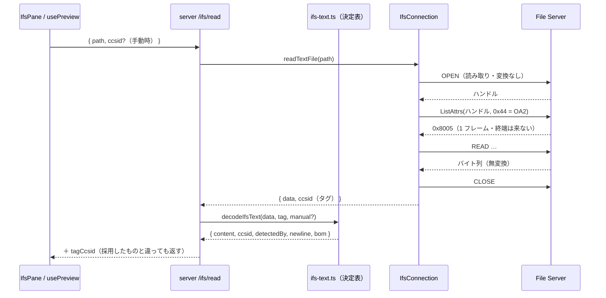
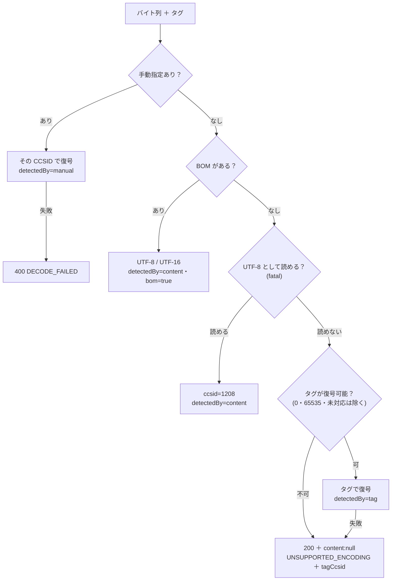

# レビューガイド: IFS テキストの CCSID 決定表

## 変更概要 / 目的

IFS のテキストを **UTF-8 決め打ちで読むのをやめ**、ファイル内容の CCSID を実際に引いたうえで復号する。
何を根拠に復号したかを画面に出し、外れていれば手動で直せるようにし、保存も**読んだときの文字コード・行末・BOM のまま**書き戻す。

`20260720-ifs-file-browser` の `02-server-api/decisions.md` D7 で「core が CCSID タグを出せるようになってから」と
後続送りにした宿題。**実機の日本語テキスト（EBCDIC）が読めない**という利用者から見た穴がこれで塞がる。

## 重要ポイント（特に見てほしい所）

### 1. タグの取り方——ハンドル指定でしか OA2 は返らない

`packages/core/src/hostserver/ifs/ifs-datastream.ts:302`

一覧要求（`buildListFilesRequest`）では **OA2 構造体が返らない**。JTOpen `IFSFileDescriptorImplRemote.listObjAttrs()` の
設計メモどおり、**開いたファイルのハンドルを指定した ListAttrs（属性リストレベル `0x44`）**でだけ返る。
research で実機のフレームを捕えて確認した（`research.md` F1・F2）。

見てほしい落とし穴が 3 つ:

- **`requestStream()` を使っていない**（`ifs-connection.ts:382`）。この応答に**終端フレーム（0x8001）は来ない**。
  連鎖指示 0 の 1 フレームで完結するので、次を待つとタイムアウトまで固まる（実測で 20 秒ハングした）
- **`parseListEntry` を流用していない**。OA2 応答は宣言テンプレート長 8 で、一覧応答の 93 とは別レイアウト
- **CCSID のオフセットを決め打ちしていない**（`ifs-datastream.ts:338`）。原典どおり
  「レベル 0 → 126 / 0xF4F4 → 142 / それ以外 → 134」で切り替える

### 2. サーバー報告のデータストリームレベルを保持する

`packages/core/src/hostserver/ifs/ifs-connection.ts:163`

交換属性の応答を今まで `rc` しか見ずに捨てていた。**要求は 8 なのに PUB400 は 24 を返す**ので、
要求値からオフセットを決めることはできない。応答の値を接続に持たせて `parseContentCcsid` に渡す。

### 3. 決定表は「中身 → タグ」の順。逆にすると自分で書いたファイルを壊す

`packages/server/src/ifs-text.ts:92`

実機では **UTF-8 の内容に CCSID 850 のタグ**が付く（サーバー既定のタグ。`research.md` F4）。
タグを先に信じると、自分で書いたファイルを自分で化けさせる。順序は
**①手動指定 → ②BOM → ③UTF-8（fatal）→ ④タグ**。③が EBCDIC を誤爆しないことは実機で確認済み（F5）。

### 4. 読めない/書けないの扱いが 3 通りある

| 状況 | 応答 | 理由 |
|---|---|---|
| 自動判定でどれでも読めない | **200** ＋ `content: null` ＋ `UNSUPPORTED_ENCODING` ＋ `tagCcsid` | 読み取りは成功していて、足りないのは表示手段。4xx にすると UI が「失敗」を出してしまう |
| 利用者が選んだ CCSID が未対応 | 400 `UNSUPPORTED_CCSID` | 要求側の問題 |
| 利用者が選んだ CCSID で復号できない | 400 `DECODE_FAILED` | 同上 |

### 5. 復号できても符号化できない文字コードがある（decisions D2）

`packages/core/src/codec/ccsid-text.ts`

`TextEncoder` は UTF-8 しか吐けないので、UTF-16 は自前で、**単バイト系（819・1252）は
「全 256 バイトを復号して逆引き表を作る」**ことで表を同梱せずに戻している。
多バイトの Shift_JIS（932・943）は同じ手が使えないため**読み取り専用**。UI は編集させず、server は 400 で断る。

### 6. 候補一覧だけ表を持たない別モジュールにした（decisions D3）

`packages/core/src/codec/ccsid-catalog.ts` は依存ゼロ。`browser.ts` から公開しているので、
**ブラウザバンドルに DBCS の巨大な表が入らない**（ビルド後の js に表が無いことを確認済み）。
一覧の `writable` が実装と食い違わないことは core のテストで突き合わせている。

## 処理フロー

決定表そのもの:

## 主要な変更箇所

| 場所 | 要点 |
|---|---|
| `packages/core/src/hostserver/ifs/ifs-datastream.ts:107` | 交換属性応答から**サーバー報告**のレベルを取る |
| `packages/core/src/hostserver/ifs/ifs-datastream.ts:302` | ハンドル指定 ListAttrs（`0x44`）。名前は送らない 40 バイト |
| `packages/core/src/hostserver/ifs/ifs-datastream.ts:338` | 可変部の CP `0x000F` を辿り、レベル依存のオフセットで CCSID を読む |
| `packages/core/src/hostserver/ifs/ifs-connection.ts:192` | `readTextFile`。**1 ハンドルで** open → OA2 → read → close |
| `packages/core/src/codec/ccsid-text.ts` | CCSID → 復号/符号化の単一入口。行末（NEL）の正規化と復元 |
| `packages/core/src/codec/ccsid-catalog.ts` | 表を持たない候補一覧（ブラウザ用） |
| `packages/server/src/ifs-text.ts:92` | 決定表の純関数。BOM の検出と復元もここ |
| `packages/server/src/host-ifs.ts:215` | `/read` の配線。**base64 要求では OA2 を引かない**（往復を増やさない） |
| `packages/server/src/host-ifs.ts:290` | `/write` を読んだ文字コードで符号化。置換件数を返す |
| `packages/web-ui/src/composables/usePreview.ts:78` | `reload(ccsid)`。**失敗しても直前の表示を消さない**（review M1） |
| `packages/web-ui/src/components/IfsPane.vue:239` | 文字コードの選び直し。編集中は確認し、取り消したら選択も戻す（review S1） |
| `tools/hostserver-check/src/ifs-ccsid.ts` | 実機でタグ取得・決定表・EBCDIC 往復を確かめるコマンド |

## リスク / 確認してほしい点

- **他機での報告レベルが未実測**。PUB400 は 24 を返し、原典の分岐（0 / 0xF4F4 / それ以外）は
  ユニットテストで覆っているが、0 や 0xF4F4 を返す実機は試せていない。社内機で 1 度読めるか見てもらえると確実
- **手動で外れた EBCDIC を選んだときは「失敗」にならない**。EBCDIC は 1 バイトずつ必ず何かに対応するため、
  化けた本文がそのまま出る（画面に採用中の文字コードを出して選び直せることで補う設計）
- **CCSID 850 / 437 は復号手段を持たない**。実機の 850 タグは中身が UTF-8 / ASCII で決定表③が拾うため、
  今は表を足していない（必要になれば `tools/gen-tables` で起こせる。ICU に ucm があることは確認済み）
- **`writeFile` の `dataCcsid` は検証専用**（decisions D5）。通常の保存経路は渡していないので、
  新規作成時のタグはサーバー既定のまま（タグを正しく付ける改修は backlog の別課題）
- 実機確認は PUB400 に対して行い、検証用ファイルは削除済み。`zip-writer` のテスト 4 件は
  サンドボックスで `unzip` を実行できないための失敗で、本変更とは無関係
