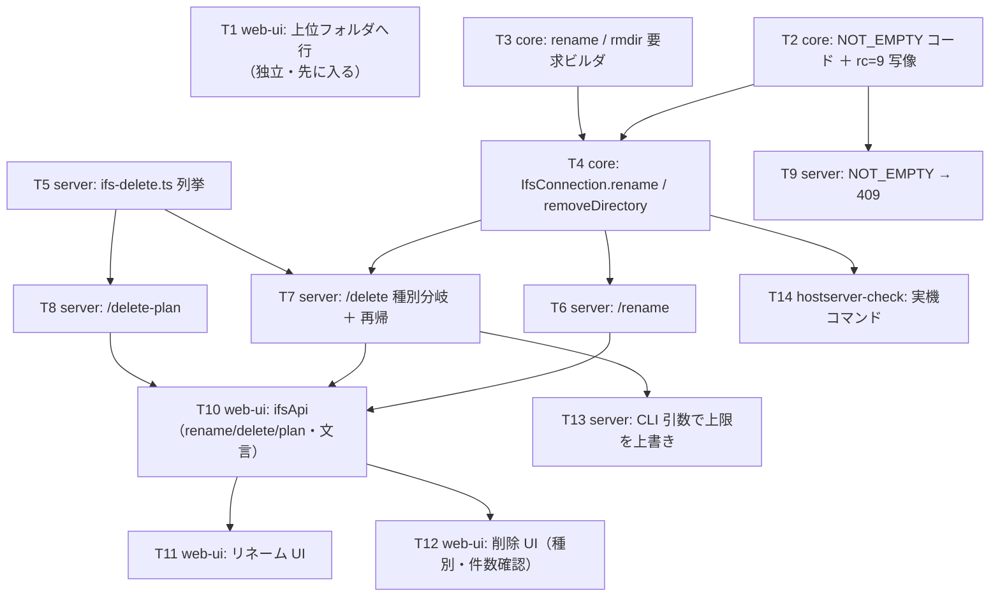

# 計画: IFS ペインの上位移動と、削除・リネーム

## 実装方針

前回（CCSID）と同じく**下から積む**。プロトコル層はレイアウトも戻りコードも research で実機確定済みなので、
**実機なしで固定できる**（捕えた値をテストの期待値にする）。

独立して先に入れられるものが 1 つある——**一覧の「上位フォルダへ」は UI だけで完結**し、
プロトコルにもサーバーにも触らない。先に片づけて、以降は削除・リネームに集中する。

- **T1 は単独で価値がある**（上位移動）。ここだけで一度動く状態になる
- 削除は **列挙（数える）と実行（消す）を別々に作る**。列挙は純関数に近い形（`IfsReader` を受け取る）なので、
  偽のリーダーで再帰・上限・辿れない場合を全部テストできる
- エラーコード（`NOT_EMPTY`）は core → server → web-ui の 3 層に波及するので、**最初にまとめて通す**
- UI は最後。確認ダイアログの文言と、消えた後の状態（選択・プレビュー・ツリー）の後始末に集中する

## 作業順序と依存関係

1. **T1**（上位へ）: 依存なし。ここだけで一度触れる状態になる
2. **T2・T3**（core のプロトコルとエラー）: 依存なし。実測値でテストを固定
3. **T4**（接続層）: 依存 T2・T3
4. **T5**（削除の列挙）: 依存なし（`IfsReader` の口だけ見る）。偽リーダーでテスト
5. **T6〜T9**（HTTP）: 依存 T4・T5・T2
6. **T10〜T12**（web-ui）: 依存 T6〜T8
7. **T13**（CLI 上限）・**T14**（実機コマンド）: 仕上げ

## リスク / 留意点

- **`buildDeleteRequest` からコピーしない**（research F2）。ディレクトリ削除はフラグ 2 バイト分ずれる。
  テストでテンプレート長 10 とバイト位置を固定する
- **種別の判定を間違えると「権限がありません」に化ける**（F4）。判定はサーバーに閉じ、
  ファイルとして失敗した rc=13 はディレクトリとして解釈し直す経路も持つ
- **部分削除を作らない**。上限超過・辿れない場合は 1 件も消さない。途中失敗は「そこで止める」
- **ページングの罠**（`hasMore` が真でも `entries` は空になりうる／`canContinue` を見ないと無限ループ）。
  列挙は `ifs-collect.ts` の `listAll` と同じ扱いにする
- **消えた後の UI の後始末**。選択・プレビュー・ツリー・パンくずが消えた対象を指したままにならないこと
  （現在地そのものを消したときは親へ移動する）
- 既存の `/delete` は**従来の要求形（`{ source, path }`）でも通る**こと（MCP・他の呼び出し元がある）

## テスト方針

- **core（vitest）**: 要求のバイト列（テンプレート長・CP・フラグ・名前位置）を実測値と突き合わせ、
  rc=9 → `NOT_EMPTY` の写像、`rename` / `removeDirectory` が正しい要求を出すこと
- **server（vitest）**: 偽リーダーで列挙を駆動——入れ子・空フォルダ・symlink を含む・上限超過・
  辿れないディレクトリ・**深い順に並ぶこと**。ルート直下（`/`）のパス連結も見る
- **server（ルート）**: `/delete` の種別分岐（ファイル / 空フォルダ / 中身あり）、`recursive` 無しでの 409、
  上限超過で**1 件も消さない**こと、`/rename` の成功・衝突・`/` を含む名前の 400
- **web-ui（vitest, パッケージ dir から）**: 上位へ行がルートで出ないこと・押すと親へ移動すること、
  リネームの入力と衝突時の文言、削除の確認に件数が出ること、削除後に選択とプレビューが片づくこと
- **実機（test 工程）**: `hostserver-check` の新コマンドで rename / rmdir / 再帰削除を往復。
  Web UI でも上位移動・リネーム・フォルダ削除を操作して確認する（前回同様 Playwright）
