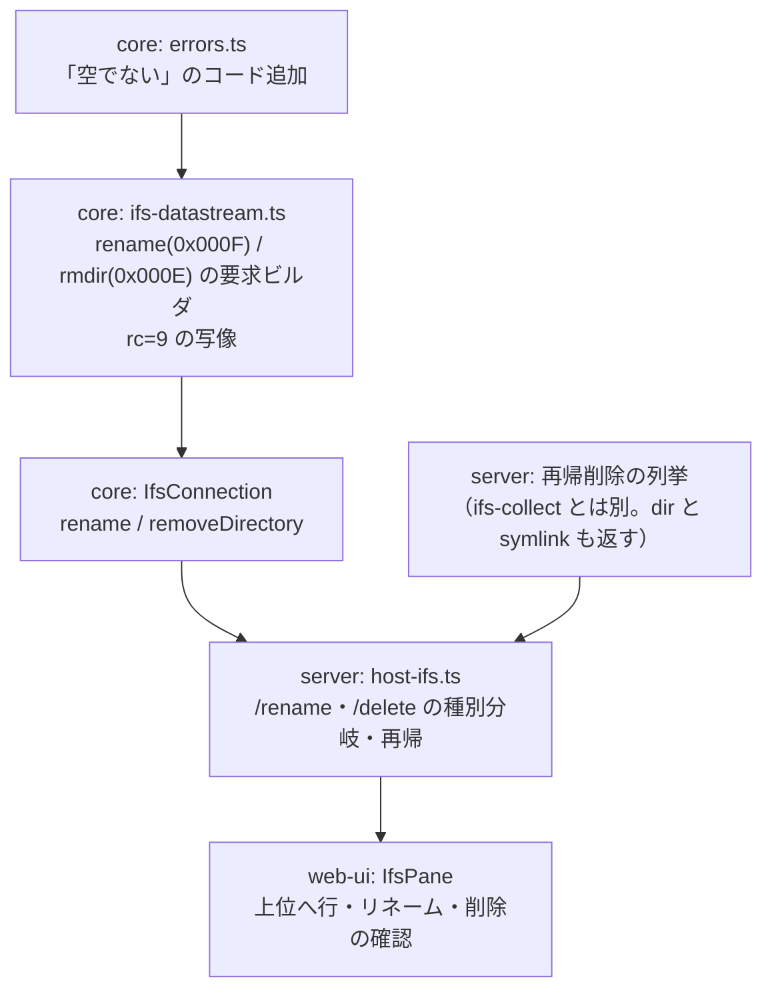

# 調査: IFS のリネーム・ディレクトリ削除・上位移動

## 調査の問い

- Q1: **リネーム**の要求はどう組むか（要求 ID・レイアウト・上書き指定の有無）。実機で往復するか
- Q2: **ディレクトリ削除（rmdir）**は backlog の記録（`0x000E` / CP `0x0001`）どおりか。空でないときはどうなるか
- Q3: 既存の削除（`0x000C`）をディレクトリに使うとどうなるか（間違った経路を選んだときの症状）
- Q4: 再帰削除に既存の `ifs-collect.ts`（zip の再帰収集）をそのまま使えるか
- Q5: 失敗の戻りコードが、既存のエラー写像（`fileFailure` → `statusOf`）で意味のある形になるか
- Q6: 一覧の 1 行目に「上位へ」を置くのに、既存の描画・キーボード操作をどう使えるか

**結論を先に**: Q1・Q2 とも原典どおりで、**実機で全パターンを 1 往復ずつ確認済み**。
ただし **Q3 と Q5 に落とし穴**がある——ディレクトリに `0x000C` を投げると「権限がありません」に化け、
「空でない（rc=9）」は現在の写像で **502（ホストが落ちている）** に落ちる。

---

## 判明した事実

### F1: リネームは `0x000F`。元と先の名前を 1 要求で送る（原典）

JTOpen `IFSRenameReq`。テンプレート長 **16**、可変部に元・先の名前を続ける。

| offset | 内容 |
|---|---|
| 20 | 連鎖指示 |
| 22 | **元の名前**の CCSID |
| 24 | **先の名前**の CCSID |
| 26 | 元の作業ディレクトリハンドル = 1 |
| 30 | 先の作業ディレクトリハンドル = 1 |
| 34 | **リネームフラグ**（1 = 既存の先を置き換える / 0 = 置き換えない） |
| 36 | 元の名前 LL（= 長さ + 6） |
| 40 | 元の名前 CP = **0x0003** |
| 42 | 元の名前（UTF-16BE） |
| 42 + 元長 | 先の名前 LL |
| +4 | 先の名前 CP = **0x0004** |
| +6 | 先の名前 |

**名前はフルパスで渡す**（実機で確認）。つまりプロトコル上は移動（別フォルダへの rename）も同じ要求で通る。
requirement で移動を対象外にしているのは UI 上の判断であって、プロトコルの制約ではない。

### F2: ディレクトリ削除は `0x000E`。テンプレート長 10 で、ファイル削除とは形が違う（原典）

JTOpen `IFSDeleteDirReq` / `IFSDeleteFileReq` を並べると、**フラグの有無で 2 バイトずれる**。

| | ディレクトリ削除 `0x000E` | ファイル削除 `0x000C`（実装済み） |
|---|---|---|
| テンプレート長 | **10** | 8 |
| 22 | CCSID | CCSID |
| 24 | 作業ディレクトリハンドル | 作業ディレクトリハンドル |
| 28 | **フラグ（0）** | 名前 LL |
| 30 | 名前 LL | — |
| 34 | 名前 CP = **0x0001** | 名前 CP = 0x0002（32 の位置） |
| 36 | 名前 | 名前（34 の位置） |

backlog の記録（`0x000E` / CP `0x0001`）は正しい。**ただしフラグの 2 バイトは記録に無かった**ので、
`buildDeleteRequest` をコピーして CP だけ差し替えると 2 バイトずれる。

### F3: 実機（PUB400）で全パターンを確認した

`/home/MARO/ifsdemo/optest` を作って一通り試し、**最後に消してある**。応答はすべて `0x8001`（戻りコード応答）。

| 操作 | rc | 意味 |
|---|---|---|
| ファイル `a.txt` → `b.txt` | **0** | 成功 |
| **既存の名前**へ（フラグ 0） | **4** | Duplicate directory entry name |
| **フォルダ** `sub` → `sub2` | **0** | ディレクトリも同じ要求で改名できる |
| 存在しない元を rename | **2** | File not found |
| **中身のあるフォルダ**を rmdir | **9** | Directory not empty |
| **ファイル**に rmdir | **3** | Path not found |
| 存在しないフォルダを rmdir | **2** | File not found |
| **フォルダに `0x000C`（ファイル削除）** | **13** | **Access denied** ← 症状が原因を説明しない |
| 空になったフォルダを rmdir | **0** | 成功 |

### F4: 経路を間違えると「権限がありません」に化ける（Q3）

現在の UI がフォルダを選んで削除しようとすると `entry.isDirectory` で早期 return するため何も起きないが、
**もし `deleteFile` をそのまま呼ぶと rc=13 → `ACCESS_DENIED` → 403「権限がありません」**になる。
原因（種別が違う）とまったく違う案内になるので、**種別で要求を出し分ける**こと。

### F5: 「空でない（rc=9）」は今の写像だと 502 に落ちる（Q5）

`fileFailure`（`ifs-datastream.ts:380`）は 2/3 → `NOT_FOUND`、4 → `ALREADY_EXISTS`、5/13 → `ACCESS_DENIED`、
1/32/33 → `RESOURCE_BUSY`、**それ以外は `PROTOCOL_ERROR`**。`statusOf`（`host-api.ts:39`）は
`PROTOCOL_ERROR` を **502** にするので、「フォルダが空ではありません」が
**「ホストが落ちている」扱い**になる。rc=9 に専用のコードが要る。

rename の rc=4（既存名）と rc=2（元が無い）は、既存の写像で `ALREADY_EXISTS`（409）／`NOT_FOUND`（404）に
なるので**そのままでよい**。

### F6: `collectFiles` は再帰削除にそのまま使えない（Q4）

`packages/server/src/ifs-collect.ts:110` はよく出来ているが、**zip 用**に作られている:

- **ファイルしか返さない**（ディレクトリはキューに積むだけで結果に含めない）。
  削除は**深い順にディレクトリも消す**必要がある
- **シンボリックリンクを飛ばす**（`:141`）。削除では**リンク自体を消さないと親が空にならない**（rc=9 で止まる）
- 上限が `maxBytes` / `maxFiles` / `maxDirectories` で、**バイト数は削除には無関係**
- 「辿り切れない（`incomplete`）」の扱いは削除でも同じく必要（部分削除は部分 zip より危険）

再利用すべきは**ページングを最後まで辿る `listAll` の考え方**（`entries` が空でも `hasMore` が真になりうる／
`canContinue` を見ずに続けると無限ループ）であって、`collectFiles` 本体ではない。

### F7: 一覧の 1 行目は UI だけで足りる（Q6）

- `.` と `..` は **core が一覧から落としている**（`ifs-connection.ts:241`）ので、ホストから来る `..` を
  そのまま出す形にはできない。**UI 側の行として足す**
- 一覧の行は `<li role="option" tabindex="0">` に `@click` / `@keydown.enter` / `@keydown.space` が付いている
  （`IfsPane.vue` の `.entries`）。同じ形の行を先頭に置けば、操作感は揃う
- 移動は既存の `openPath(親パス)` をそのまま呼べる（ツリー展開・パンくず・プレビュー消去まで面倒を見ている）
- **追加の往復は発生しない**（行を 1 つ描くだけ）

---

## 影響範囲

---

## 実現性 / リスク

- **実現性は確認済み**（F3）。rename も rmdir も実機で往復し、失敗時の戻りコードも揃っている
- **再帰削除は往復回数が読めない**。`/QSYS.LIB` のような巨大ディレクトリを指定されると、
  ディレクトリ数の上限（zip は既定 5,000）に掛かるまで往復し続ける。**削除は zip より慎重な上限**が要る
- **辿り切れないディレクトリ**（`canContinue` が false）を含む再帰削除は、**やってはいけない**。
  「一部だけ消えた」状態は、部分的な zip より始末が悪い
- **シンボリックリンクの削除は未実測**。実機の `link.txt` は利用者の資産なので消して試していない。
  原典（`IFSFileImplRemote.delete`）はディレクトリ以外に `0x000C` を使っており、リンクもこれで消える見込み
- 削除・リネームは**取り消せない**。確認ダイアログと監査ログを省かないこと（requirement の非機能要件）

---

## spec への申し送り

1. **要求ビルダを 2 本足す**: `buildRenameRequest`（0x000F・テンプレート 16・CP 0x0003/0x0004・フラグ）と
   `buildRemoveDirRequest`（0x000E・テンプレート **10**・CP 0x0001）。
   **`buildDeleteRequest` からのコピーで CP だけ替えないこと**（フラグの 2 バイト分ずれる）
2. **種別で経路を分ける**。ディレクトリに `0x000C` を投げると rc=13 →「権限がありません」に化ける（F4）
3. **rc=9 に専用のエラーコードを足す**（例 `NOT_EMPTY` → 409）。今のままだと 502「ホストが落ちている」になる
4. **再帰削除の列挙は新しく書く**（ファイル・ディレクトリ・シンボリックリンクを、**深い順**に返す）。
   `collectFiles` は流用しない。ページングの罠（`hasMore` / `canContinue`）だけ同じ扱いにする
5. **辿り切れないディレクトリを含む場合は削除しない**（`incomplete` は中止。理由を利用者に返す）
6. **削除の上限**は件数（ファイル＋ディレクトリ）で持つ。zip の 5,000 ディレクトリよりは絞る方向で決める
7. **リネームは置換フラグ 0 で送る**（既存があれば rc=4 で失敗させる）。上書きは要件に無い
8. リネームは**フルパスで送る**（同一フォルダ内に限るのは UI の制約として実装する）
9. **一覧の 1 行目は UI の行として足す**。移動は既存の `openPath` を呼ぶだけ。ルートでは出さない

### 残った未確定事項

- シンボリックリンクを `0x000C` で消せるか（実機未確認。原典の実装からは消せる見込み）
- 再帰削除の上限値の妥当な既定（zip の実績値からの当て込みになる）
