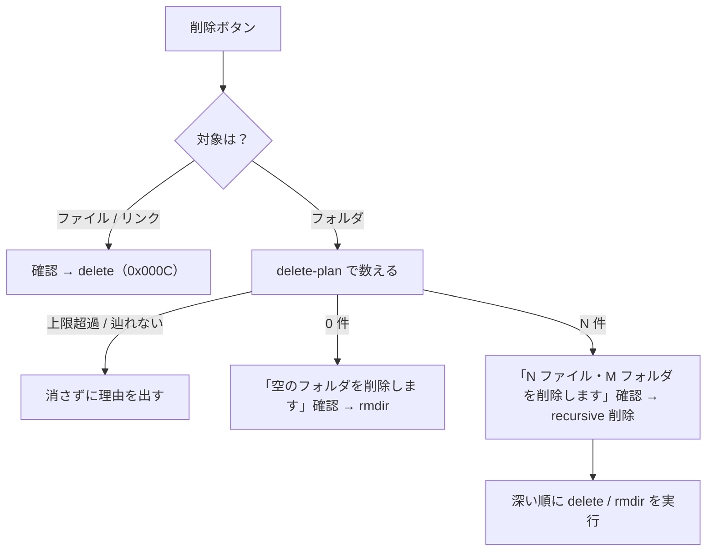

# 仕様: IFS ペインの上位移動と、削除・リネーム

## 概要

IFS ペインを「辿る・整理する」まで完結させる。

1. 一覧の先頭に **「.. 上位フォルダへ」** の行を置く（UI だけで完結。追加の往復なし）
2. **フォルダの削除**（`0x000E`）。空でなければ**中身ごと再帰削除**（件数を確認・上限あり）
3. **リネーム**（`0x000F`）。同じフォルダ内での改名

プロトコルのレイアウトと戻りコードは research で実機確定済み（F1〜F3）。
**種別で要求を出し分けること**（フォルダに `0x000C` を投げると rc=13 →「権限がありません」に化ける。F4）と、
**rc=9（空でない）に専用コードを足すこと**（今は 502 に落ちる。F5）が、この仕様の要。

## 設計方針

- **削除は「1 つ消す」と「まとめて消す」を 1 つの API にまとめる**。UI からは対象のパスを渡すだけで、
  種別の判定・再帰の要否はサーバーが決める。**種別ごとに別ルートにしない**——
  UI が種別を間違えると「権限がありません」に化けるため、判断を 1 か所に閉じる
- **再帰削除は「数えてから消す」**。zip の一括取得と同じ姿勢で、**先に全部列挙して上限を判定**し、
  超えていれば **1 つも消さずに**断る。途中で止まって「一部だけ消えた」を作らない
- **辿り切れないディレクトリを含むときは削除しない**（`/QSYS.LIB` 系。部分削除は部分 zip より危険）
- **列挙は削除用に新しく書く**。`collectFiles` はファイルしか返さず symlink を飛ばすため流用しない（F6）
- **リネームは置換しない**（フラグ 0）。既存名なら失敗させ、UI で案内する
- UI は**確認を挟む**。削除は消える件数を示し、リネームは現在の名前を初期値にする

## 対象範囲

| 層 | ファイル | 変更内容 |
|---|---|---|
| core | `errors.ts` | エラーコード `NOT_EMPTY` を追加 |
| core | `hostserver/ifs/ifs-datastream.ts` | `buildRenameRequest` / `buildRemoveDirRequest`、rc=9 の写像 |
| core | `hostserver/ifs/ifs-connection.ts` | `rename` / `removeDirectory` |
| server | `ifs-delete.ts`（新規） | 削除対象の再帰列挙（深い順・symlink 含む・上限判定） |
| server | `host-api.ts` | `NOT_EMPTY` → 409 |
| server | `host-ifs.ts` | `/delete` を種別分岐＋再帰対応に、`/rename` を追加、`/delete-plan` を追加 |
| server | `main.ts` | 削除の上限を CLI 引数で上書きできるようにする |
| web-ui | `ifsApi.ts` | `deletePath` / `deletePlan` / `renamePath`、新エラーコードの文言 |
| web-ui | `components/IfsPane.vue` | 上位へ行・リネーム操作・削除の確認 |

## インターフェース / データ構造

### core: データストリーム層

```ts
/**
 * リネーム要求（0x000F）。**元も先もフルパス**で送る。
 * 原典 IFSRenameReq: テンプレート長 16 / 元 CP 0x0003 / 先 CP 0x0004 / フラグ 1 = 置換。
 */
export function buildRenameRequest(from: string, to: string, opts?: { replace?: boolean }): Uint8Array;

/**
 * ディレクトリ削除要求（0x000E）。
 * **ファイル削除（0x000C）とはテンプレート長が違う**（10 と 8。フラグ 2 バイトの有無）。
 */
export function buildRemoveDirRequest(path: string): Uint8Array;
```

`fileFailure` に `case 9 → NOT_EMPTY` を足す。

### core: 接続層

```ts
class IfsConnection {
  /** 名前を変える（元も先もフルパス）。既定は置換しない＝既存名なら ALREADY_EXISTS */
  rename(from: string, to: string, opts?: { replace?: boolean }): Promise<void>;
  /** 空のディレクトリを消す。空でなければ NOT_EMPTY */
  removeDirectory(path: string): Promise<void>;
}
```

### server: 削除の列挙（`ifs-delete.ts`）

```ts
export interface DeleteLimits {
  /** 消す対象（ファイル＋リンク＋ディレクトリ）の総数の上限 */
  maxEntries: number;
  /** 辿るディレクトリ数の上限 */
  maxDirectories: number;
  pageSize?: number;
}

export interface DeleteTarget {
  path: string;
  kind: "file" | "directory";
}

export type DeletePlan =
  | { ok: true; targets: DeleteTarget[]; files: number; directories: number }
  | { ok: false; reason: "too-many"; entries: number }
  | { ok: false; reason: "too-many-directories"; directories: number }
  /** 一覧を辿り切れないディレクトリがあった。**部分削除はしない** */
  | { ok: false; reason: "incomplete"; path: string };

/**
 * 削除対象を**消す順（深い順）**に並べて返す。中身は消さない（数えるだけ）。
 * シンボリックリンクは **`file` として対象に含める**（辿らない）——
 * リンクを残すと親ディレクトリが空にならず rmdir が rc=9 で止まる。
 */
export function planDelete(reader: IfsReader, root: string, limits: DeleteLimits): Promise<DeletePlan>;
```

### server: HTTP API

```
POST /api/host/ifs/delete-plan   { source, path }
  → 200 { files, directories, entries }        // 消える件数（数えただけ。まだ消していない）
  → 200 { blocked: "too-many", entries, max }  // 上限超過。消さない
  → 200 { blocked: "too-many-directories", directories, max }
  → 409 { error, code: "INCOMPLETE_LISTING", path }

POST /api/host/ifs/delete        { source, path, recursive?: boolean }
  → 200 { files, directories }
  → 409 { error, code: "NOT_EMPTY" }           // recursive 無しでフォルダが空でない
  → 409 { error, code: "TOO_MANY" , entries, max }
  → 404 / 403 は既存の写像どおり

POST /api/host/ifs/rename        { source, path, newName }
  → 200 { path }                                // 新しいフルパス
  → 409 { error, code: "ALREADY_EXISTS" }
  → 404 { error, code: "NOT_FOUND" }
```

- `newName` は**名前だけ**（`/` を含めない）。サーバーが親ディレクトリと結合してフルパスにする。
  **移動を許さないのはここ**（プロトコルは移動もできる。F1）
- `delete-plan` を分けるのは、**確認ダイアログに件数を出す**ため。押す前に規模が分かる

### web-ui

```ts
export async function deletePlan(source, path): Promise<IfsDeletePlan>;
export async function deletePath(source, path, opts?: { recursive?: boolean }): Promise<{ files: number; directories: number }>;
export async function renamePath(source, path, newName): Promise<{ path: string }>;
```

`KNOWN_ERROR_CODES` に `NOT_EMPTY` / `TOO_MANY` を足し、`messageFor` に日本語を足す。

## 振る舞いの詳細

### 上位フォルダへ


- `currentPath === "/"` のときは**行そのものを出さない**
- 親パスは `currentPath` の最後の要素を落として求める（`/a/b` → `/a`、`/a` → `/`）
- 行の見た目は他の行と同じ構造（アイコン `↩`・名前・サイズ空・日時空）。**選択状態にはしない**
  （プレビューや削除の対象にならない）

### 削除



- サーバーは `path` の種別を**親ディレクトリの一覧で判定**する（`knownSize` と同じ手口）。
  種別が分からない場合はファイルとして試し、rc=13 なら**ディレクトリとして解釈し直す**——
  「権限がありません」で終わらせない（research F4）
- `recursive: false` でフォルダが空でなければ **409 `NOT_EMPTY`**（`rc=9` の写像）
- 再帰実行は **`planDelete` の順（深い順）**で 1 件ずつ。途中で失敗したら**そこで止めて**、
  消せた件数と失敗したパスを返す（成功したところまでは実際に消えている）
- **削除はログに残す**（利用者・パス・件数）。既存の `log.info(..., "ifs delete")` を件数付きに拡張

### リネーム

- `newName` の検証: 空でない／`/` を含まない／`.` `..` でない／`currentPath` と結合した長さが妥当
- 置換フラグは **0 固定**。既存名なら rc=4 → `ALREADY_EXISTS` → 409
- 成功したら新しいフルパスを返し、UI は一覧・ツリーを更新して**選択とプレビューを新しい名前に付け替える**

### 上限の既定

| 項目 | 既定 | 根拠 |
|---|---|---|
| 削除の総件数 `maxEntries` | **1,000** | zip のファイル上限（500）より広く、事故の規模は抑える。1 件 1 往復なので実測 100KB/s でも待てる範囲 |
| 辿るディレクトリ `maxDirectories` | **500** | zip の 5,000 より絞る。削除は「消して良い範囲を選び直せる」ので、広く許す必要がない |

CLI 引数 `--ifs-delete-max-entries` / `--ifs-delete-max-dirs` で上書きできる（既存の zip 系と同じ形）。

## ドメイン固有の考慮

- **原典準拠**（AGENTS.md）: 要求のレイアウトは research F1・F2 に記録した JTOpen の該当クラスに拠る。
  **`buildDeleteRequest` からのコピーで CP だけ差し替えない**（テンプレート長 10 と 8 の違いで 2 バイトずれる）
- **ページングの罠**（core decisions D1・D6）: 列挙は `hasMore` / `canContinue` を正しく扱う。
  `entries` が空でも続きがあることがあり、`canContinue` を見ないと `/QSYS.LIB` で無限ループする
- **シンボリックリンクは辿らないが、対象には含める**。辿ると循環しうる／リンク先は対象外だが、
  リンク自体を消さないと親が空にならない
- **ホストのデータを壊す操作は記録を残す**（`host-ifs.ts` 冒頭の方針）
- UI の見た目は `docs/UI-DESIGN.md` に従う（ボタンの系統・確認の作法）

## エラー処理 / 異常系

| 状況 | 挙動 |
|---|---|
| フォルダを `recursive` 無しで削除、中身あり | 409 `NOT_EMPTY`（「空ではありません。中身ごと削除しますか？」へ誘導） |
| 上限超過 | **1 件も消さず** 409 `TOO_MANY`（件数と上限を返す） |
| 辿り切れないディレクトリを含む | **1 件も消さず** 409 `INCOMPLETE_LISTING`（対象のパスを返す） |
| 再帰の途中で失敗（権限・使用中） | そこで中止。**消せた件数と失敗パス**を返す（黙って続行しない） |
| リネーム先が既存 | 409 `ALREADY_EXISTS` |
| リネーム元が無い | 404 `NOT_FOUND` |
| `newName` に `/` が含まれる | 400（移動は対象外） |
| ルートで上位へ | 行を出さない（押せない行を残さない） |

## 受け入れ基準との対応

| requirement の受け入れ基準 | 満たし方 |
|---|---|
| 一覧の先頭から 1 クリックで上位へ／ルートでは出ない | UI の行 ＋ `openPath`。`currentPath === "/"` で非表示 |
| 空のフォルダを削除できる | `/delete` が種別を見て `removeDirectory`（0x000E） |
| 中身ごと削除できる（件数を確認） | `/delete-plan` で数えて確認 → `/delete { recursive: true }` |
| 上限超過は実行されず理由が伝わる | `planDelete` が `too-many` / `too-many-directories` を返し、**1 件も消さない** |
| リネームでき、一覧とツリーが追随 | `/rename` ＋ UI の更新 |
| 既存名との衝突は失敗して伝わる | 置換フラグ 0 ＋ `ALREADY_EXISTS` の文言 |
| 実機で往復する | test 工程で `hostserver-check` に追加するコマンドと Web UI で確認 |
| 既存機能に退行が無い | 既存ルートは無変更（`/delete` のみ拡張。従来の要求形も通る） |
