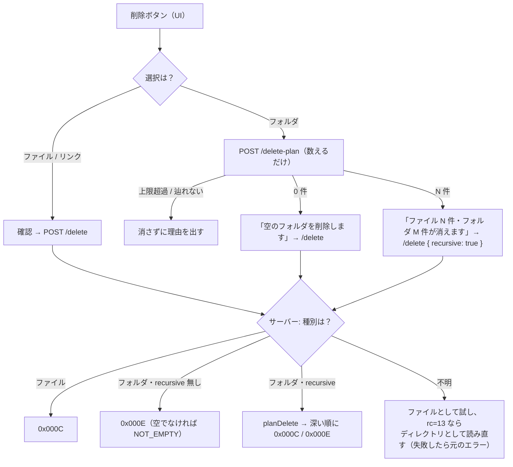

# レビューガイド: IFS ペインの上位移動と、削除・リネーム

## 変更概要 / 目的

IFS ペインで「辿る・整理する」が完結するようにした。

1. 一覧の先頭に **「.. 上位フォルダへ」**（UI だけで完結・追加の往復なし）
2. **フォルダの削除**（`0x000E`）。空でなければ**中身ごと**（件数を確認してから）
3. **リネーム**（`0x000F`）。同じフォルダ内の改名

これまでフォルダは選んでも削除できず（`isDirectory` で早期 return）、リネームは**プロトコル層から存在しなかった**。
一覧から 1 つ上に戻る手段も無く、左ツリーへ視線を往復させる必要があった。

## 重要ポイント（特に見てほしい所）

### 1. 削除は「数えてから消す」——部分削除を作らない

`packages/server/src/ifs-delete.ts:84` / `packages/server/src/host-ifs.ts:515`

再帰削除は**先に全部列挙して上限を判定**し、超えていれば **1 件も消さずに**断る。
途中で止まって「一部だけ消えた」状態を作らないための姿勢で、zip の一括取得と同じ
（あちらも「中身を読む前に上限で断る」）。**辿り切れないディレクトリ**（`/QSYS.LIB` 系）が
混ざっている場合も同じく実行しない——欠けに気づけない削除は、失敗より悪い。

列挙は `collectFiles`（zip 用）を**流用していない**。理由は 3 つで、いずれも削除固有:

- ディレクトリ自身を返す必要がある（**深い順・親は最後**）
- **シンボリックリンクを対象に含める**必要がある（残すと親が空にならず rmdir が rc=9 で止まる）
- 上限がバイト数ではなく件数

### 2. 種別の判定はサーバーに閉じる（UI に持たせない）

`packages/server/src/host-ifs.ts:197`（`entryKind`）/ `:475`

**フォルダに `0x000C`（ファイル削除）を投げると rc=13 →「権限がありません」に化ける**（research F4・実機確認）。
症状が原因を説明しないので、種別の判断を 1 か所に集めた。親ディレクトリの一覧から引く（`knownSize` と同じ手口）。

種別を引けなかったときだけ、ファイル削除の rc=13 を「実はディレクトリだったのでは」と読み直す。
**その読み直しも失敗したら元の `ACCESS_DENIED` に戻す**（`asDirectory()`。decisions D3）——
本当に権限が無いファイルに対して、rmdir 由来の「見つかりません」を返しては余計に分からない。

### 3. 戻りコードを利用者に伝わる形へ写像する

| ホストの rc | 写像 | なぜ |
|---|---|---|
| 9（Directory not empty） | **新設 `NOT_EMPTY` → 409** | 従来は `PROTOCOL_ERROR` → **502**（＝ホストが落ちている）に落ちていた |
| 4（Duplicate entry） | `ALREADY_EXISTS` → 409 | 既存 |
| 3（Path not found）**かつ その名前が使われている** | **`ALREADY_EXISTS` に読み替え** → 409 | フォルダを既存のファイル名へ改名すると rc=3 が返る（実機で確認）。対象は在るのに「見つかりません」では誤案内 |

読み替えは**失敗したときだけ**確認する（成功する経路に往復を足さない）。`host-ifs.ts:584`

### 4. リネームは「名前だけ」を受け取る

`packages/server/src/host-ifs.ts:562`

プロトコル（`0x000F`）は元も先も**フルパス**なので、**移動もできてしまう**（research F1）。
要件は同一フォルダ内の改名までなので、API は `newName`（名前のみ）を受け取り、
**親ディレクトリはサーバーが付ける**。`/` を含む名前はホストへ送らず 400 で断る。

### 5. ディレクトリ削除の要求はファイル削除のコピーで作らない

`packages/core/src/hostserver/ifs/ifs-datastream.ts`（`buildRemoveDirRequest`）

`0x000E` はテンプレート長 **10**、`0x000C` は 8。**名前 LL の前にフラグ 2 バイトが入る**ため、
コードポイントだけ差し替えると 2 バイトずれる。テストで両者の差（テンプレート長・CP・名前位置）を固定してある。

### 6. フォルダの選択は行末の「…」から（decisions D1）

`packages/web-ui/src/components/IfsPane.vue`

クリック＝開く（移動）は毎日使うので変えず、**削除・改名に要る「選択」だけ**を行末の小さなボタンで足した。
`@click.stop` が無いと行の移動が同時に走る。
これに伴い一覧の ARIA を `listbox/option` から **`list/listitem`** に変えた（option は操作可能な子孫を持てないため。review 対応）。

## 処理フロー

## 主要な変更箇所

| 場所 | 要点 |
|---|---|
| `packages/core/src/errors.ts` | `NOT_EMPTY` を追加（502 に落とさないため） |
| `packages/core/src/hostserver/ifs/ifs-datastream.ts` | `buildRenameRequest`（0x000F）/ `buildRemoveDirRequest`（0x000E・**テンプレート長 10**）/ rc=9 の写像 |
| `packages/core/src/hostserver/ifs/ifs-connection.ts` | `rename` / `removeDirectory`（**種別を取り違えたときの症状**をコメントに明記） |
| `packages/server/src/ifs-delete.ts` | 削除対象の列挙（深い順・symlink 込み・上限・`incomplete`） |
| `packages/server/src/host-ifs.ts:197` | `entryKind`（親の一覧から種別を引く） |
| `packages/server/src/host-ifs.ts:467` | `/delete` の種別分岐・再帰・部分削除の扱い |
| `packages/server/src/host-ifs.ts:532` | `/delete-plan`（確認ダイアログ用に数えるだけ） |
| `packages/server/src/host-ifs.ts:562` | `/rename`（名前のみ・rc=3 の読み替え） |
| `packages/server/src/host-api.ts` | `NOT_EMPTY` → 409 |
| `packages/web-ui/src/components/IfsPane.vue` | 上位へ行・「…」での選択・リネーム・件数つき削除確認 |
| `tools/hostserver-check/src/ifs-ops.ts` | 実機で成功と**失敗の出方**まで確かめるコマンド |

## リスク / 確認してほしい点

- **上限の既定（1,000 件 / 500 フォルダ）は実測に基づかない**。zip の実績値からの当て込みで、
  CLI（`--ifs-delete-max-entries` / `--ifs-delete-max-dirs`）で変えられる。運用してみて妥当か見てほしい
- **再帰削除の途中失敗は実機で再現していない**（権限・使用中で止まる場合）。
  消せた件数と失敗パスを返して止める設計だが、**この経路はコードレビューでの確認に留まる**
- **シンボリックリンクの実削除は実機未検証**。列挙が対象に含めることは単体テストで固定済みだが、
  実機の `link.txt` は利用者の資産なので消していない
- **TOCTOU**: `delete-plan` と `/delete` の間にファイルが増えると、rmdir が rc=9 で止まる（部分削除になる）。
  実運用で問題になるなら、`/delete` 側の列挙結果だけで確認まで完結させる形に寄せる余地がある
- 実機確認は PUB400 で行い、検証用のフォルダは削除済み。`zip-writer` のテスト 4 件は
  開発環境で `unzip` を実行できないための失敗で、本変更とは無関係
