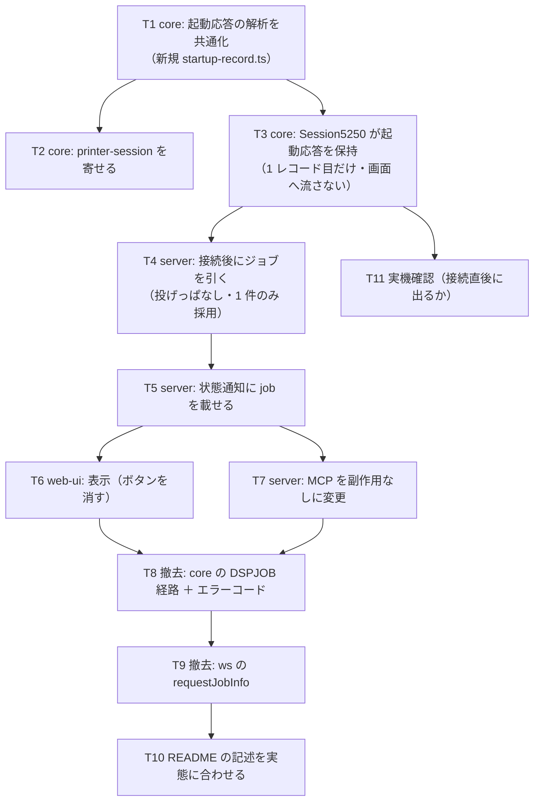

# 計画: セッションのジョブ情報を起動応答＋ジョブ一覧で取る

## 実装方針

**撤去と追加が絡む**ので、順番を間違えると途中でビルドが通らない期間が長くなる。
「先に新しい経路を通し、最後に古い経路をまとめて抜く」順で進める。

1. **起動応答の解析を core に切り出す**（プリンターの読み方を共通化 → 表示セッションでも使う）。
   ここは実機で捕えたバイト列があるので**実機なしで固定できる**
2. **サーバーでジョブを引く**（資格情報があるときだけ・投げっぱなし・1 件のときだけ採用）
3. **通知と UI** を新しい形に合わせる
4. **最後に `DSPJOB` 経路をまとめて撤去**する（core・ws・MCP・UI・エラーコード）。
   ここで初めてテストの削除も行う——先に消すと、新経路が出来るまで機能が無い期間ができる

`session.ts` の 1 レコード目の扱いは**画面の初期表示に直結する**ので、
「起動応答と判定したときだけ食べる」ことをテストで固定してから触る。

## 作業順序と依存関係

## リスク / 留意点

- **通常のデータストリームを食べない**こと。判定は「1 レコード目」かつ「応答コードの形」の両方。
  誤って食べると**画面が真っ白**になる。テストで「2 レコード目は画面へ流す」「起動応答でない
  1 レコード目は画面へ流す」を固定する
- **他人のジョブを出さない**。`listJobs` が 1 件に絞れないときは採用しない（実機で 2 件返った）
- **接続を遅くしない**。ジョブ引きは `await` しない。セッションが先に閉じられた場合に備える
- **撤去漏れ**に注意（core・ws・MCP・UI・型・テスト・README の 6 か所）。
  `JOB_INFO_BUSY` / `JOB_INFO_UNAVAILABLE` は core の公開型なので、消すと参照側がビルドで落ちる＝検出できる
- 手サインオン環境（資格情報なし）で**壊れない**こと。`listJobs` を呼ばない経路を明示的にテストする

## テスト方針

- **core（vitest）**: 実機で捕えた起動応答レコード（73 バイト）を固定値にして、
  応答コード / システム名 / 装置名が取れること。**起動応答でないレコードでは `undefined`**。
  `Session5250` は起動応答を画面へ流さず、2 レコード目以降は流すこと
- **core**: プリンターセッションが共通化後も同じ応答コードを読むこと（既存テストが通ること）
- **server（vitest）**: 偽のセッション・偽のジョブ一覧で、
  「資格情報が無ければ引かない」「1 件なら採用」「0 件・複数件なら採用しない」「失敗しても例外を投げない」
- **web-ui（vitest）**: 取得ボタンが無いこと、`job` があれば表示（番号あり／装置名だけの 2 形）、
  無ければ行を出さないこと
- **実機（test 工程）**: PUB400 に接続し、**何も押さずに**ポップオーバーへジョブが出ること。
  画面が `DSPJOB` に飛ばないこと。手サインオン設定（資格情報なし）でも壊れないこと
