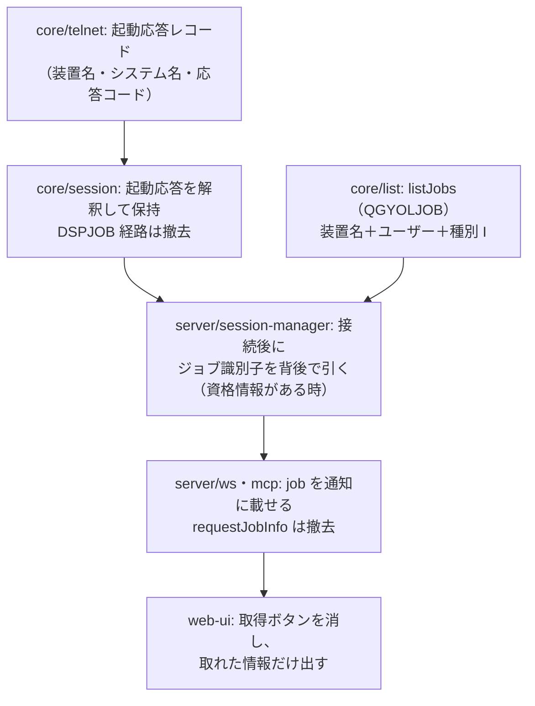

# 調査: セッションのジョブ情報を画面に触れずに取れるか

## 調査の問い

- Q1: 接続時に、**画面に触れずに**装置名（＝対話ジョブのジョブ名）を知れるか。**ホスト採番のとき**も分かるか
- Q2: そこからジョブ識別子（番号 / ユーザー / 名前）を引けるか。引けるとして、**一意に定まるか**
- Q3: 所要時間は。接続の体感を損なわないか
- Q4: 資格情報が無い環境（画面で手サインオンする使い方）ではどうなるか
- Q5: 撤去する `DSPJOB` 経路はどこまで広がっているか

**結論を先に**: Q1 は**取れる**（RFC 4777 の起動応答レコード。実機で確認）。
Q2 も**引ける**が、**装置名だけでは一意にならない**（実機で同名ジョブが 2 件）。**装置名＋ユーザー**で一意になった。
よって「置き換え」で成立する——ただし**ユーザーが分かる場合に限る**（Q4）。

---

## 判明した事実

### F1: 接続時にホストが「起動応答レコード」を送ってくる。装置名はここに入っている（実機で確認）

RFC 4777 §10 の Startup Response Record。`IBMSENDCONFREC=YES` を申告した端末に送られ、
**実際に割り当てられた装置名**・システム名・応答コードを含む。**当方は既にこの申告を送っている**
（`packages/core/src/telnet/telnet.ts:236`）。

PUB400 へ**装置名を指定せず**（ホスト採番）接続したときの実測（1 レコード目・73 バイト）:

```
00 49 12 a0 90 00 05 60 06 00 20 c0 00 3d 00 00
c9 f9 f0 f2  ← "I902"（応答コード）
d7 e4 c2 f4 f0 f0 40 40  ← "PUB400  "（システム名 8 バイト）
d8 d7 c1 c4 c5 e5 f0 f0 f1 d7  ← "QPADEV001P"（★ 装置名 10 バイト）
```

読み取り位置は**プリンターセッションと同じ**（`printer-session.ts:213` の `(6 + rec[6]) + 5` から
4 バイトが応答コード）。その後ろに システム名 8 ＋ **装置名 10** が続く。

- **追加の往復はゼロ**（接続の最初の 1 レコードとして必ず来る）
- **資格情報は要らない**（telnet の交渉だけで分かる）
- **ホスト採番でも分かる**——これが要点で、装置名を設定していない利用者でも装置名を知れる
- 表示セッション（`session.ts`）は**このレコードを起動応答として解釈していない**。
  現状は通常のデータストリームとして `applyDataStream` に渡している（実害は出ていないが、意味は取っていない）

### F2: 装置名からジョブを引ける。ただし**装置名だけでは一意にならない**（実機で確認）

`QGYOLJOB`（`core/src/hostserver/list/job-list.ts` の `listJobs`）を、上で得た装置名で引いた結果:

| 絞り込み | 件数 | 内容 |
|---|---|---|
| 名前 = `QPADEV001P` | **2 件** | `337228/MARO/QPADEV001P`（自分）／`300886/NIKESHM/QPADEV001P`（**別の利用者**） |
| 名前 ＋ 種別 `I`（対話） | **2 件** | 同上。種別では絞れない |
| **名前 ＋ ユーザー ＋ 種別** | **1 件** | `337228/MARO/QPADEV001P` |

PUB400 は多人数が使う実機で、**同じ装置名のジョブが複数存在しうる**ことがそのまま出た。
「ジョブ名＝装置名」は成り立つが、**名前だけを鍵にすると他人のジョブを掴む**。ユーザーで絞ること。

### F3: 所要時間（実測）

| 段階 | 時間 |
|---|---|
| 5250 接続 → 起動応答レコード受信 | **約 2.4 秒**（＝接続そのもの。追加コストなし） |
| コマンドサーバー接続（signon 込み） | 約 2.0 秒 |
| `QGYOLJOB`（装置名 ＋ ユーザー ＋ 種別） | **約 0.3 秒** |

ジョブ識別子の取得に要る追加コストは**別接続 1 本（約 2 秒）＋ 0.3 秒**。
接続完了を待たせる必要はない（背後で取り、取れたら足す形にできる）。

### F4: ユーザーが分からない場合がある

`SessionManager.open` は `ConnectOptions` の `user` をそのまま渡す（`session-manager.ts:242`）。
これは**自動サインオンの設定がある場合のみ**入る。画面で手サインオンする使い方では `user` は `undefined` で、
**誰のジョブかをこちら側は知らない**。この状態で F2 の絞り込みはできない（他人のジョブを掴む危険がある）。

つまり:

| 状況 | 装置名（F1） | 完全な識別子（F2） |
|---|---|---|
| 自動サインオンあり | 取れる | **取れる** |
| 手サインオン（資格情報なし） | 取れる | **取れない** |

### F5: `DSPJOB` 経路の広がり

| 層 | 場所 | 内容 |
|---|---|---|
| core | `session/session.ts:345` `fetchJobInfo` | コマンド行に `DSPJOB` → Enter → 画面走査 → F3 |
| core | `session/session.ts:92` `parseJobInfo` | **英語 NLV 前提**の正規表現 |
| core | `session/session.ts:119-120` | `jobInfoCache` / `fetchingJobInfo`（占有フラグ） |
| core | `errors.ts` | `JOB_INFO_BUSY` / `JOB_INFO_UNAVAILABLE` |
| server | `ws-handler.ts:242` | `requestJobInfo` の要求処理 |
| server | `ws-messages.ts:77` | `job` を返すメッセージ型 |
| server | `mcp-tools.ts:821-828` | MCP ツール（`job` を返す） |
| web-ui | `components/SessionInfo.vue:40` | 「🔄 取得」ボタン |
| web-ui | `stores/sessions.ts:57` | `job` の保持 |

`assertNotBusy()` が `fetchingJobInfo` を見ているので、**撤去すると占有チェックも消える**（副作用として良い方向）。

---

## 影響範囲



---

## 実現性 / リスク

- **実現性は確認済み**。装置名は接続の 1 レコード目で必ず来る。ジョブ識別子も 0.3 秒で引ける
- **他人のジョブを掴む危険**が現実にある（F2）。ユーザーを鍵に含めること。
  ユーザーが分からないときは**引かない**（誤った情報を出すより出さない方がよい）
- **別接続 1 本のコスト**。セッションを開くたびにコマンドサーバー接続が増える（約 2 秒・接続数 +1）。
  使い捨てにするか、他のパネルと同じく要求ごとに開いて閉じるかは spec の判断
- **ジョブは途中で変わりうる**（サインオンし直す・ジョブが終わる）。接続時に 1 度取るだけなら、
  表示が古くなる可能性がある。**装置名は変わらない**が、番号は変わる
- 起動応答レコードを**表示セッションでも解釈する**改修は、既存の画面処理に触る。
  現状はこのレコードを `applyDataStream` に流しており、**解釈を足すときに画面の初期表示を壊さないこと**

---

## spec への申し送り

1. **装置名は起動応答レコードから取る**（追加の往復なし・資格情報不要・ホスト採番でも取れる）。
   読み位置はプリンターと同じ（`(6 + rec[6]) + 5` から 応答コード 4 ／ システム名 8 ／ 装置名 10）
2. **完全な識別子は `listJobs({ name: 装置名, user: 利用者, type: "I" })`** で引く。
   **ユーザーを必ず鍵に含める**（名前だけでは他人のジョブを掴む。F2）
3. **ユーザーが分からない場合は引かない**。その場合に何を出すか（装置名だけ出す／何も出さない）は spec で決める
4. **接続完了を待たせない**。ジョブ引きは背後で行い、取れたらセッションの状態に足して通知する
5. **`DSPJOB` 経路は F5 の一覧をすべて撤去する**（`JOB_INFO_BUSY` / `JOB_INFO_UNAVAILABLE` と
   `assertNotBusy` の占有チェックも道連れにできる）
6. MCP のツールを消す/変える場合は README の記述と揃える

### 残った未確定事項

- 手サインオン環境で「装置名だけ」を出すか、ジョブ行そのものを出さないか（**利用者に確認したい**）
- 取得のタイミング（接続直後に自動 / ポップオーバーを開いたとき）。前者は接続のたびに
  コマンドサーバー接続が 1 本増える。後者は「開くまで出ない」
- 社内機（SR-OSAKA）でも起動応答レコードが来るか（PUB400 でのみ確認）
