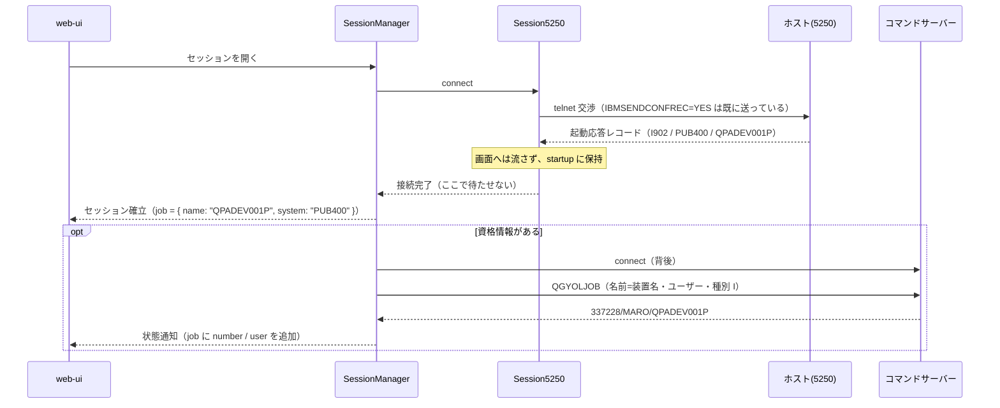

# 仕様: セッションのジョブ情報を起動応答＋ジョブ一覧で取る（DSPJOB 経路は撤去）

## 概要

ジョブ情報の取得を、**画面を奪う `DSPJOB`** から**接続時に必ず届く起動応答レコード**へ置き換える。

1. **接続時**: 起動応答レコード（RFC 4777 §10）から**実際に割り当てられた装置名**・システム名・応答コードを取る。
   追加の往復ゼロ・資格情報不要・ホスト採番でも取れる（research F1）
2. **接続直後（背後）**: 資格情報があれば `QGYOLJOB` で**ジョブ識別子（番号/ユーザー/名前）**を引く（同 F2・F3）
3. **`DSPJOB` 経路は撤去**する（core / ws / MCP / UI。同 F5）

装置名は必ず取れるので、**どの環境でも「ジョブ名（＝装置名）」までは出せる**。
番号とユーザーは、自動サインオンで利用者が分かるときだけ足す。

## 設計方針

- **画面には一切触れない**。キー送信もフィールド書き込みもしない。よって占有（`JOB_INFO_BUSY`）も不要になる
- **接続を待たせない**。ジョブ引きは接続完了後に投げっぱなしで走らせ、取れたら状態に足して通知する
- **ユーザーを鍵に含める**。装置名だけで引くと**他人のジョブを掴む**（実機で再現。research F2）。
  利用者が分からないときは**引かない**
- **失敗は静かに諦める**。ジョブ情報は付加価値であって、セッションの成立条件ではない
- 起動応答の解釈は**プリンターセッションと同じ読み方**を使う（`(6 + rec[6]) + 5`）。
  ただし表示セッションでは**接続を拒否しない**（応答コードは記録だけ。装置名衝突の扱いは現状を変えない）

## 対象範囲

| 層 | ファイル | 変更内容 |
|---|---|---|
| core | `telnet/startup-record.ts`（新規） | 起動応答レコードの判定と解析（プリンターと共有） |
| core | `session/printer-session.ts` | 上記を使うように寄せる（読み方の重複を無くす） |
| core | `session/session.ts` | 1 レコード目の起動応答を解釈して保持。**`fetchJobInfo` / `parseJobInfo` / 占有フラグを撤去** |
| core | `errors.ts` | `JOB_INFO_BUSY` / `JOB_INFO_UNAVAILABLE` を削除 |
| server | `session-manager.ts` | 接続後にジョブ識別子を背後で引く（資格情報があるときだけ） |
| server | `ws-handler.ts` / `ws-messages.ts` | `requestJobInfo` を撤去。ジョブ情報は状態通知に載せる |
| server | `mcp-tools.ts` | `get_job_info` は**副作用なしで既知の情報を返す**形に変更 |
| web-ui | `stores/sessions.ts` / `components/SessionInfo.vue` | 取得ボタンを撤去し、届いた情報を表示 |
| docs | `README.md` | MCP ツールの説明を実態に合わせる |

## インターフェース / データ構造

### core: 起動応答レコード

```ts
/** RFC 4777 §10 の起動応答レコード（表示・プリンター共通） */
export interface StartupResponse {
  /** 例 "I902"（成功）/ "8902"（装置が使用中）等 */
  code: string;
  /** システム名（例 "PUB400"） */
  system: string;
  /** **実際に割り当てられた**装置名（例 "QPADEV001P"）。対話ジョブのジョブ名でもある */
  device: string;
}

/**
 * 起動応答レコードなら解析する。違えば `undefined`。
 * **判定は応答コードの形**（`I902` `8902` のような英数 4 文字）で行う——
 * 通常のデータストリームを誤って食べないため。
 */
export function parseStartupResponse(record: Uint8Array, codec: Codec): StartupResponse | undefined;
```

### core: 表示セッション

```ts
class Session5250 {
  /** 起動応答レコードで分かったこと。接続直後に埋まる（来なければ undefined） */
  readonly startup?: StartupResponse;
}
```

- **1 レコード目だけ**を起動応答の候補として見る。2 レコード目以降は従来どおり画面へ流す
- 起動応答と判定したレコードは**画面へ流さない**（従来は素通ししていた）
- `fetchJobInfo` / `parseJobInfo` / `jobInfoCache` / `fetchingJobInfo` / `assertNotBusy` は**削除**

### server: ジョブ識別子の解決

```ts
/** セッションのジョブ識別子。装置名だけ分かる場合もある */
export interface SessionJob {
  /** ジョブ名（＝装置名）。起動応答から必ず入る */
  name: string;
  /** システム名（起動応答から） */
  system?: string;
  /** 以下は QGYOLJOB で引けたときだけ */
  user?: string;
  number?: string;
}
```

`session-manager.ts` に、接続完了後の**投げっぱなしの解決**を足す:

```ts
// 資格情報が無ければ何もしない（手サインオンでは誰のジョブか分からない。research F4）
if (opts.user !== undefined && opts.password !== undefined && session.startup) {
  void resolveJob(entry, opts).catch(() => undefined); // 失敗は握りつぶす
}
```

- `CommandConnection.connect` → `listJobs({ name: 装置名, user, type: "I" })` → **1 件に絞れたときだけ**採用する
  （0 件・複数件は採用しない。他人のジョブを出さないため）
- 接続は**使い終わったら閉じる**（他のパネルと同じ「要求ごとに開いて閉じる」）
- 解決したら `entry.job` に格納し、**状態通知**（既存のセッション状態のブロードキャスト）に載せる

### server: ws / MCP

- `requestJobInfo` メッセージ（`ws-messages.ts:77` の応答含む）を**削除**
- セッション状態の通知に `job?: SessionJob` を足す（既存の状態メッセージに 1 項目追加）
- MCP `get_job_info` は**副作用なし**に変更:
  - 説明文を「セッションの装置名・ジョブ識別子（**画面には触れない**）」に
  - `refresh` 引数を削除
  - 出力は `{ job: { name, system?, user?, number? } }`。**未解決なら `job` は返さず理由を文言で返す**

### web-ui

```ts
// stores/sessions.ts
job?: { name: string; system?: string; user?: string; number?: string };
```

- `SessionInfo.vue` の「🔄 取得」ボタンと `fetchJob()` を**削除**
- 表示は次のとおり（`job` が無ければ**行を出さない**）:
  - 番号まで分かる: `337228/MARO/QPADEV001P`（従来と同じ並び）
  - 装置名だけ: `QPADEV001P`
- 既存の「デバイス名」行は、**起動応答で分かった実際の装置名**を優先して出す
  （設定値と違うことがある——未指定でホスト採番のときは設定値が空）

## 振る舞いの詳細



- **ジョブ引きは 1 回だけ**（接続直後）。番号は途中で変わりうる（サインオンし直し等）が、
  再取得の手段は設けない——手動更新ボタンを残さないのが本件の主旨
- 応答コードが成功（`I901` / `I902` / `I906`）以外でも**接続処理は変えない**。
  コードは記録し、警告ログに出すだけ（装置名衝突時の挙動は現状のまま）

## ドメイン固有の考慮

- **原典準拠**（AGENTS.md）: 起動応答レコードのレイアウトは RFC 4777 §10 と、
  実機で捕えたバイト列（research F1）に拠る。読み位置は tn5250 の `printsession.c` と同じ式
- **プリンターと表示で同じ解析を使う**。今はプリンター側にだけ読み方があり、
  同じ式を 2 か所に書くと片方だけずれる
- **通常のデータストリームを食べない**。判定は応答コードの形で行い、**1 レコード目に限る**
- ジョブ情報は**セッションの成立条件ではない**。失敗しても接続は成立させる

## エラー処理 / 異常系

| 状況 | 挙動 |
|---|---|
| 起動応答レコードが来ない（古いホスト等） | `startup` は `undefined`。ジョブ行は出ない。接続は成立する |
| 資格情報が無い（手サインオン） | 装置名だけ表示。`QGYOLJOB` は**呼ばない** |
| `QGYOLJOB` が 0 件 / 複数件 | **採用しない**（装置名だけのまま）。他人のジョブを出さない |
| コマンドサーバーに繋がらない・権限が無い | 静かに諦める（警告ログのみ）。セッションには影響しない |
| セッションが即座に閉じられた | 解決結果は捨てる（`entry` が無ければ何もしない） |

## 受け入れ基準との対応

| requirement の受け入れ基準 | 満たし方 |
|---|---|
| 何も押さずにジョブ情報が出る | 起動応答（即時）＋背後の `QGYOLJOB` |
| 取得で画面が変化しない | `DSPJOB` を撤去。起動応答は接続時に届くレコードを読むだけ |
| 取得できない環境ではジョブ行が出ない | `job` が無ければ行を出さない（装置名すら無い場合） |
| `fetchJobInfo` / `requestJobInfo` / MCP / ボタンが無い | すべて撤去（MCP は副作用なしの読み取りに変更） |
| 実機で接続直後にジョブ情報が出る | test 工程で PUB400 に接続して確認 |
| 既存テストが通り、撤去分も整理されている | `fetchJobInfo` のテストを削除し、起動応答の解析テストを追加 |
