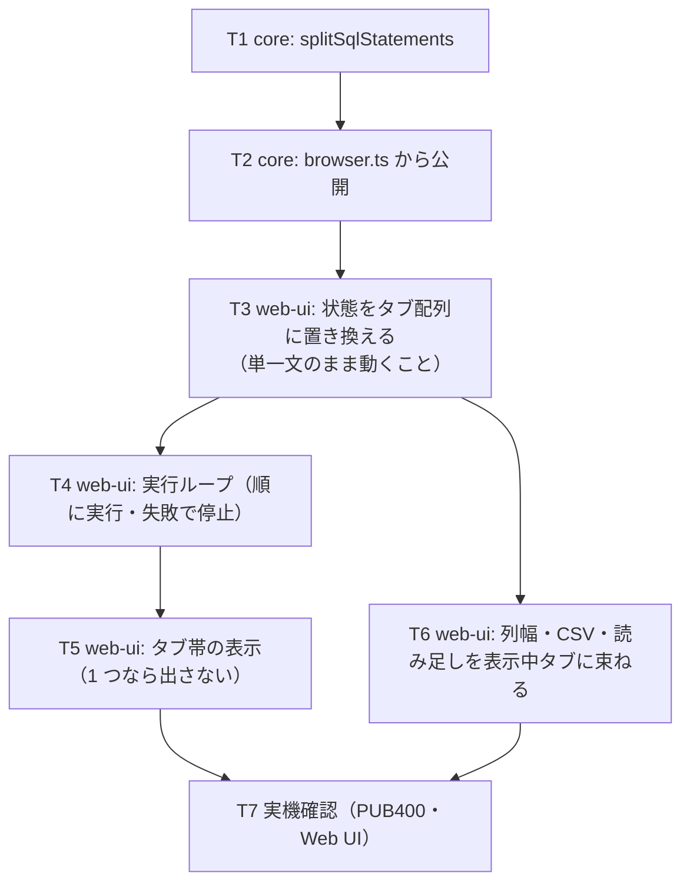

# 計画: SQL の複数文実行と結果タブ

## 実装方針

**分割（core）→ UI の状態のタブ化 → 実行ループ** の順。分割は純ロジックで実機も UI も要らないので先に固める。
UI は「単一の状態」を「タブの配列 ＋ 表示中のタブから引く算出プロパティ」に置き換えるのが本体で、
テンプレート側の変更を最小にするのが狙い（既存の表示・CSV・ページングを壊さないため）。

サーバーには触らない。既存の `/api/host/sql` を 1 文ずつ叩く。

## 作業順序と依存関係

1. **T1・T2**（core）: 依存なし。境界（文字列・識別子・コメント・空文・閉じ忘れ）をテストで固定
2. **T3**（状態の置き換え）: 依存 T2。**この時点では単一文のまま**動くこと（退行を出さない）
3. **T4**（実行ループ）: 依存 T3
4. **T5**（タブ帯）・**T6**（列幅・CSV・読み足し）: 依存 T3/T4
5. **T7**（実機）: 最後

## リスク / 留意点

- **既存の単一文の操作感を壊さない**のが最優先。T3 の時点で既存テスト（sql-pane 系）が通ること
- **結果セットの手放し漏れ**。実行のたびに全タブぶん手放す。漏らすとプールが効かず毎回 4〜6 秒
- **列幅の混線**。列が違うタブ間で幅を共有すると対応が狂う（既存も「列が変わったら捨てる」規律）
- **5 本以上の SELECT** で古いタブの続きが切れる（サーバーの上限）。期限切れ表示に落ちることを確認する
- **保存済みクエリの復元**が単一結果前提。最初のタブに入れる形にし、古い保存データでも壊れないこと
- ログは**文ごとに 1 件**。まとめて 1 件にすると、どの文が遅かったのかが分からなくなる

## テスト方針

- **core（vitest）**: 分割の境界——単純な 2 文／末尾に `;` あり・なし／`;;`／文字列の中の `;`／
  `''` エスケープ／識別子 `"…"`／`--` コメント／`/* */` コメント／閉じ忘れ／空白とコメントだけ
- **web-ui（vitest）**: 2 文を実行するとタブが 2 つ出て切り替わる／1 文ならタブ帯が出ない／
  2 文目で失敗したら 1 文目のタブが残り 3 文目を実行しない／CSV と読み足しが表示中のタブを見る／
  実行のたびに前の結果セットを手放す
- **実機（test 工程）**: PUB400 で `SELECT … ; SELECT …` を Web UI から実行し、タブが 2 つ出ること・
  切り替えて中身が違うこと・CSV が表示中のタブのものになること
