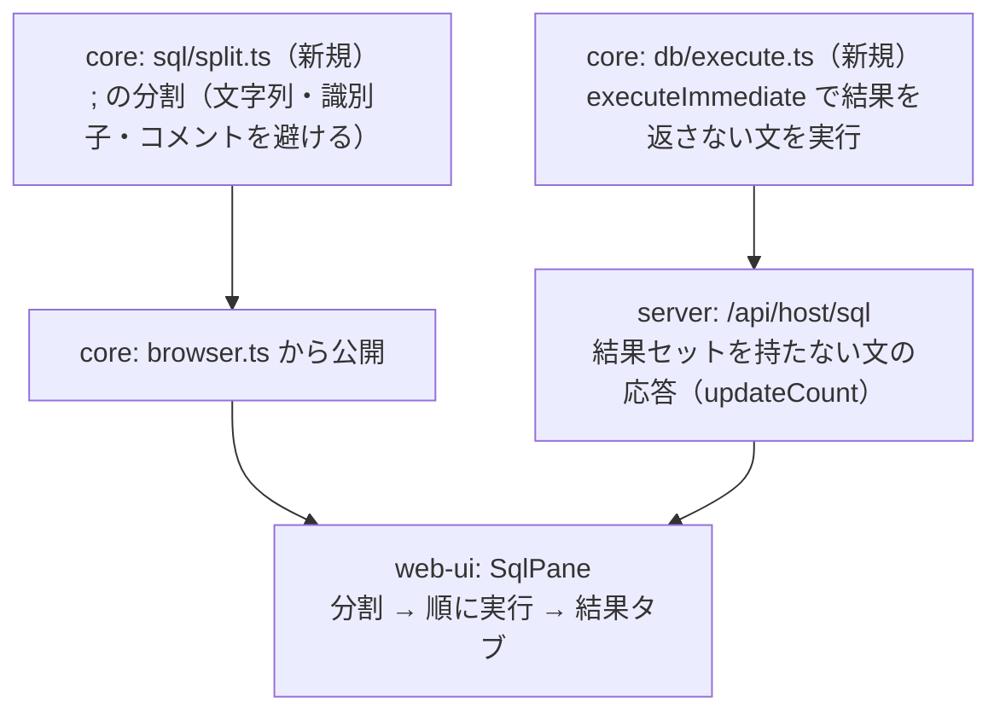

# 調査: SQL の複数文実行と結果タブ

## 調査の問い

- Q1: 結果を返さない文（`INSERT` / `UPDATE` / `CREATE` 等）を今のサーバーで実行できるか。できないなら何が要るか
- Q2: 結果セットを**同時にいくつ開けるか**。タブごとにカーソルを持つと何が起きるか
- Q3: 文の分割（`;`）をどこに置くか。既存に流用できる仕組みはあるか
- Q4: 実行の入口は「クライアントが 1 文ずつ投げる」か「サーバーがまとめて実行する」か
- Q5: 既存 UI の状態（列幅・CSV・ページング・ログ・期限切れ）は、タブ化でどう変わるか

**結論を先に**: Q1 は**今は実行できない**（`prepareAndOpen` が文型 SELECT 固定）。
`executeImmediate`（0x1806）も `prepare`（0x1800）も**実機で通らなかった**（F2b）ので、
**結果を返さない文は今回のスコープ外**とする。
Q2 は **1 利用者あたり 4 本まで**で、超えると**古いものから自動で閉じられる**（既存の期限切れ表示に乗る）。
Q4 は**クライアントが 1 文ずつ投げる**方が既存の資産（ページング・プール・期限切れ）をそのまま使える。

---

## 判明した事実

### F1: 今の SQL 経路は「SELECT 専用」。文型が固定されている

`packages/core/src/hostserver/db/query.ts:205` の `prepareAndOpen` は、prepare 要求に

- `sqlStatementType = STATEMENT_TYPE_SELECT`
- `openAttributes = OPEN_ATTR_SELECT`

を**固定で**入れている。SELECT 以外を渡すと列定義が返らず、
`「この結果セットは取得できません（rcClass=…）。SELECT 以外の文か…」` で落ちる（`:242`）。

`SqlPane.vue:19` のコメント（「実行できるのは SELECT だけ」）はこの実装を指している。

### F2: 結果を返さない文の実行手段は「用意されているように見えて、実機で通らなかった」

`db-datastream.ts` の要求 ID には **`executeImmediate: 0x1806`** と `prepare: 0x1800` がある（どちらも未使用）。
`insert.ts` は `prepareAndDescribe`(0x1803) → `changeDescriptor` → `execute`(0x1805) の 3 段で
INSERT を実行できているので、筋道はあるように見えた。

**実機（PUB400）で試した結果**:

| 試したこと | 結果 |
|---|---|
| `executeImmediate` に 文テキストのみ | `rcClass=2 rcCode=-215`（SQLCA なし） |
| `executeImmediate` に 文テキスト＋文型＋`openAttributes`＋`prepareOption`（原典 `AS400JDBCStatement` と同じ組み合わせ） | **同じ -215** |
| `prepare`(0x1800) → `execute`(0x1805) の 2 段（マーカー無し） | **prepare の時点で -215** |

一方 `prepareAndDescribe`(0x1803) は同じ接続で通る（SELECT が動いている）。
つまり**この 2 つの要求 ID は、今の接続の作り方（RPB の設定・テンプレートの欄）では受け付けられていない**。
原典との差分を詰めれば通せる見込みはあるが、**プロトコル調査をもう 1 本要する**。

参考（原典 `AS400JDBCStatement` の EXECUTE_IMMEDIATE が送るもの）: 文テキスト（V5R4 以降は拡張形式）・
文型（`JDSQLStatement` の native type。**SELECT=2 / OTHER=1**——当方の `query.ts` は 0、`insert.ts` は 1 を
使っており、原典の定数とは一致していない）・`openAttributes`(0x3809)・`prepareOption`(0x3808)。
拡張形式の文テキストや RPB の設定が鍵の可能性がある。

**判断**: 結果を返さない文（DML/DDL）の実行は**今回のスコープ外**とし、backlog へ送る。
本件の主眼（`;` 区切りの複数文と結果タブ）は、結果を返す文だけでも成立する。

### F3: 結果セットは 1 利用者 4 本まで。超えると古いものが閉じられる

`packages/server/src/result-set-store.ts:25` に `MAX_PER_USER = 4`。
`open()` は上限に達していると**最も古いものを閉じてから**開く（`:78-83`）。
アイドル 60 秒でも閉じる（`IDLE_MS`）。

閉じられた結果セットの続きを取ろうとすると、UI は既に**期限切れ**として扱う仕組みを持っている
（`SqlPane.vue` の `expired`）。つまり「5 本目を開いたら 1 本目のページングが切れる」状態は、
**新しい失敗ではなく既存の失敗の形**に落ちる。

各結果セットは接続を 1 本掴む。プールは鍵ごとに**待機 2 本**まで（`db-pool.ts` の `MAX_IDLE_PER_KEY`）だが、
**貸し出し中の本数に上限は無い**——掴んだままの結果セットが 4 本あれば接続も 4 本使う。

### F4: 分割は自前で書くしかない（既存に無い）

`;` で文を割る仕組みは web-ui・server・core のどこにも無い。
**文字列リテラル（`'…'`）・引用符付き識別子（`"…"`）・コメント（`--` / `/* */`）**の中の `;` を
区切りにしないためには、簡単な走査が要る。

DB2 for i の SQL では:

- 文字列内の `'` は `''` でエスケープする（`'A;B'` / `'It''s'`）
- 識別子は `"…"`（`"MY;TABLE"` は正当）
- 行コメント `--`、ブロックコメント `/* … */`（**入れ子にしない**）

置き場所の候補は core（`@as400web/core/browser` 経由で UI から使える。表を引き込まない純テキスト処理）。
既に `csv-parse.ts` など**純ロジックを core に置いて UI から使う前例**がある（`browser.ts`）。

### F5: 既存 UI の状態は「1 結果」を前提に散らばっている

| 状態 | 場所 | タブ化で必要なこと |
|---|---|---|
| `columns` / `rows` / `hasMore` / `resultSetId` / `expired` | `SqlPane.vue:37-42` | **タブごとに持つ** |
| 列幅（`useColumnWidths` の `cols`） | 同 `:47` 付近 | タブごとに分ける（列が違う） |
| CSV 出力 | `toCsv(columns, rows)` | 表示中のタブを出す |
| ページング（`loadMore`） | `resultSetId` を見る | 表示中のタブの id を使う |
| 実行ログ | `record({ kind: "run", sql, … })` | **文ごとに 1 件**（既存形式のまま） |
| 保存済みクエリ（`q.columns` / `q.rows`） | `:308-360` | 「結果の復元」がタブ前提でない。**最初のタブに入れる**のが素直 |

### F6: 1 文ずつ投げても、接続の使い回しは効く

`/api/host/sql` は `pageSize` 指定時にプールから接続を取り、**1 ページで読み切れたら即座に手放す**
（`host-sql.ts:172-176`）。つまり「小さな SELECT を続けて投げる」流れではプールが効き、
2 文目以降は接続確立の 4.6 秒を払わない。

**まとめて 1 要求で実行する形**（新しい `/script` 相当）にすると、
ページングのために結果セットを複数開く仕組みを**サーバー側に作り直す**ことになる。
1 文ずつ投げれば、既存のページング・期限切れ・プールの規律がそのまま効く。

---

## 影響範囲

---

## 実現性 / リスク

- **分割**は素直に書ける。境界（文字列・コメント・末尾の `;` 無し・空文）をテストで固定すればよい
- **結果を返さない文**は core にプロトコルを足す必要がある。**実機で確かめないと入れられない**
  （`executeImmediate` の応答の形・`updateCount` の位置）
- **4 本を超える SELECT** を含むスクリプトでは、古いタブのページングが切れる。
  既存の期限切れ表示に乗るが、**タブが増えるほど起きやすくなる**ので UI で分かるようにする
- **保存済みクエリの復元**が単一結果前提。タブ化した後の互換（古い保存データを読んだとき）に注意
- 実行の途中で失敗したとき、**それまでのタブを残すか**を決める必要がある（残す方が調査しやすい）

---

## spec への申し送り

1. **分割は core（`sql/split.ts`）に置き、`browser.ts` から公開**する。UI から使い、テストは core に置く
2. 分割規則: `'…'`（`''` エスケープ）・`"…"`・`--` 行コメント・`/* … */` ブロックコメントの中の `;` は区切りにしない。
   空の文（`;;` や末尾の `;`）は捨てる
3. **クライアントが 1 文ずつ順に投げる**（新しい API を作らない）。既存のページング・プール・期限切れがそのまま効く
4. **結果を返さない文は実行できない**（F2）。混ざっていたら**その文で止め、どの文かを示す**。
   今は「文全体が構文エラー」になるだけなので、**どの文で落ちたかが分かるだけでも前進**。
   DML/DDL の実行は backlog へ（`executeImmediate` の -215 を解く調査が要る）
5. **失敗したら止める**（後続は実行しない）。**それまでのタブは残す**
6. タブは実行順。見出しは「1 SELECT …」のように**順番＋文の要約**。列幅はタブごとに分ける
7. 保存済みクエリの復元は**最初のタブ**に入れる（古い保存データとの互換）

### 残った未確定事項

- `executeImmediate` / `prepare` が -215 になる理由（拡張形式の文テキスト・RPB の設定・テンプレートの欄）。
  **別の調査**として backlog に送る
- 5 本目以降の SELECT を含むスクリプトでの見せ方（期限切れの案内文）
