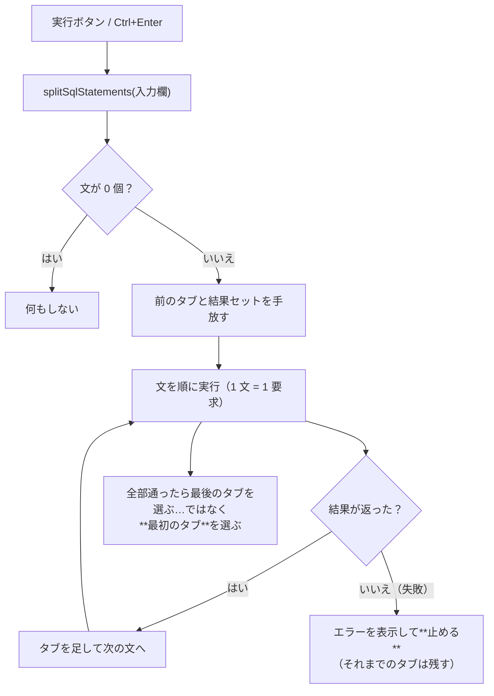

# 仕様: SQL の複数文実行と結果タブ

## 概要

入力欄の SQL を `;` で分割して**順に実行**し、結果を返した文ごとに**結果領域のタブ**を出す。

- 分割は **core の純ロジック**（`sql/split-statements.ts`）に置き、`@as400web/core/browser` から UI が使う
- 実行は**クライアントが 1 文ずつ既存の `/api/host/sql` へ投げる**。
  新しい API を作らない——既存のページング・接続プール・期限切れの規律がそのまま効く（research F6）
- 結果を返さない文（DML/DDL）は**サーバーが実行できない**（同 F2）。
  混ざっていたら**その文で止め、何番目の文か**を示す

## 設計方針

- **分割は「区切りに見えるが区切りでないもの」を外すことが本体**。
  文字列 `'…'`（`''` エスケープ）・引用符付き識別子 `"…"`・行コメント `--`・ブロックコメント `/* … */`
  の中の `;` は区切りにしない
- **タブは実行順に積む**。実行のたびに前のタブは捨てる（結果セットも手放す）
- **途中で失敗したら止める**が、**それまでのタブは残す**（どこまで通ったかが分かる）
- **単一文のときは今までと同じに見える**——タブが 1 つのときはタブ帯を出さない
- 状態は「タブの配列」に寄せる。列幅・CSV・ページングは**表示中のタブ**に対して働く

## 対象範囲

| 層 | ファイル | 変更内容 |
|---|---|---|
| core | `sql/split-statements.ts`（新規） | `;` 分割（文字列・識別子・コメントを避ける） |
| core | `browser.ts` | 上記を公開（表を引き込まない純ロジック） |
| web-ui | `components/SqlPane.vue` | 分割 → 順に実行 → 結果タブ。列幅・CSV・ページングをタブ単位に |
| （変更なし） | server / core の DB 層 | **触らない**（既存 API をそのまま使う） |

## インターフェース / データ構造

### core: 文の分割

```ts
export interface SqlStatement {
  /** 実行する文（前後の空白と末尾の `;` を除いたもの） */
  sql: string;
  /** 入力欄の中での開始位置（0 起点）。将来エラー箇所の強調に使える */
  offset: number;
}

/**
 * `;` で分割する。**文字列・引用符付き識別子・コメントの中の `;` は区切りにしない**。
 * 空の文（`;;`・末尾の `;`・コメントだけ）は返さない。
 */
export function splitSqlStatements(text: string): SqlStatement[];
```

- `'` は `''` でエスケープ（`'It''s'` は 1 つの文字列）
- `"` は `""` でエスケープ（識別子）
- `--` は行末まで、`/* … */` は閉じるまで（**入れ子にしない**——DB2 for i の仕様）
- 閉じていない文字列・コメントは、**そこから末尾までを 1 つの文**として返す
  （実行すればホストが構文エラーを返す。こちらで判定して弾かない）

### web-ui: 結果タブ

```ts
interface ResultTab {
  id: string;
  /** 何番目の文か（1 起点）。見出しに出す */
  index: number;
  /** 実行した文（見出しの要約とログに使う） */
  sql: string;
  columns: Column[];
  rows: Row[];
  hasMore: boolean;
  resultSetId: string;
  expired: boolean;
  /** 列幅（タブごとに持つ。列が違うので共有できない） */
  widths: Map<number, number>;
}
```

- `tabs: ResultTab[]` と `activeTabId` を持つ
- 既存の単一状態（`columns` / `rows` / `hasMore` / `resultSetId` / `expired`）は
  **表示中のタブから引く算出プロパティ**にする（テンプレートの変更を最小にする）

## 振る舞いの詳細



- **選ぶのは最初のタブ**。書いた順に見るのが自然で、最後の文が小さな確認クエリのことも多い
- 実行中は**タブが増えていく**のが見える（1 文ずつ `await` するので、途中経過が画面に出る）
- **失敗しても止まるだけ**——それまでのタブは残り、エラー文言に「n 番目の文」を添える
- 実行ログは**文ごとに 1 件**（既存の `record({ kind: "run", sql, … })` を文の数だけ呼ぶ）
- タブの見出し: `1 SELECT * FROM …`（順番＋文の先頭 30 文字ほど。改行は空白に潰す）
- **タブが 1 つのときはタブ帯を出さない**（単一文の見え方を変えない）

### 前の結果の手放し

実行の最初に、**開いているすべてのタブの結果セット**を手放す（既存の `releaseResultSet` を全タブに広げる）。
手放しを待ってから 1 文目を投げる（既存の規律。待たないとプールが効かず毎回 4〜6 秒かかる）。

### 期限切れ（結果セットが閉じられた場合）

サーバーは 1 利用者あたり **4 本**までしか結果セットを保持しない（research F3）。
5 本以上の SELECT を含むスクリプトでは、**古いタブのページングが切れる**。
その場合は既存の期限切れ表示（`expired`）に落ち、
「続きは取得できません（結果が保持されていません）。再実行してください」と案内する。

**タブを開いた時点では何も起きない**（既に取得済みの行はそのまま見える）。切れるのは「続きの読み足し」だけ。

## ドメイン固有の考慮

- **core のピュアロジックは Node API 非依存**（AGENTS.md）。分割は文字列処理だけで書く
- **UI デザイン**（`docs/UI-DESIGN.md`）: タブは既存のペインタブと同じ意匠に寄せる。
  1 つのときは出さない（レイアウトシフトを避ける）
- **SQL 文はサーバーへ送らない**（`sqlLog.ts` の方針）。ログはブラウザ内に留める
- 実行中の操作禁止（`disabled`）は既存の `useDelayedLoading` の `run()` に載せる

## エラー処理 / 異常系

| 状況 | 挙動 |
|---|---|
| 入力が空白・コメントだけ | 何も実行しない（今と同じ） |
| 2 文目で失敗 | 1 文目のタブは残る。エラーに「2 番目の文」と表示し、3 文目以降は**実行しない** |
| 結果を返さない文（DML/DDL） | サーバーのエラーがそのまま出る。**何番目の文か**を添える |
| 5 本以上の SELECT | 古いタブの続きが取れない（期限切れ表示）。取得済みの行は見える |
| 閉じていない文字列・コメント | そこから末尾までを 1 文として実行 → ホストが構文エラーを返す |
| 実行中にタブを切り替え | 表示は切り替わる。実行は続く（`run()` の間は実行ボタンが無効） |

## 受け入れ基準との対応

| requirement の受け入れ基準 | 満たし方 |
|---|---|
| `SELECT…; SELECT…;` で結果タブが 2 つ | 分割 → 順に実行 → タブに積む |
| 文字列内の `;` で分割されない | `splitSqlStatements` の走査（`''` エスケープ込み） |
| コメント内の `;` で分割されない | 同上（`--` と `/* */`） |
| 結果を返さない文で止まったことが分かる | エラー文言に「n 番目の文」を添える |
| 途中で失敗したら後続を実行しない | 逐次実行のループを抜ける |
| 各タブで CSV と読み足しができる | CSV・`loadMore` は**表示中のタブ**を見る |
| 単一文の操作感が変わらない | タブが 1 つならタブ帯を出さない |
| 実機で複数文の実行を確認 | test 工程（PUB400・Web UI） |
