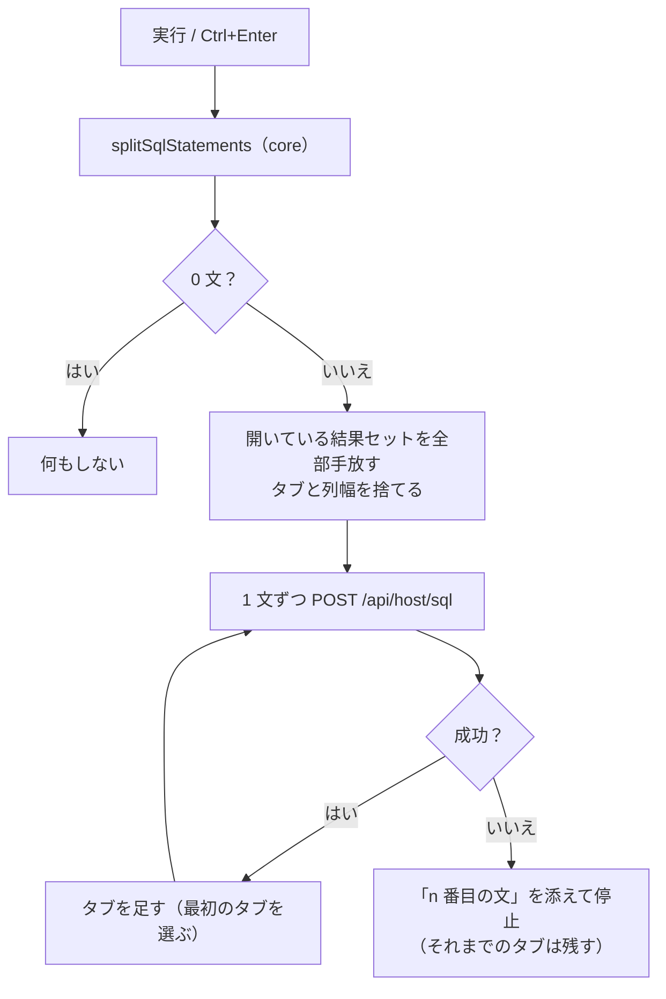

# レビューガイド: SQL の複数文実行と結果タブ

## 変更概要 / 目的

SQL 画面は 1 回の実行につき 1 文しか投げられず、`;` 区切りで書くとそのままホストへ送られて構文エラーになっていた。
`;` で分割して**書いた順に実行**し、結果を返した文ごとに**結果領域のタブ**を出す。

## 重要ポイント（特に見てほしい所）

### 1. 分割は「区切りに見えるが区切りでないもの」を外すのが本体

`packages/core/src/sql/split-statements.ts`

`WHERE NAME = 'A;B'` を割ると壊れた 2 文になる。文字列 `'…'`（`''` エスケープ）・
引用符付き識別子 `"…"`（`"MY;TABLE"` は正当）・行コメント `--`・ブロックコメント `/* */` の中の `;` は
区切りにしない。**閉じていない文字列やコメントは、そこから末尾までを 1 文**として返す——
こちらで構文を判定して弾くより、ホストの構文エラーの方が利用者に情報が多い。

core に置いたのは、**UI を通さずに境界をテストするため**（17 件）。`@as400web/core/browser` から UI が使う。

### 2. サーバーには触っていない。既存 API を 1 文ずつ叩く

`packages/web-ui/src/components/SqlPane.vue`（`execute` / `executeOne`）

まとめて実行する API を作らなかったのは、**ページング・接続プール・期限切れの規律が既存のまま効く**ため。
`/api/host/sql` は 1 ページで読み切れたら接続をプールへ返すので、続けて投げても接続確立の 4.6 秒は払わない
（research F6）。

### 3. 状態は「タブの配列 ＋ 表示中のタブから引く算出」に寄せた

`columns` / `rows` / `hasMore` / `resultSetId` / `expired` を**算出プロパティ**にしたので、
テンプレートと既存の処理（CSV・読み足し・列幅）は**ほぼそのまま**動く。
既存の `sql-pane.test.ts`（43 件）が無修正で通ることが、単一文に退行が無いことの証明になっている。

### 4. 失敗したら止める。それまでのタブは残す

2 文目で失敗したら 3 文目は投げない。エラーには「**2 番目の文:**」を添える
（単一文のときは付けない——文言を変えないため）。1 文目の結果は残るので、どこまで通ったかが分かる。

### 5. 手放しは全タブぶん

`releaseResultSets()` は開いているタブの結果セットを**すべて**返す。
1 本でも残すとその接続はアイドル（60 秒）までプールへ戻らず、次の実行が 4〜6 秒かかる。

## 処理フロー

## 主要な変更箇所

| 場所 | 要点 |
|---|---|
| `packages/core/src/sql/split-statements.ts` | `;` の分割と `summarizeSql`（見出し用。**先頭コメントを飛ばす**） |
| `packages/core/src/browser.ts` | UI へ公開（表も I/O も引き込まない純ロジック） |
| `SqlPane.vue`（`ResultTab` / `tabs` / `activeTab`） | 結果状態をタブの配列に。既存の参照は算出プロパティで吸収 |
| `SqlPane.vue`（`execute` / `executeOne`） | 分割 → 逐次実行 → 失敗で停止 |
| `SqlPane.vue`（`releaseResultSets`） | 全タブぶん手放す |
| `SqlPane.vue`（テンプレート `.rtabs`） | **2 つ以上のときだけ**タブ帯を出す |

## リスク / 確認してほしい点

- **結果を返さない文（INSERT/UPDATE/CREATE）は実行できない**。`executeImmediate`(0x1806) も
  `prepare`(0x1800) も実機で `-215` で拒否された（research F2）。今回はスコープ外で、backlog へ送った。
  混ざっていれば**その文で止まり、何番目かは分かる**
- **5 本以上の SELECT** ではサーバーが古い結果セットから閉じる（1 利用者 4 本）。
  古いタブの**続きの読み足しだけ**が期限切れになる（取得済みの行は見える）。**実機では未再現**
- **タブごとの列幅は保持しない**（切り替えで既定に戻る）。列が違うタブに前の幅を当てる方が害が大きいと判断
- 実機（PUB400）で 3 文（コメント・文字列内 `;` 入り）を実行し、タブの切り替えと CSV を確認済み
